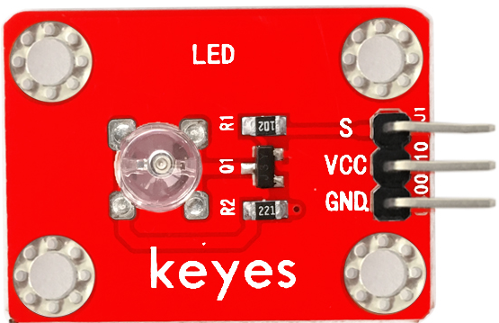
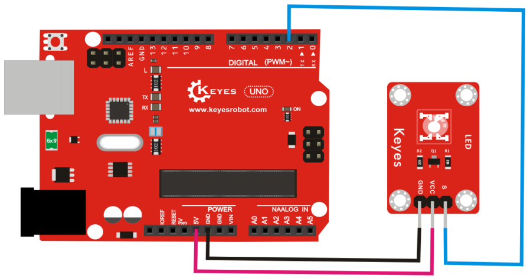
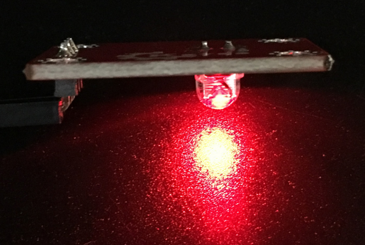

# KE0011 Keyes 草帽LED白发红模块



---

## **1. 介绍**

KE0011 Keyes 草帽LED白发红模块是一款专为 Arduino 和其他微控制器设计的 LED 模块。模块采用草帽型 LED，发光颜色为红色，具有低功耗、亮度高、颜色纯正、寿命长、稳定性高等特点。模块自带 3PIN 接口（VCC、GND、信号），兼容 Arduino 传感器扩展板，适合快速搭建电子实验和 DIY 项目。此外，模块还配备 4 个定位孔，方便固定在其他设备上。

该模块广泛应用于电子学习、指示灯设计、信号显示、DIY 创意项目等场景，是初学者学习 Arduino 编程和电子电路的理想选择。

---

## **2. 特点**

1. **发光颜色**：白发红光，颜色纯正，亮度高。  
2. **低功耗**：适合电池供电的项目，节能环保。  
3. **高兼容性**：支持 Arduino 及其他微控制器，兼容传感器扩展板。  
4. **稳定性高**：模块设计可靠，适合长期使用。  
5. **易于固定**：配备 4 个定位孔，方便安装在其他设备上。  
6. **简单易用**：通过数字信号控制，适合初学者快速上手。

---

## **3. 规格参数**

- **工作电压**：3.3-5V（DC）  
- **接口类型**：3PIN 接口（VCC、GND、信号）  
- **输入信号**：数字信号  
- **发光颜色**：红色  
- **LED 类型**：草帽型 LED  
- **定位孔**：4 个，孔径 3mm  
- **特点**：低功耗、颜色纯正、寿命长、稳定性高  

---

## **4. 工作原理**

草帽LED白发红模块的核心是一个草帽型 LED，通过数字信号控制其亮灭。模块的信号引脚（S）连接到 Arduino 的数字引脚，当信号引脚接收到高电平（HIGH）时，LED 点亮；当信号引脚接收到低电平（LOW）时，LED 熄灭。

模块的工作电压为 3.3-5V，适合直接连接到 Arduino 的电源引脚。通过简单的数字信号控制，可以实现 LED 的闪烁、状态指示等功能。

---

## **5. 接口**

模块提供 3PIN 接口，具体说明如下：  
- **VCC**：电源正极，连接 Arduino 的 5V 或 3.3V 引脚。  
- **GND**：电源负极，连接 Arduino 的 GND 引脚。  
- **S（信号）**：数字信号输入，连接 Arduino 的数字引脚（如 D2）。  

---

## **6. 连接图**

将 KE0011 草帽LED白发红模块与 Arduino 开发板连接，具体接线如下：  

| 模块引脚 | Arduino 引脚 |
|----------|--------------|
| VCC      | 5V 或 3.3V   |
| GND      | GND          |
| S        | D2           |

连接示意图：



---

## **7. 示例代码**

以下是一个简单的示例代码，用于控制草帽LED模块以 1 秒的间隔闪烁：

```cpp
int led = 2;                     // 定义数字引脚 2
void setup()
{
  pinMode(led, OUTPUT);          // 设置引脚为输出模式
}

void loop()
{
  digitalWrite(led, HIGH);       // 点亮 LED
  delay(1000);                   // 延迟 1 秒
  digitalWrite(led, LOW);        // 熄灭 LED
  delay(1000);                   // 延迟 1 秒
}
```

---

## **8. 实验现象**

1. 将草帽LED白发红模块与 Arduino 开发板按照连接图连接好。  

2. 将示例代码烧录到 Arduino 开发板中。  

3. 上电后，草帽LED模块会以 1 秒的间隔闪烁：亮 1 秒，灭 1 秒。  

	

---

## **9. 注意事项**

1. **供电电压**：确保模块的供电电压在 3.3-5V 范围内，避免过高电压损坏模块。  
2. **引脚连接**：在连接模块时，确保引脚连接正确，避免短路或反接。  
3. **信号控制**：信号引脚（S）需连接到 Arduino 的数字引脚，确保代码中定义的引脚与实际连接一致。  
4. **固定模块**：如果需要将模块固定在设备上，可使用定位孔，避免模块松动影响实验效果。  
5. **环境要求**：避免在高温、高湿或强光环境下使用模块，以免影响 LED 的性能。  

---

## **10. 参考链接**

- **Arduino 官网**：[https://www.arduino.cc/](https://www.arduino.cc/)  
  提供 Arduino IDE 下载、官方教程和示例代码。  
- **Keyes 官网**：http://www.keyes-robot.com/
  提供 Keyes 产品的详细信息和技术支持。  
- **Arduino 教程资源**：[https://www.arduino.cc/en/Tutorial/HomePage](https://www.arduino.cc/en/Tutorial/HomePage)  
  提供丰富的 Arduino 教程，适合初学者和进阶用户。  

---

KE0011 Keyes 草帽LED白发红模块是一款简单易用的 LED 模块，适合初学者学习 Arduino 编程和电子电路设计，也适用于各种 DIY 项目和教学实验。通过简单的数字信号控制，用户可以轻松实现 LED 的闪烁、状态指示等功能。

