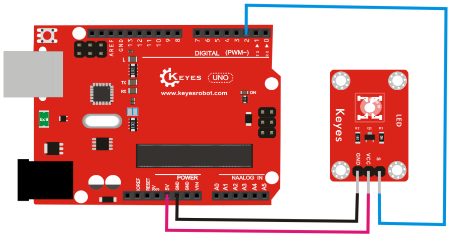

# KE0012 Keyes 草帽LED白发绿模块详细教程


---

## **1. 介绍**

KE0012 Keyes 草帽LED白发绿模块是一款专为 Arduino 和其他微控制器设计的 LED 模块，采用草帽型 LED，发光颜色为绿色。模块具有低功耗、亮度高、颜色纯正、寿命长、稳定性高等特点。模块自带 3PIN 接口，兼容 Arduino 传感器扩展板，方便用户快速搭建电路。模块还配备 4 个定位孔，便于固定在其他设备上，适合用于电子学习、DIY 项目和教学实验。

---

## **2. 特点**

1. **高亮度**：采用草帽型 LED，发光均匀，亮度高。  
2. **低功耗**：适合长时间运行的项目。  
3. **颜色纯正**：发光颜色为绿色，光线柔和。  
4. **寿命长**：LED 使用寿命长，稳定性高。  
5. **易于使用**：3PIN 接口设计，兼容 Arduino 传感器扩展板，接线简单。  
6. **固定方便**：模块自带 4 个定位孔，便于安装在其他设备上。

---

## **3. 规格参数**

- **工作电压**：3.3-5V（DC）  
- **接口类型**：3PIN 接口（VCC、GND、S）  
- **输入信号**：数字信号  
- **发光颜色**：绿色  
- **LED 类型**：草帽型 LED  
- **重量**：约 2.4g  
- **模块尺寸**：标准小型模块尺寸，便于集成到项目中。

---

## **4. 工作原理**

草帽LED模块的核心是一个草帽型 LED，通过数字信号控制其亮灭。模块的信号引脚（S）连接到 Arduino 的数字引脚，Arduino 通过输出高电平（HIGH）或低电平（LOW）来控制 LED 的亮灭状态。  
- 当信号引脚为高电平时，LED 点亮。  
- 当信号引脚为低电平时，LED 熄灭。  

模块内部通过限流电阻保护 LED，确保其在 3.3V 或 5V 的工作电压下安全运行。

---

## **5. 接口**

模块提供一个 3PIN 接口，具体引脚功能如下：  
- **VCC**：连接 Arduino 的 5V 或 3.3V 电源引脚。  
- **GND**：连接 Arduino 的 GND 引脚。  
- **S（信号）**：连接 Arduino 的数字引脚，用于控制 LED 的亮灭。  

---

## **6. 连接图**

将 KE0012 草帽LED白发绿模块与 Arduino 开发板连接，具体接线如下：  

```
Arduino 开发板       草帽LED模块  
-----------------     -----------------  
5V                  -> VCC  
GND                 -> GND  
D2                  -> S  
```

连接示意图如下：  



---

## **7. 示例代码**

以下是一个简单的示例代码，用于控制草帽LED模块以 1 秒的间隔闪烁：

```cpp
int led = 2;                     // 定义数字引脚2为LED控制引脚
void setup()
{
  pinMode(led, OUTPUT);          // 设置引脚为输出模式
}

void loop()
{
  digitalWrite(led, HIGH);       // 点亮LED
  delay(1000);                   // 延迟1秒
  digitalWrite(led, LOW);        // 熄灭LED
  delay(1000);                   // 延迟1秒
}
```

---

## **8. 实验现象**

1. 将草帽LED模块与 Arduino 开发板按照连接图连接好。  
2. 将示例代码烧录到 Arduino 开发板中。  
3. 上电后，草帽LED模块会以 1 秒的间隔闪烁：亮 1 秒，灭 1 秒。


---

## **9. 注意事项**

1. **供电电压**：确保供电电压在模块支持的范围内（3.3V-5V）。  
2. **引脚连接**：接线时注意引脚对应关系，避免接错引脚导致模块无法正常工作。  
3. **限流保护**：模块内部已集成限流电阻，无需额外添加电阻。  
4. **固定模块**：使用模块上的定位孔将其固定在设备上时，注意避免短路。  
5. **避免长时间高电流**：虽然模块支持长时间运行，但建议避免长时间高电流工作，以延长 LED 的使用寿命。  

