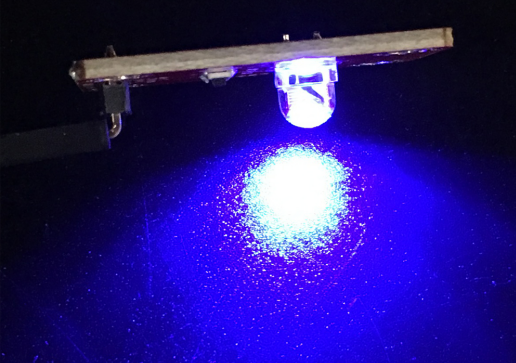

# KE0013 Keyes 草帽LED白发蓝模块详细教程


---

## **1. 介绍**

KE0013 Keyes 草帽LED白发蓝模块是一款专为 Arduino 和其他微控制器设计的 LED 模块。模块采用草帽LED设计，发光颜色为蓝色，具有低功耗、亮度高、颜色纯正、寿命长、稳定性高等特点。模块自带 3PIN 接口（VCC、GND、S）和 4 个定位孔，方便用户将模块固定在其他设备上。它广泛应用于电子学习、DIY 项目、智能设备指示灯等场景。

---

## **2. 特点**

1. **颜色纯正**：采用白发蓝光草帽LED，发光颜色稳定且亮度高。  
2. **低功耗**：适合电池供电的项目，节能环保。  
3. **寿命长**：LED 使用寿命长，适合长期运行的项目。  
4. **稳定性高**：模块设计简单，性能稳定，适合初学者和教学实验。  
5. **易于固定**：模块自带 4 个定位孔，方便安装在其他设备上。  
6. **兼容性强**：支持 Arduino 和其他微控制器，接口标准化，易于连接。

---

## **3. 规格参数**

- **工作电压**：3.3-5V（DC）  
- **接口类型**：3PIN 接口（VCC、GND、S）  
- **输入信号**：数字信号  
- **发光颜色**：蓝色  
- **LED 类型**：草帽LED（白发蓝光）  
- **重量**：约 2.4g  
- **模块尺寸**：标准化设计，便于与其他模块配合使用  

---

## **4. 工作原理**

草帽LED模块通过数字信号控制其亮灭状态。当信号引脚接收到高电平（HIGH）时，LED 被点亮；当信号引脚接收到低电平（LOW）时，LED 熄灭。模块内部通过限流电阻保护 LED，确保其在安全电流范围内工作。

---

## **5. 接口**

模块提供 3PIN 接口，具体定义如下：  
- **VCC**：电源正极，连接 Arduino 的 5V 或 3.3V 引脚。  
- **GND**：电源负极，连接 Arduino 的 GND 引脚。  
- **S（信号）**：数字信号输入，连接 Arduino 的数字引脚（如 D2）。  

---

## **6. 连接图**

将 KE0013 草帽LED白发蓝模块与 Arduino 开发板连接，具体接线如下：  


---

## **7. 示例代码**

以下是一个简单的示例代码，用于控制草帽LED模块以 1 秒的间隔闪烁：

```cpp
int led = 2;                     // 定义数字引脚2连接LED模块
void setup()
{
  pinMode(led, OUTPUT);          // 设置引脚为输出模式
}

void loop()
{
  digitalWrite(led, HIGH);       // 点亮LED
  delay(1000);                   // 延迟1秒
  digitalWrite(led, LOW);        // 熄灭LED
  delay(1000);                   // 延迟1秒
}
```

---

## **8. 实验现象**

1. 将草帽LED模块与 Arduino 开发板按照连接图连接好。  

2. 将示例代码烧录到 Arduino 开发板中。  

3. 上电后，草帽LED模块会以 1 秒的间隔闪烁：亮 1 秒，灭 1 秒。  

	

---

## **9. 注意事项**

1. **供电电压**：确保供电电压在 3.3-5V 范围内，避免过高电压损坏模块。  
2. **引脚连接**：严格按照连接图接线，避免短路或反接。  
3. **信号控制**：信号引脚需连接到 Arduino 的数字引脚，确保代码中定义的引脚与实际连接一致。  
4. **固定模块**：使用模块上的定位孔将其固定在设备上，避免运行过程中松动。  
5. **避免过流**：模块内部已集成限流电阻，无需额外添加电阻，但仍需避免长时间高电流工作。  


