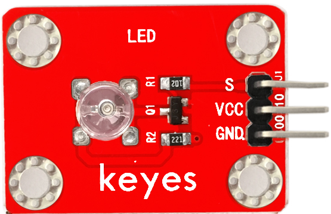

# KE0014 Keyes 草帽LED白发黄模块详细教程



---

## **1. 介绍**

KE0014 Keyes 草帽LED白发黄模块是一款专为 Arduino 和其他微控制器设计的 LED 模块，采用草帽LED设计，发光颜色为黄色（白色外壳，发黄光）。模块具有低功耗、颜色纯正、寿命长、稳定性高等特点，适合用于电子学习、DIY 项目和教学实验。模块自带 3PIN 接口和 4 个定位孔，方便用户快速连接和固定模块。

---

## **2. 特点**

1. **颜色纯正**：采用草帽LED，发光颜色为黄色，亮度高且稳定。  
2. **低功耗**：适合长时间运行的项目，节能环保。  
3. **寿命长**：LED 使用寿命长，适合多次实验和长期使用。  
4. **易于连接**：3PIN 接口设计，兼容 Arduino 传感器扩展板，连接简单。  
5. **固定方便**：模块自带 4 个定位孔，便于固定在其他设备或实验平台上。  

---

## **3. 规格参数**

- **工作电压**：3.3-5V（DC）  
- **接口类型**：3PIN 接口（VCC、GND、S）  
- **输入信号**：数字信号  
- **发光颜色**：黄色（白色外壳，发黄光）  
- **重量**：约 2.4g  
- **模块尺寸**：标准 Keyes 模块尺寸  
- **特点**：低功耗、颜色纯正、寿命长、稳定性高  

---

## **4. 工作原理**

草帽LED模块的核心是一个草帽型 LED 灯珠，通过数字信号控制其亮灭状态。模块的信号引脚（S）连接到 Arduino 的数字引脚，Arduino 通过输出高电平（HIGH）或低电平（LOW）来控制 LED 的亮灭。  
- **高电平（HIGH）**：LED 点亮。  
- **低电平（LOW）**：LED 熄灭。  

模块内部通过限流电阻保护 LED，确保其在 3.3V 或 5V 电压下安全工作。

---

## **5. 接口**

模块提供一个 3PIN 接口，具体引脚功能如下：  
- **VCC**：电源正极，连接 Arduino 的 3.3V 或 5V 引脚。  
- **GND**：电源负极，连接 Arduino 的 GND 引脚。  
- **S（信号）**：数字信号输入，连接 Arduino 的数字引脚（如 D2）。  

---

## **6. 连接图**

将 KE0014 草帽LED白发黄模块与 Arduino 开发板连接，具体接线如下：  

| Arduino 开发板 | 草帽LED模块 |  
|----------------|-------------|  
| 5V 或 3.3V     | VCC         |  
| GND            | GND         |  
| D2             | S           |  

连接示意图：  


---

## **7. 示例代码**

以下是一个简单的示例代码，用于控制草帽LED模块以 1 秒的间隔闪烁：

```cpp
int led = 2;                     // 定义数字引脚2为LED控制引脚
void setup()
{
  pinMode(led, OUTPUT);          // 设置引脚为输出模式
}

void loop()
{
  digitalWrite(led, HIGH);       // 点亮LED
  delay(1000);                   // 延迟1秒
  digitalWrite(led, LOW);        // 熄灭LED
  delay(1000);                   // 延迟1秒
}
```

---

## **8. 实验现象**

1. 将草帽LED模块与 Arduino 开发板按照连接图连接好。  

2. 将示例代码烧录到 Arduino 开发板中。  

3. 上电后，草帽LED模块会以 1 秒的间隔闪烁：亮 1 秒，灭 1 秒。  

	

---

## **9. 注意事项**

1. **供电电压**：确保模块的供电电压在 3.3V-5V 范围内，避免过高电压损坏模块。  
2. **引脚连接**：连接时注意引脚对应关系，避免接错引脚导致模块无法正常工作。  
3. **避免短路**：在实验过程中，确保模块与其他元件之间无短路现象。  
4. **固定模块**：如果需要将模块固定在设备上，建议使用螺丝或其他固定方式，避免模块松动。  
5. **代码调试**：在上传代码前，确保选择正确的开发板型号和端口。  

