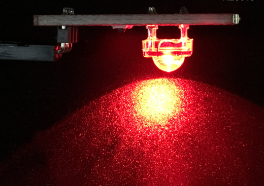

# KE0016 Keyes 食人鱼LED红光模块详细教程


---

## **1. 介绍**

KE0016 Keyes 食人鱼LED红光模块是一款基于高亮度食人鱼LED的模块，专为 Arduino 和其他微控制器设计。模块采用高亮度红光食人鱼LED，具有亮度高、功耗低、寿命长、稳定性强等特点。模块自带 3PIN 接口，兼容 Arduino 传感器扩展板，方便用户快速搭建电路。模块还带有定位孔，便于固定在其他设备上，适合用于电子学习、DIY 项目和各种光源控制实验。

---

## **2. 特点**

1. **高亮度**：采用高亮度红光食人鱼LED，发光效果显著。  
2. **低功耗**：功耗低，适合长时间运行的项目。  
3. **寿命长**：LED 寿命长，稳定性高，适合多种应用场景。  
4. **兼容性强**：支持 Arduino 和其他微控制器，接口简单易用。  
5. **模块化设计**：自带 3PIN 接口和定位孔，方便连接和固定。  

---

## **3. 规格参数**

- **工作电压**：3.3-5V（DC）  
- **接口类型**：3PIN 接口（VCC、GND、信号）  
- **输入信号**：数字信号  
- **LED 类型**：食人鱼LED（红光）  
- **发光颜色**：红色  
- **模块尺寸**：22mm x 22mm  
- **重量**：约 2.5g  

---

## **4. 工作原理**

食人鱼LED是一种高亮度发光二极管，通过向其正向施加电压，LED 内部的半导体材料会发光。模块通过数字信号控制 LED 的亮灭状态，当信号引脚接收到高电平时，LED 点亮；当信号引脚接收到低电平时，LED 熄灭。模块的工作电压范围为 3.3V-5V，适合与 Arduino 等微控制器直接连接。

---

## **5. 接口**

模块提供 3PIN 接口，具体引脚说明如下：  
- **VCC**：连接电源正极（3.3V 或 5V）  
- **GND**：连接电源负极（GND）  
- **S（信号）**：连接数字信号引脚，用于控制 LED 的亮灭  

---

## **6. 连接图**

将 KE0016 Keyes 食人鱼LED红光模块与 Arduino 开发板连接，具体接线如下：  
- **VCC**：连接 Arduino 的 5V 或 3.3V 电源引脚  
- **GND**：连接 Arduino 的 GND 引脚  
- **S（信号）**：连接 Arduino 的数字引脚（如 D3）  

连接示意图如下：  


---

## **7. 示例代码**

以下是一个简单的示例代码，用于控制食人鱼LED模块以 1 秒的间隔闪烁：

```cpp
int led = 3;                     // 定义数字引脚3
void setup()
{
  pinMode(led, OUTPUT);          // 设置引脚为输出模式
}

void loop()
{
  digitalWrite(led, HIGH);       // 点亮LED
  delay(1000);                   // 延迟1秒
  digitalWrite(led, LOW);        // 熄灭LED
  delay(1000);                   // 延迟1秒
}
```

---

## **8. 实验现象**

1. 将食人鱼LED模块与 Arduino 开发板按照连接图连接好。  

2. 将示例代码烧录到 Arduino 开发板中。  

3. 上电后，食人鱼LED模块会以 1 秒的间隔闪烁：亮 1 秒，灭 1 秒。  

	

---

## **9. 注意事项**

1. **供电电压**：确保供电电压在模块支持的范围内（3.3V-5V），避免因过高电压损坏模块。  
2. **引脚连接**：在连接模块时，确保引脚连接正确，避免短路或反接。  
3. **信号控制**：信号引脚需连接到 Arduino 的数字引脚，确保代码中定义的引脚与实际连接一致。  
4. **固定模块**：模块自带定位孔，建议使用螺丝或其他方式将模块固定在设备上，避免松动。  
5. **长时间运行**：如果模块长时间运行，建议检查电源是否稳定，避免因电源问题导致模块损坏。  

---

## **10. 参考链接**

- **Arduino 官网**：[https://www.arduino.cc/](https://www.arduino.cc/)  
  提供 Arduino IDE 下载、官方教程和示例代码。  
  
- **Keyes 官网**：http://www.keyes-robot.com/

  提供 Keyes 产品的详细信息和技术支持。  

- **Arduino 教程资源**：[https://www.arduino.cc/en/Tutorial/HomePage](https://www.arduino.cc/en/Tutorial/HomePage)  
  提供丰富的 Arduino 教程，适合初学者和进阶用户。  

---

KE0016 Keyes 食人鱼LED红光模块是一款简单易用的 LED 模块，适合初学者学习 Arduino 编程和电子电路设计，也适用于各种 DIY 项目和教学实验。通过该模块，用户可以快速实现 LED 的控制，轻松完成各种光源控制实验。

