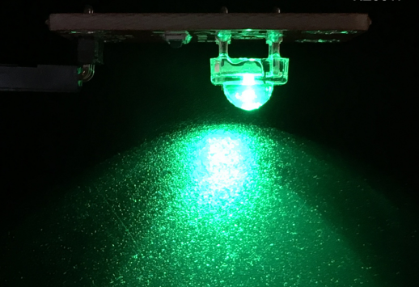

# KE0017 Keyes 食人鱼LED绿光模块


---

## **1. 介绍**

KE0017 Keyes 食人鱼LED绿光模块是一款基于高亮度食人鱼LED的模块，专为 Arduino 和其他微控制器设计。模块采用绿色发光的食人鱼LED，具有高亮度、低功耗、寿命长、稳定性高等特点。模块自带 3PIN 接口，兼容 Arduino 传感器扩展板，适合用于电子学习、DIY 项目、指示灯设计等场景。

---

## **2. 特点**

1. **高亮度**：采用绿色食人鱼LED，亮度高且光线均匀。  
2. **低功耗**：工作电流小，适合低功耗应用场景。  
3. **长寿命**：LED 使用寿命长，稳定性高。  
4. **兼容性强**：3PIN 接口设计，兼容 Arduino 和其他微控制器。  
5. **易于固定**：模块自带定位孔，方便固定在其他设备上。  

---

## **3. 规格参数**

- **工作电压**：3.3-5V（DC）  
- **接口类型**：3PIN 接口（VCC、GND、信号）  
- **输入信号**：数字信号  
- **发光颜色**：绿色  
- **模块尺寸**：19mm x 15mm  
- **重量**：约 2.5g  
- **特点**：高亮度、低功耗、寿命长  

---

## **4. 工作原理**

食人鱼LED是一种高亮度发光二极管，通过向其正向施加电压，LED 内部的半导体材料会发光。模块通过数字信号控制 LED 的亮灭状态，Arduino 或其他微控制器通过输出高电平（HIGH）点亮 LED，输出低电平（LOW）熄灭 LED。模块的 3PIN 接口分别连接电源正极（VCC）、电源负极（GND）和控制信号（S）。

---

## **5. 接口**

- **VCC**：连接 Arduino 的 5V 或 3.3V 电源引脚。  
- **GND**：连接 Arduino 的 GND 引脚。  
- **S（信号）**：连接 Arduino 的数字引脚，用于控制 LED 的亮灭。  

---

## **6. 连接图**

将 KE0017 Keyes 食人鱼LED绿光模块与 Arduino 开发板连接，具体接线如下：  


---

## **7. 示例代码**

以下是一个简单的示例代码，用于控制食人鱼LED模块以 1 秒的间隔闪烁：

```cpp
int led = 3;                     // 定义数字引脚3连接LED模块
void setup()
{
  pinMode(led, OUTPUT);          // 设置引脚为输出模式
}

void loop()
{
  digitalWrite(led, HIGH);       // 点亮LED
  delay(1000);                   // 延迟1秒
  digitalWrite(led, LOW);        // 熄灭LED
  delay(1000);                   // 延迟1秒
}
```

---

## **8. 实验现象**

1. 将食人鱼LED模块与 Arduino 开发板按照连接图连接好。  

2. 将示例代码烧录到 Arduino 开发板中。  

3. 上电后，食人鱼LED模块会以 1 秒的间隔闪烁：亮 1 秒，灭 1 秒。  

	

---

## **9. 注意事项**

1. **供电电压**：确保供电电压在模块支持的范围内（3.3-5V）。  
2. **引脚连接**：连接时注意接口对应关系，避免接错引脚导致模块损坏。  
3. **电流限制**：避免长时间高电流工作，以延长 LED 使用寿命。  
4. **固定模块**：使用模块上的定位孔将其固定在设备上，避免因震动导致接触不良。  
5. **调试注意**：在调试过程中，确保 Arduino 开发板和模块的电源共地（GND 连接）。  

---

## **10. 参考链接**

- **Arduino 官网**：[https://www.arduino.cc/](https://www.arduino.cc/)  
  提供 Arduino IDE 下载、官方教程和示例代码。  
- **Keyes 官网**：http://www.keyes-robot.com/ 
  提供 Keyes 产品的详细信息和技术支持。  
- **Arduino 教程资源**：[https://www.arduino.cc/en/Tutorial/HomePage](https://www.arduino.cc/en/Tutorial/HomePage)  
  提供丰富的 Arduino 教程，适合初学者和进阶用户。  

---

KE0017 Keyes 食人鱼LED绿光模块是一款简单易用的 LED 模块，适合初学者学习 Arduino 编程和电子电路设计，也适用于各种 DIY 项目和教学实验。通过其高亮度和低功耗的特点，用户可以轻松实现指示灯、状态显示等功能。

