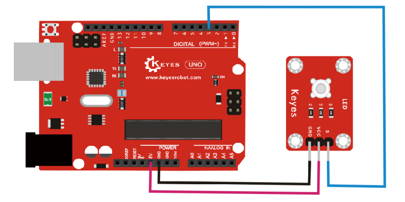

# KE0018 Keyes 食人鱼LED蓝光模块详细教程


---

## **1. 介绍**

KE0018 Keyes 食人鱼LED蓝光模块是一款基于高亮度食人鱼LED的模块，专为 Arduino 和其他微控制器设计。该模块采用蓝光食人鱼LED，具有高亮度、低功耗、寿命长、稳定性高等特点。模块自带 3PIN 接口（VCC、GND、S），兼容 Arduino 传感器扩展板，适合用于电子学习、DIY 项目、智能设备指示灯等场景。

---

## **2. 特点**

1. **高亮度**：采用高亮度蓝光食人鱼LED，发光效果显著。  
2. **低功耗**：功耗低，适合电池供电的项目。  
3. **长寿命**：LED 寿命长，适合长期使用。  
4. **稳定性高**：模块设计稳定，适合各种环境下使用。  
5. **兼容性强**：支持 Arduino 和其他微控制器，易于集成到各种项目中。  
6. **易于固定**：模块自带定位孔，方便固定在其他设备上。

---

## **3. 规格参数**

- **工作电压**：3.3-5V（DC）  
- **接口类型**：3PIN 接口（VCC、GND、S）  
- **输入信号**：数字信号  
- **发光颜色**：蓝光  
- **LED 类型**：食人鱼LED  
- **模块尺寸**：22mm x 22mm  
- **重量**：约 2.5g  

---

## **4. 工作原理**

食人鱼LED是一种高亮度发光二极管，其发光原理与普通LED相同：当正向电流通过LED时，电子与空穴复合释放能量，以光的形式发射出来。KE0018 模块通过数字信号控制食人鱼LED的亮灭，用户可以通过 Arduino 或其他微控制器发送高低电平信号来控制 LED 的状态。

---

## **5. 接口**

KE0018 Keyes 食人鱼LED蓝光模块提供 3PIN 接口，具体说明如下：  
- **VCC**：连接电源正极（3.3V 或 5V）  
- **GND**：连接电源负极（地）  
- **S（信号）**：连接微控制器的数字引脚，用于控制 LED 的亮灭  

---

## **6. 连接图**

将 KE0018 模块与 Arduino 开发板连接，具体接线如下：  
- **VCC**：连接 Arduino 的 5V 或 3.3V 电源引脚  
- **GND**：连接 Arduino 的 GND 引脚  
- **S（信号）**：连接 Arduino 的数字引脚（如 D3）  

连接示意图如下：  



---

## **7. 示例代码**

以下是一个简单的示例代码，用于控制食人鱼LED蓝光模块以 1 秒的间隔闪烁：

```cpp
int led = 3;                     // 定义数字引脚3
void setup()
{
  pinMode(led, OUTPUT);          // 设置引脚为输出模式
}

void loop()
{
  digitalWrite(led, HIGH);       // 点亮LED
  delay(1000);                   // 延迟1秒
  digitalWrite(led, LOW);        // 熄灭LED
  delay(1000);                   // 延迟1秒
}
```

---

## **8. 实验现象**

1. 将 KE0018 模块与 Arduino 开发板按照连接图连接好。  

2. 将示例代码烧录到 Arduino 开发板中。  

3. 上电后，食人鱼LED蓝光模块会以 1 秒的间隔闪烁：亮 1 秒，灭 1 秒。  

	

---

## **9. 注意事项**

1. **供电电压**：确保供电电压在模块支持的范围内（3.3V-5V），避免因过高电压损坏模块。  
2. **引脚连接**：在连接模块时，确保引脚连接正确，避免短路或反接。  
3. **电流限制**：食人鱼LED的工作电流较小，避免过大电流导致损坏。  
4. **固定模块**：使用模块上的定位孔将其固定在设备上，避免因移动导致接触不良。  
5. **环境要求**：避免在高温或潮湿环境下使用，以延长模块寿命。  

