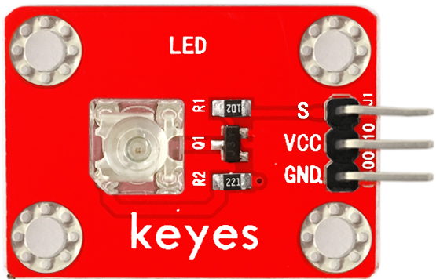
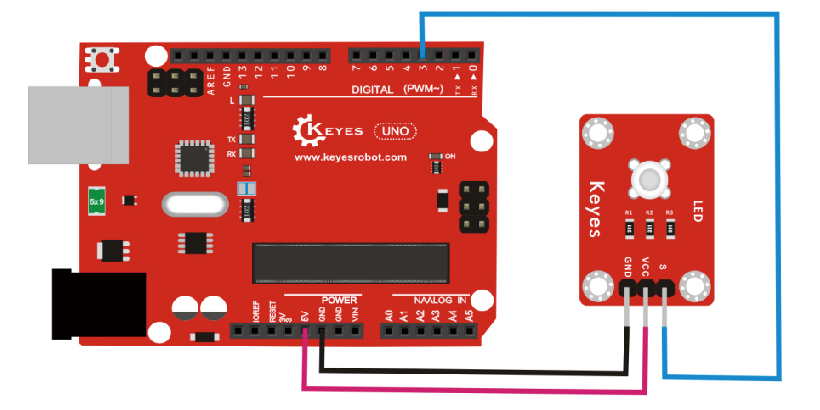
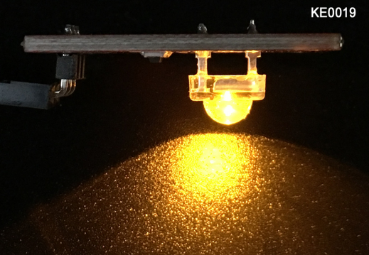

# KE0019 Keyes 食人鱼LED黄光模块详细教程



---

## **1. 介绍**

KE0019 Keyes 食人鱼LED黄光模块是一款基于高亮度食人鱼LED的模块，专为 Arduino 和其他微控制器设计。模块采用高亮度黄光食人鱼LED，具有亮度高、功耗低、寿命长、稳定性强等特点。模块自带 3PIN 接口，兼容 Arduino 传感器扩展板，适合用于电子学习、DIY 项目、智能家居等场景。模块还配备 4 个定位孔，方便固定在其他设备上。

---

## **2. 特点**

1. **高亮度**：采用高亮度黄光食人鱼LED，发光效果显著。  
2. **低功耗**：功耗低，适合电池供电的项目。  
3. **长寿命**：LED 寿命长，适合长期使用。  
4. **稳定性强**：模块性能稳定，适合各种环境下的应用。  
5. **易于使用**：3PIN 接口设计，兼容 Arduino 和其他微控制器。  
6. **固定方便**：模块自带 4 个定位孔，便于安装和固定。

---

## **3. 规格参数**

- **工作电压**：3.3V-5V（DC）  
- **接口类型**：3PIN 接口（VCC、GND、信号）  
- **输入信号**：数字信号  
- **LED 类型**：食人鱼LED  
- **发光颜色**：黄光  
- **重量**：约 2.5g  
- **尺寸**：标准模块尺寸，带 4 个定位孔  

---

## **4. 工作原理**

食人鱼LED是一种高亮度发光二极管，通过控制其正向电流来实现发光。模块通过 Arduino 或其他微控制器的数字信号控制 LED 的开关状态。当信号引脚输出高电平时，LED 点亮；当信号引脚输出低电平时，LED 熄灭。模块的工作电压范围为 3.3V-5V，适合直接连接到 Arduino 的数字引脚。

---

## **5. 接口**

模块采用 3PIN 接口设计，具体引脚功能如下：  
- **VCC**：电源正极，连接 Arduino 的 3.3V 或 5V 引脚。  
- **GND**：电源负极，连接 Arduino 的 GND 引脚。  
- **S（信号）**：控制信号引脚，连接 Arduino 的数字引脚（如 D3）。  

---

## **6. 连接图**

将 KE0019 Keyes 食人鱼LED黄光模块与 Arduino 开发板连接，具体接线如下：  



---

## **7. 示例代码**

以下是控制食人鱼LED模块以 1 秒间隔闪烁的示例代码：

```cpp
int led = 3;                     // 定义数字引脚3
void setup()
{
  pinMode(led, OUTPUT);          // 设置引脚为输出模式
}

void loop()
{
  digitalWrite(led, HIGH);       // 点亮LED
  delay(1000);                   // 延迟1秒
  digitalWrite(led, LOW);        // 熄灭LED
  delay(1000);                   // 延迟1秒
}
```

---

## **8. 实验现象**

1. 将食人鱼LED模块与 Arduino 开发板按照连接图连接好。  

2. 将示例代码烧录到 Arduino 开发板中。  

3. 上电后，食人鱼LED模块会以 1 秒的间隔闪烁：亮 1 秒，灭 1 秒。  

	

---

## **9. 注意事项**

1. **供电电压**：确保供电电压在模块支持的范围内（3.3V-5V）。  
2. **引脚连接**：连接时注意引脚对应关系，避免接错引脚导致模块损坏。  
3. **电流限制**：避免长时间过大电流通过 LED，以免缩短 LED 寿命。  
4. **固定模块**：使用定位孔固定模块时，避免用力过大损坏模块。  
5. **环境要求**：避免在高温或潮湿环境下使用模块，以确保其稳定性和寿命。  

---

## **10. 参考链接**

- **Arduino 官网**：[https://www.arduino.cc/](https://www.arduino.cc/)  
  提供 Arduino IDE 下载、官方教程和示例代码。  
- **Keyes 官网**：http://www.keyes-robot.com/ 
  提供 Keyes 产品的详细信息和技术支持。  
- **Arduino 教程资源**：[https://www.arduino.cc/en/Tutorial/HomePage](https://www.arduino.cc/en/Tutorial/HomePage)  
  提供丰富的 Arduino 教程，适合初学者和进阶用户。  

---

KE0019 Keyes 食人鱼LED黄光模块是一款简单易用的 LED 模块，适合初学者学习 Arduino 编程和电子电路设计，也适用于各种 DIY 项目和教学实验。通过其高亮度和稳定性，用户可以轻松实现各种创意项目。

