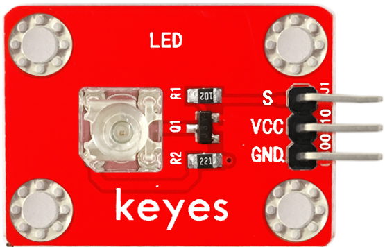

# KE0020 Keyes 食人鱼LED白光模块详细教程



---

## **1. 介绍**

KE0020 Keyes 食人鱼LED白光模块是一款基于高亮度食人鱼LED的模块，专为 Arduino 和其他微控制器设计。模块采用白光食人鱼LED，具有高亮度、低功耗、寿命长、发光均匀等特点。模块自带 3PIN 接口（VCC、GND、S），兼容 Arduino 传感器扩展板，适合用于电子学习、DIY 项目、智能家居照明等场景。

---

## **2. 特点**

1. **高亮度**：采用高亮度白光食人鱼LED，发光均匀，亮度高。  
2. **低功耗**：工作电流低，适合电池供电的项目。  
3. **长寿命**：LED 使用寿命长，稳定性高。  
4. **易于使用**：3PIN 接口设计，兼容 Arduino 和其他微控制器。  
5. **模块化设计**：小巧轻便，适合嵌入式项目和教学实验。

---

## **3. 规格参数**

- **工作电压**：3.3-5V（DC）  
- **接口类型**：3PIN 接口（VCC、GND、S）  
- **输入信号**：数字信号  
- **LED 类型**：食人鱼白光LED  
- **特点**：高亮度、低功耗、寿命长  

---

## **4. 工作原理**

食人鱼LED是一种高亮度发光二极管，通过向其正向施加电压，电流流过 LED 的 PN 结，产生电致发光现象。模块通过数字信号控制 LED 的开关状态，输入高电平时 LED 点亮，输入低电平时 LED 熄灭。模块的 3PIN 接口设计使其能够轻松与 Arduino 等微控制器连接，通过简单的代码即可实现控制。

---

## **5. 接口**

模块提供 3PIN 接口，具体功能如下：  
- **VCC**：连接 Arduino 的 5V 或 3.3V 电源引脚  
- **GND**：连接 Arduino 的 GND 引脚  
- **信号（S）**：连接 Arduino 的数字引脚，用于控制 LED 的开关  

---

## **6. 连接图**

将 KE0020 Keyes 食人鱼LED白光模块与 Arduino 开发板连接，具体接线如下：  


---

## **7. 示例代码**

以下是一个简单的示例代码，用于控制食人鱼LED模块以 1 秒的间隔闪烁：

```cpp
int led = 3;                     // 定义数字引脚3
void setup()
{
  pinMode(led, OUTPUT);          // 设置引脚为输出模式
}

void loop()
{
  digitalWrite(led, HIGH);       // 点亮LED
  delay(1000);                   // 延迟1秒
  digitalWrite(led, LOW);        // 熄灭LED
  delay(1000);                   // 延迟1秒
}
```

---

## **8. 实验现象**

1. 将食人鱼LED模块与 Arduino 开发板按照连接图连接好。  
2. 将示例代码烧录到 Arduino 开发板中。  
3. 上电后，食人鱼LED模块会以 1 秒的间隔闪烁：亮 1 秒，灭 1 秒。  

---

## **9. 注意事项**

1. **供电电压**：确保供电电压在模块支持的范围内（3.3-5V），避免过高电压损坏模块。  
2. **引脚连接**：连接时注意接口对应关系，避免接错引脚导致模块无法正常工作。  
3. **电流限制**：如果需要长时间点亮 LED，建议在信号引脚上串联一个限流电阻（如 220Ω）以保护 LED。  
4. **环境光影响**：在强光环境下，LED 的亮度可能不明显，建议在暗光环境中测试。  
5. **模块固定**：模块较小，建议使用螺丝或胶固定在设备上，避免松动影响实验效果。  

