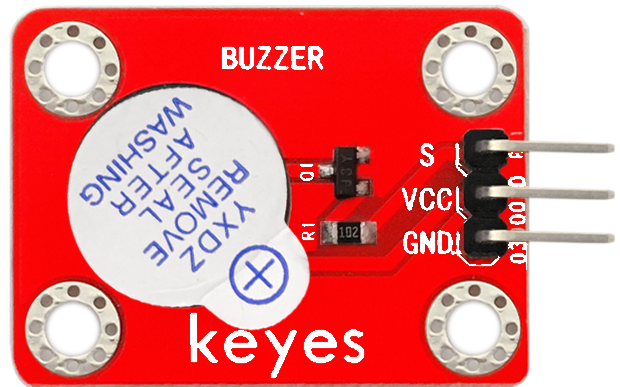
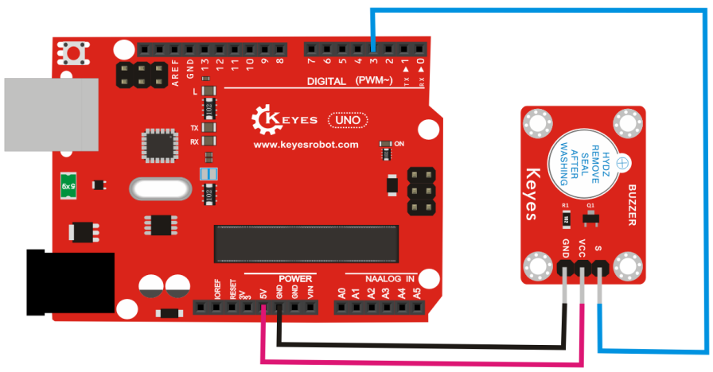

# KE0021 Keyes 有源蜂鸣器模块



---

## **1. 介绍**

KE0021 Keyes 有源蜂鸣器模块是一款专为 Arduino 和其他微控制器设计的声音输出模块。它采用有源蜂鸣器，能够通过简单的数字信号控制发出固定频率的声音。模块设计小巧，使用方便，适合各种电子项目，如报警器、提示音设备、声音反馈系统等。

与无源蜂鸣器不同，有源蜂鸣器内部集成了振荡电路，只需提供高低电平信号即可发声，无需额外的 PWM 信号控制，非常适合初学者和快速开发项目。

---

## **2. 特点**

1. **易于使用**：只需提供高低电平信号即可控制蜂鸣器发声，无需复杂的 PWM 信号。
2. **兼容性强**：与 Arduino、Raspberry Pi 等开发板兼容。
3. **小巧轻便**：模块设计紧凑，适合嵌入式项目。
4. **固定频率**：发出稳定的固定频率声音，适合报警和提示音应用。
5. **环保设计**：低功耗，长寿命。

---

## **3. 规格参数**

- **工作电压**：3.3V-5V（DC）  
- **接口类型**：3PIN 接口（VCC、GND、信号）  
- **输入信号**：数字信号（高低电平）  
- **声音频率**：固定频率（约 2kHz）  
- **特点**：内置振荡电路，稳定性高  

---

## **4. 工作原理**

有源蜂鸣器模块内部集成了振荡电路，当信号引脚接收到高电平时，振荡电路开始工作，驱动蜂鸣器发出固定频率的声音。相比无源蜂鸣器，有源蜂鸣器不需要外部提供 PWM 信号，使用更加简单。

- **高电平（3.3V 或 5V）**：蜂鸣器发声。  
- **低电平（0V）**：蜂鸣器停止发声。

---

## **5. 接口**

模块提供 3 个接口：  
- **VCC**：连接 Arduino 的 5V 或 3.3V 电源引脚。  
- **GND**：连接 Arduino 的 GND 引脚。  
- **S（信号）**：连接 Arduino 的数字引脚，用于控制蜂鸣器发声。  

---

## **6. 连接图**

将 KE0021 有源蜂鸣器模块与 Arduino 开发板连接，具体接线如下：  



---

## **7. 示例代码**

以下是一个简单的示例代码，用于控制蜂鸣器以 1 秒的间隔发声和停止：

```cpp
int buzzer = 3;                  // 定义蜂鸣器连接的数字引脚为 D3

void setup() {
  pinMode(buzzer, OUTPUT);       // 设置蜂鸣器引脚为输出模式
}

void loop() {
  digitalWrite(buzzer, HIGH);    // 蜂鸣器发声
  delay(1000);                   // 延迟 1 秒
  digitalWrite(buzzer, LOW);     // 蜂鸣器停止发声
  delay(1000);                   // 延迟 1 秒
}
```

---

## **8. 实验现象**

1. 将 KE0021 有源蜂鸣器模块与 Arduino 开发板按照连接图连接好。  
2. 将示例代码烧录到 Arduino 开发板中。  
3. 上电后，蜂鸣器会以 1 秒的间隔发声和停止，发出固定频率的声音。  

---

## **9. 注意事项**

1. **供电电压**：确保供电电压在 3.3V-5V 范围内，避免过高电压损坏模块。  
2. **信号控制**：有源蜂鸣器只需高低电平信号即可控制，无需 PWM 信号。  
3. **声音频率**：有源蜂鸣器的频率是固定的，无法通过代码调整音调。  
4. **模块固定**：模块自带定位孔，建议在项目中使用螺丝固定模块，避免松动。  
5. **环境噪声**：在嘈杂环境中，蜂鸣器的声音可能不够明显，建议根据需求选择更大功率的蜂鸣器。  

---

## **10. 参考链接**

1. **Arduino 官网**：[https://www.arduino.cc/](https://www.arduino.cc/)  
   提供 Arduino IDE 下载、官方教程和示例代码。  
2. **Keyes 官网**：[http://www.keyes-robot.com/](http://www.keyes-robot.com/)  
   提供 Keyes 产品的详细信息和技术支持。  
4. **Arduino 教程资源**：[https://www.arduino.cc/en/Tutorial/HomePage](https://www.arduino.cc/en/Tutorial/HomePage)  
   提供丰富的 Arduino 教程，适合初学者和进阶用户。  
---

KE0021 Keyes 有源蜂鸣器模块是一款简单易用的声音输出模块，非常适合初学者学习 Arduino 编程和电子电路设计。通过该模块，用户可以轻松实现报警、提示音等功能，是物联网项目开发的理想选择。

