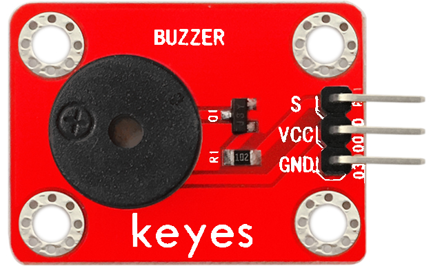
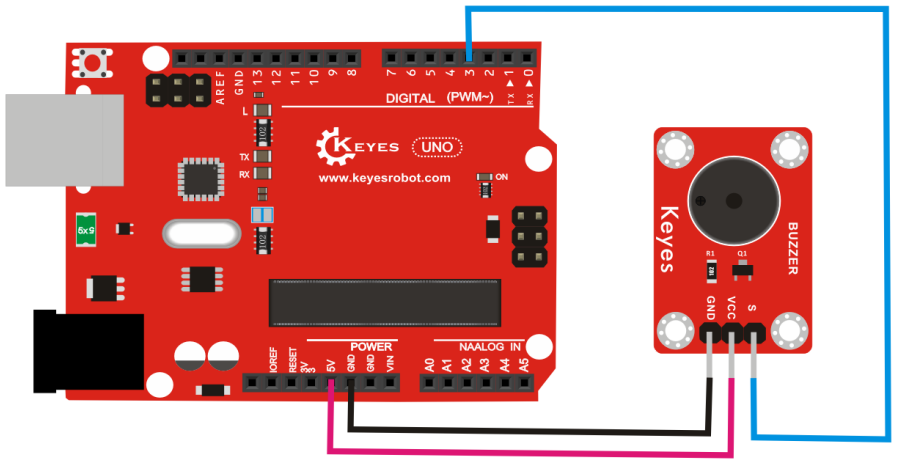

# KE0022 Keyes 无源蜂鸣器模块详细教程



---

## **1. 介绍**

KE0022 Keyes 无源蜂鸣器模块是一款专为 Arduino 和其他微控制器设计的声音输出模块。无源蜂鸣器需要通过外部信号驱动，能够发出不同频率的声音，因此可以用来播放简单的音调或音乐。模块采用标准 3PIN 接口设计，兼容 Arduino 传感器扩展板，适合电子学习、DIY 项目和声音提示功能的开发。

---

## **2. 特点**

1. **兼容性强**：支持 Arduino 和其他微控制器，接口标准化，易于连接。  
2. **灵活性高**：通过 PWM 信号控制，可发出不同频率的声音，适合播放音调或音乐。  
3. **小巧轻便**：模块体积小，重量轻，适合嵌入式项目。  
4. **易于使用**：模块设计简单，适合初学者快速上手。  

---

## **3. 规格参数**

- **工作电压**：3.3-5V（DC）  
- **接口类型**：3PIN 接口（VCC、GND、S）  
- **输入信号**：PWM 信号  
- **特点**：需要外部驱动信号，支持多种频率声音输出  

---

## **4. 工作原理**

无源蜂鸣器是一种需要外部驱动信号的声音输出设备。通过向蜂鸣器输入不同频率的 PWM 信号，蜂鸣器内部的压电陶瓷片会产生振动，从而发出对应频率的声音。  
- **低频信号**：发出低音。  
- **高频信号**：发出高音。  
- **无信号**：蜂鸣器静音。  

无源蜂鸣器与有源蜂鸣器的区别在于：无源蜂鸣器需要外部信号驱动，而有源蜂鸣器内部自带振荡电路，只需提供电源即可发声。

---

## **5. 接口**

- **VCC**：连接电源正极（3.3V 或 5V）。  
- **GND**：连接电源负极（地）。  
- **S（信号）**：连接 Arduino 的数字引脚，用于输入 PWM 信号。  

---

## **6. 连接图**

将 KE0022 无源蜂鸣器模块与 Arduino 开发板连接，具体接线如下：  
- **VCC**：连接 Arduino 的 5V 或 3.3V 电源引脚。  
- **GND**：连接 Arduino 的 GND 引脚。  
- **S（信号）**：连接 Arduino 的数字引脚（如 D3）。  

连接示意图如下：  



---

## **7. 示例代码**

以下是一个简单的示例代码，用于控制无源蜂鸣器发出不同频率的声音：

```cpp
int buzzer = 3; // 定义蜂鸣器连接的数字引脚

void setup() {
  pinMode(buzzer, OUTPUT); // 设置蜂鸣器引脚为输出模式
}

void loop() {
  tone(buzzer, 1000); // 发出 1000Hz 的声音
  delay(1000);        // 持续 1 秒
  noTone(buzzer);     // 停止发声
  delay(500);         // 停止 0.5 秒

  tone(buzzer, 1500); // 发出 1500Hz 的声音
  delay(1000);        // 持续 1 秒
  noTone(buzzer);     // 停止发声
  delay(500);         // 停止 0.5 秒
}
```

---

## **8. 实验现象**

1. 将无源蜂鸣器模块与 Arduino 开发板按照连接图连接好。  
2. 将示例代码烧录到 Arduino 开发板中。  
3. 上电后，无源蜂鸣器会发出两种不同频率的声音（1000Hz 和 1500Hz），每种声音持续 1 秒，中间间隔 0.5 秒。  

---

## **9. 注意事项**

1. **供电电压**：确保供电电压在模块支持的范围内（3.3V-5V）。  
2. **信号输入**：无源蜂鸣器需要 PWM 信号驱动，不能直接接电源发声。  
3. **引脚连接**：确保引脚连接正确，避免短路或反接。  
4. **音量控制**：无源蜂鸣器的音量无法直接调节，但可以通过改变 PWM 信号的占空比间接控制音量。  
5. **频率范围**：蜂鸣器的最佳工作频率范围为 1kHz-5kHz，超出范围可能导致声音失真或无声。  


