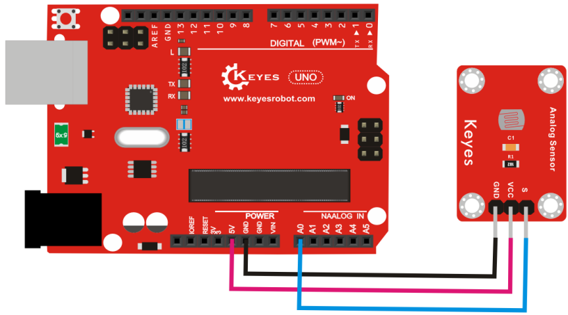

# KE0024 Keyes 光敏电阻传感器模块


---

## **1. 介绍**

KE0024 Keyes 光敏电阻传感器模块是一款基于光敏电阻的光强检测模块，适用于 Arduino 和其他微控制器开发板。光敏电阻是一种对光线敏感的电阻器，其阻值会随着光线强度的变化而变化。该模块通过检测光敏电阻的阻值变化，输出模拟信号，从而实现光强的测量。

该模块具有灵敏度高、响应速度快、稳定性好等特点，广泛应用于光线检测、环境监测、智能家居等领域。

---

## **2. 特点**

1. **高灵敏度**：对光线强度变化反应灵敏，适合实时光强监测。  
2. **稳定性好**：模块设计稳定，适合长期使用。  
3. **兼容性强**：支持 Arduino、Raspberry Pi 等多种开发板。  
4. **简单易用**：模块输出模拟信号，直接连接到开发板的模拟引脚即可读取光强变化。  
5. **小巧轻便**：便于集成到各种项目中。

---

## **3. 规格参数**

- **工作电压**：3.3V-5V  
- **输出信号**：模拟信号  
- **接口类型**：3PIN 接口（VCC、GND、AOUT）  
- **检测范围**：0-1000 Lux（具体范围取决于光敏电阻参数）  
- **灵敏度**：光线强度变化时，输出电压随之变化  

---

## **4. 工作原理**

光敏电阻是一种光敏元件，其阻值会随着光线强度的变化而变化。KE0024 模块通过一个分压电路将光敏电阻的阻值变化转换为电压信号输出。  
- 当光线强度增加时，光敏电阻的阻值减小，输出电压增大。  
- 当光线强度减弱时，光敏电阻的阻值增大，输出电压减小。  

开发板通过读取模块的模拟信号（AOUT 引脚），结合光敏电阻的特性曲线（或通过校准公式），即可计算出当前的光强值。

---

## **5. 接口**

KE0024 光敏电阻传感器模块提供 3 个引脚：  
- **VCC**：电源正极（3.3V 或 5V）  
- **GND**：电源负极  
- **AOUT**：模拟信号输出  

---

## **6. 连接图**

将 KE0024 光敏电阻传感器模块与 Arduino UNO 开发板连接，具体接线如下：  

| 模块引脚 | Arduino 引脚 |
|----------|--------------|
| VCC      | 5V           |
| GND      | GND          |
| AOUT     | A0           |

连接示意图：  



---

## **7. 示例代码**

以下是一个简单的示例代码，用于读取光敏电阻模块的模拟信号，并将其转换为光强值（需根据实际光敏电阻参数调整公式）：

```cpp
const int sensorPin = A0;  // 光敏电阻模块连接到 A0 引脚
float voltage;             // 模拟信号转换后的电压值
int lightLevel;            // 光强值（0-1023）

void setup() {
  Serial.begin(9600);      // 初始化串口通信
}

void loop() {
  int sensorValue = analogRead(sensorPin);  // 读取模拟信号
  voltage = sensorValue * (5.0 / 1023.0);   // 将模拟信号转换为电压值
  lightLevel = sensorValue;                 // 光强值直接对应模拟信号值（0-1023）

  // 输出结果到串口监视器
  Serial.print("Voltage: ");
  Serial.print(voltage);
  Serial.print(" V, Light Level: ");
  Serial.println(lightLevel);

  delay(1000);  // 延迟 1 秒
}
```

---

## **8. 实验现象**

1. 将 KE0024 光敏电阻传感器模块与 Arduino UNO 按照连接图连接好。  
2. 将示例代码上传到 Arduino 开发板。  
3. 打开 Arduino IDE 的串口监视器，选择波特率为 9600。  
4. 在串口监视器中，可以看到实时的电压值和光强值。  
5. 改变光敏电阻周围的光线强度（如用手遮挡或用手电筒照射），观察光强值的变化。


---

## **9. 注意事项**

1. **供电电压**：确保模块的供电电压在 3.3V-5V 范围内，避免损坏模块。  
2. **光敏电阻参数**：示例代码中的光强值为模拟信号值（0-1023），实际使用时需根据光敏电阻的参数调整计算公式。  
3. **环境光线**：模块适用于常规光线检测，极端光线条件下可能需要特殊处理。  
4. **校准**：为了提高测量精度，建议对模块进行校准，获取更准确的光强特性曲线。  
5. **避免短路**：在连接模块时，确保接线正确，避免短路或反接。  

---

## **10. 参考链接**

- **Arduino 官网**：[https://www.arduino.cc/](https://www.arduino.cc/)  
  提供 Arduino IDE 下载、官方教程和示例代码。  
- **Keyes 官网**：[http://www.keyes-robot.com/](http://www.keyes-robot.com/)  
  提供 Keyes 产品的详细信息和技术支持。  
- **Arduino 教程资源**：[https://www.arduino.cc/en/Tutorial/HomePage](https://www.arduino.cc/en/Tutorial/HomePage)  
  提供丰富的 Arduino 教程，适合初学者和进阶用户。  

---

KE0024 Keyes 光敏电阻传感器模块是一款简单易用的光强检测模块，适合初学者学习 Arduino 编程和传感器应用，也适用于各种智能家居和环境监测项目。通过本教程，用户可以快速上手并实现光强检测功能。

