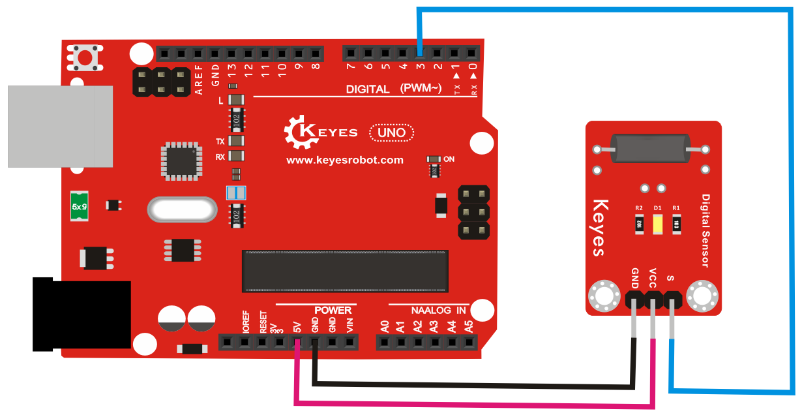

# KE0026 Keyes 倾斜传感器模块详细教程


---

## **1. 介绍**

KE0026 Keyes 倾斜传感器模块是一款基于滚珠开关的倾斜检测模块，适用于 Arduino 和其他微控制器开发板。模块通过检测滚珠开关的状态变化，输出数字信号（DOUT），从而实现倾斜状态的检测。

该模块具有灵敏度高、响应速度快、稳定性好等特点，广泛应用于倾斜检测、姿态控制、智能家居等领域。

---

## **2. 特点**

1. **高灵敏度**：对倾斜状态变化反应灵敏，适合实时检测。  
2. **稳定性好**：模块设计稳定，适合长期使用。  
3. **兼容性强**：支持 Arduino、Raspberry Pi 等多种开发板。  
4. **简单易用**：模块输出数字信号，便于开发板读取倾斜状态。  
5. **小巧轻便**：便于集成到各种项目中。

---

## **3. 规格参数**

- **工作电压**：3.3V-5V  
- **输出信号**：数字信号（DOUT）  
- **接口类型**：3PIN 接口（VCC、GND、DOUT）  
- **检测范围**：倾斜状态（水平或倾斜）  
- **灵敏度**：对倾斜状态的响应灵敏  

---

## **4. 工作原理**

KE0026 倾斜传感器模块基于滚珠开关的特性，当模块处于水平状态时，滚珠开关的触点闭合，DOUT 引脚输出低电平信号；当模块倾斜到一定角度时，滚珠开关的触点断开，DOUT 引脚输出高电平信号。  
- **DOUT（数字信号）**：用于检测模块是否倾斜。  

---

## **5. 接口**

KE0026 倾斜传感器模块提供 3 个引脚：  
- **VCC**：电源正极（3.3V 或 5V）  
- **GND**：电源负极  
- **DOUT**：数字信号输出  

---

## **6. 连接图**

将 KE0026 倾斜传感器模块与 Arduino UNO 开发板连接，具体接线如下：  

| 模块引脚 | Arduino 引脚 |
|----------|--------------|
| VCC      | 5V           |
| GND      | GND          |
| DOUT     | D3           |

连接示意图：  



---

## **7. 示例代码**

以下是一个简单的示例代码，用于读取倾斜传感器的数字信号，并在串口监视器中显示结果：

```cpp
const int tiltPin = 3;  // DOUT 引脚连接到数字引脚 D3

void setup() {
  pinMode(tiltPin, INPUT);  // 设置 DOUT 为输入
  Serial.begin(9600);       // 初始化串口通信
}

void loop() {
  int tiltState = digitalRead(tiltPin);  // 读取数字信号

  // 输出结果到串口监视器
  if (tiltState == HIGH) {
    Serial.println("Tilt detected!");  // 检测到倾斜
  } else {
    Serial.println("No tilt detected.");  // 未检测到倾斜
  }

  delay(100);  // 延迟 100 毫秒
}
```

---

## **8. 实验现象**

1. 将 KE0026 倾斜传感器模块与 Arduino UNO 按照连接图连接好。  
2. 将示例代码上传到 Arduino 开发板。  
3. 打开 Arduino IDE 的串口监视器，选择波特率为 9600。  
4. 在串口监视器中，可以看到实时的倾斜检测结果：  
   - **倾斜时**：串口监视器显示 "Tilt detected!"  
   - **水平时**：串口监视器显示 "No tilt detected."  
5. 改变模块的倾斜角度，观察数字信号的变化。

---

## **9. 注意事项**

1. **供电电压**：确保模块的供电电压在 3.3V-5V 范围内，避免损坏模块。  
2. **信号读取**：DOUT 输出为数字信号，适合检测倾斜状态。  
3. **环境干扰**：避免模块受到过多的振动干扰，以免影响检测结果。  
4. **固定模块**：在实际应用中，建议将模块固定在稳定的表面上，以提高检测精度。  
5. **避免短路**：在连接模块时，确保接线正确，避免短路或反接。  

---

## **10. 参考链接**

- **Arduino 官网**：[https://www.arduino.cc/](https://www.arduino.cc/)  
  提供 Arduino IDE 下载、官方教程和示例代码。  
- **Keyes 官网**：[http://www.keyes-robot.com/](http://www.keyes-robot.com/)  
  提供 Keyes 产品的详细信息和技术支持。  
- **Arduino 教程资源**：[https://www.arduino.cc/en/Tutorial/HomePage](https://www.arduino.cc/en/Tutorial/HomePage)  
  提供丰富的 Arduino 教程，适合初学者和进阶用户。  

---

KE0026 Keyes 倾斜传感器模块是一款简单易用的倾斜检测模块，适合初学者学习 Arduino 编程和传感器应用，也适用于各种智能家居和姿态检测项目。通过本教程，用户可以快速上手并实现倾斜检测功能。

