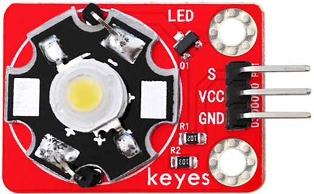
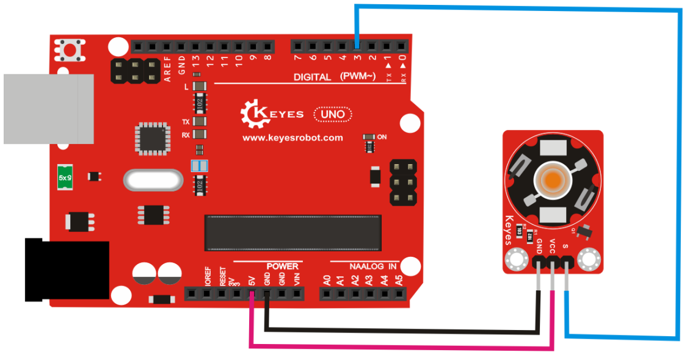

# **KE0029 Keyes 3W LED模块详细教程**



---

## **1. 介绍**

KE0029 Keyes 3W LED模块是一款高亮度的LED模块，适用于Arduino和其他微控制器开发板。该模块内置一个3W功率的LED灯珠，亮度高、功耗低，适合用于照明、指示灯、装饰灯等场景。

模块通过PWM信号控制亮度，也可以直接通过数字信号控制开关状态。

---

## **2. 特点**

1. **高亮度**：内置3W LED灯珠，亮度高，适合多种场景。  
2. **低功耗**：功耗低，适合长时间使用。  
3. **兼容性强**：支持Arduino、Raspberry Pi等多种开发板。  
4. **简单易用**：通过数字信号或PWM信号即可控制。  
5. **环保设计**：模块采用环保材料，安全可靠。

---

## **3. 规格参数**

- **工作电压**：3.3V-5V  
- **功率**：3W  
- **接口类型**：3PIN接口（VCC、GND、SIG）  
- **控制方式**：数字信号或PWM信号  
- **发光颜色**：红色  

---

## **4. 工作原理**

KE0029 3W LED模块通过控制信号引脚（SIG）来控制LED灯的亮灭或亮度：  
- **数字信号控制**：通过数字信号（HIGH/LOW）控制LED灯的开关状态。  
- **PWM信号控制**：通过PWM信号调节LED灯的亮度，PWM占空比越高，亮度越高。  

---

## **5. 接口**

KE0029 3W LED模块提供3个引脚：  
- **VCC**：电源正极（3.3V或5V）  
- **GND**：电源负极  
- **SIG**：控制信号输入（数字信号或PWM信号）  

---

## **6. 连接图**

将KE0029 3W LED模块与Arduino UNO开发板连接，具体接线如下：  

| 模块引脚 | Arduino 引脚 |
| -------- | ------------ |
| VCC      | 5V           |
| GND      | GND          |
| SIG      | D3           |

连接示意图：  



---

## **7. 示例代码**

以下是两个示例代码：  
1. **数字信号控制LED开关**  
2. **PWM信号控制LED亮度**

---

##### **示例1：数字信号控制LED开关**
```cpp
const int ledPin = 3;  // SIG 引脚连接到数字引脚 D3

void setup() {
  pinMode(ledPin, OUTPUT);  // 设置 SIG 为输出
}

void loop() {
  digitalWrite(ledPin, HIGH);  // 打开LED
  delay(1000);                 // 延迟1秒
  digitalWrite(ledPin, LOW);   // 关闭LED
  delay(1000);                 // 延迟1秒
}
```

---

##### **示例2：PWM信号控制LED亮度**
```cpp
const int ledPin = 9;  // SIG 引脚连接到数字引脚 D3

void setup() {
  pinMode(ledPin, OUTPUT);  // 设置 SIG 为输出
}

void loop() {
  for (int brightness = 0; brightness <= 255; brightness++) {  // 逐渐变亮
    analogWrite(ledPin, brightness);  // 输出PWM信号
    delay(10);  // 延迟10毫秒
  }

  for (int brightness = 255; brightness >= 0; brightness--) {  // 逐渐变暗
    analogWrite(ledPin, brightness);  // 输出PWM信号
    delay(10);  // 延迟10毫秒
  }
}
```

---

## **8. 实验现象**

1. **数字信号控制实验**：  
   - 将KE0029 3W LED模块与Arduino UNO按连接图连接好。  
   - 上传示例1代码到Arduino开发板。  
   - LED灯会以1秒的间隔亮灭交替。  

2. **PWM信号控制实验**：  
   - 将KE0029 3W LED模块与Arduino UNO按连接图连接好。  
   - 上传示例2代码到Arduino开发板。  
   - LED灯会逐渐变亮，然后逐渐变暗，循环往复。  

---

## **9. 注意事项**

1. **供电电压**：确保模块的供电电压在3.3V-5V范围内，避免损坏模块。  
2. **散热问题**：3W LED灯珠功率较高，长时间使用时可能会发热，建议在必要时添加散热措施。  
3. **信号控制**：SIG引脚既可以接数字信号，也可以接PWM信号，根据需求选择控制方式。  
4. **避免短路**：在连接模块时，确保接线正确，避免短路或反接。  

---

## **10. 参考链接**

- **Arduino 官网**：[https://www.arduino.cc/](https://www.arduino.cc/)  
  提供Arduino IDE下载、官方教程和示例代码。  
- **Keyes 官网**：[http://www.keyes-robot.com/](http://www.keyes-robot.com/)  
  提供Keyes产品的详细信息和技术支持。  
- **Arduino 教程资源**：[https://www.arduino.cc/en/Tutorial/HomePage](https://www.arduino.cc/en/Tutorial/HomePage)  
  提供丰富的Arduino教程，适合初学者和进阶用户。  

---

KE0029 Keyes 3W LED模块是一款简单易用的高亮度LED模块，适合初学者学习Arduino编程和LED控制，也适用于各种照明和装饰项目。通过本教程，用户可以快速上手并实现LED灯的控制功能。

