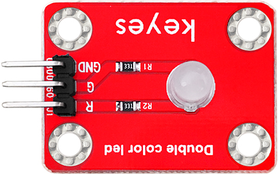
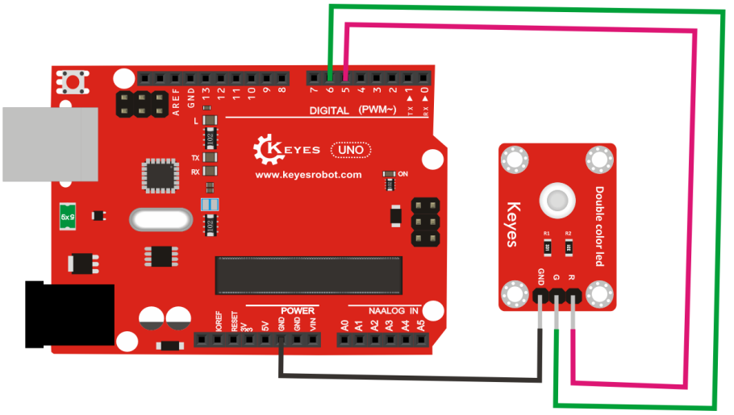

# KE0030 Keyes双色LED模块教程



## **1. 模块介绍**

KE0030 Keyes双色LED模块是一款简单易用的LED模块，集成了一个双色LED灯（红色和绿色）以及限流电阻。通过控制模块上的两个引脚（RED和GREEN），可以点亮红色、绿色或混合成黄色的光。该模块适用于Arduino等微控制器开发板，广泛用于电子实验、指示灯显示等场景。

---

## **2. 模块特点**

- **双色LED**：支持红色和绿色两种颜色，可通过PWM调节亮度。
- **简单易用**：仅需3个引脚（GND、RED、GREEN）即可控制。
- **低功耗**：内置限流电阻，无需额外电阻保护。
- **兼容性强**：适用于Arduino、树莓派等主流开发板。

---

## **3. 规格参数**

| 参数            | 值                     |
|-----------------|------------------------|
| 工作电压        | 3.3V - 5V             |
| LED颜色         | 红色、绿色            |
| 接口类型        | 3针接口（GND, RED, GREEN） |
| 模块尺寸        | 19mm x 15mm           |
| 工作电流        | 红色约20mA，绿色约20mA |
| 内置电阻        | 220Ω                  |

---

## **4. 工作原理**

KE0030模块的双色LED灯包含两个发光二极管（红色和绿色），共用一个阴极（GND）。通过向RED或GREEN引脚施加高电平信号，可以分别点亮红色或绿色LED。如果同时向RED和GREEN引脚施加高电平，红绿光会混合成黄色。

- **红色灯亮**：RED引脚高电平，GREEN引脚低电平。
- **绿色灯亮**：GREEN引脚高电平，RED引脚低电平。
- **黄色灯亮**：RED和GREEN引脚同时高电平。

---

## **5. 接口说明**

模块有3个引脚：
1. **GND**：接地。
2. **RED**：控制红色LED的引脚。
3. **GREEN**：控制绿色LED的引脚。

---

## **6. 连接图**

以下是KE0030模块与Arduino UNO的连接示意图：

| KE0030模块引脚 | Arduino引脚 |
| -------------- | ----------- |
| GND            | GND         |
| RED            | D5          |
| GREEN          | D6          |

连接图如下：



---

## **7. 示例代码**

以下是一个Arduino示例代码，用于控制双色LED模块显示红色、绿色和黄色。

```cpp
// 定义引脚
#define RED_PIN 5
#define GREEN_PIN 6

void setup() {
  // 设置引脚为输出模式
  pinMode(RED_PIN, OUTPUT);
  pinMode(GREEN_PIN, OUTPUT);
}

void loop() {
  // 点亮红色
  digitalWrite(RED_PIN, HIGH);
  digitalWrite(GREEN_PIN, LOW);
  delay(1000); // 延迟1秒

  // 点亮绿色
  digitalWrite(RED_PIN, LOW);
  digitalWrite(GREEN_PIN, HIGH);
  delay(1000); // 延迟1秒

  // 点亮黄色（红绿同时亮）
  digitalWrite(RED_PIN, HIGH);
  digitalWrite(GREEN_PIN, HIGH);
  delay(1000); // 延迟1秒

  // 关闭所有灯
  digitalWrite(RED_PIN, LOW);
  digitalWrite(GREEN_PIN, LOW);
  delay(1000); // 延迟1秒
}
```

---

## **8. 实验现象**

运行上述代码后，双色LED模块会按照以下顺序显示：
1. 红色亮1秒。
2. 绿色亮1秒。
3. 黄色亮1秒（红绿同时亮）。
4. 熄灭1秒。

循环重复上述过程。

---

## **9. 注意事项**

1. **电压范围**：确保模块工作在3.3V-5V范围内，避免损坏LED。
2. **限流保护**：模块已内置限流电阻，无需额外添加电阻。
3. **引脚连接**：确保GND正确连接，否则LED无法正常工作。
4. **PWM调节**：如果需要调节亮度，可以使用PWM信号控制RED和GREEN引脚。
5. **避免短路**：在连接模块时，注意避免引脚短路。

---

## **10. 参考链接**

以下是一些有助于开发的参考链接：
- [Arduino官网](https://www.arduino.cc/)
- [Keyes官网](http://www.keyes-robot.com/)
- [Arduino PWM教程](https://www.arduino.cc/en/Tutorial/PWM)

