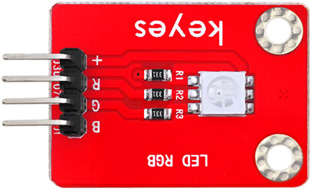
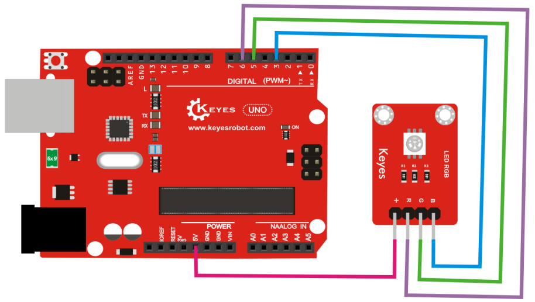

# KE0031 Keyes 贴片RGB模块



---

## **1. 介绍**

KE0031 Keyes 贴片RGB模块是一款基于贴片式RGB LED灯珠的模块，适用于Arduino和其他微控制器开发板。该模块通过控制红色、绿色和蓝色三种颜色的亮度，可以实现多种颜色的混合显示，广泛应用于装饰灯、状态指示灯和多彩显示等场景。

---

## **2. 特点**

1. **多彩显示**：支持红、绿、蓝三基色的混合，能够显示多种颜色。  
2. **PWM控制**：通过PWM信号调节亮度，实现颜色渐变和动态效果。  
3. **兼容性强**：支持Arduino、Raspberry Pi等多种开发板。  
4. **环保设计**：模块采用环保材料，安全可靠。  
5. **小巧轻便**：贴片式设计，便于集成到各种项目中。

---

## **3. 规格参数**

- **工作电压**：3.3V-5V  
- **输出信号**：PWM信号  
- **接口类型**：4PIN接口（VCC、R、G、B）  
- **发光颜色**：红色、绿色、蓝色及其混合颜色  

---

## **4. 工作原理**

KE0031 贴片RGB模块通过控制红色（R）、绿色（G）和蓝色（B）三基色的亮度来实现颜色的混合显示：  
- **单色显示**：通过控制单个颜色引脚的高低电平点亮对应颜色。  
- **混合显示**：通过PWM信号调节多个颜色引脚的亮度，实现颜色混合。  
- **颜色渐变**：通过动态改变PWM信号的占空比，实现颜色的渐变效果。  

---

## **5. 接口**

KE0031 贴片RGB模块提供 **4 个引脚**：  
- **VCC**：电源正极（3.3V 或 5V）  
- **R**：红色控制信号输入（PWM信号）  
- **G**：绿色控制信号输入（PWM信号）  
- **B**：蓝色控制信号输入（PWM信号）  

---

## **6. 连接图**

将KE0031 贴片RGB模块与Arduino UNO开发板连接，具体接线如下：  

| 模块引脚 | Arduino 引脚 |
| -------- | ------------ |
| VCC      | 5V           |
| R        | D6           |
| G        | D5           |
| B        | D3           |

连接示意图：  



---

## **7. 示例代码**

以下是两个示例代码：  
1. **单色显示和混合颜色控制**  
2. **颜色渐变效果**

---

##### **示例1：单色显示和混合颜色控制**
```cpp
const int redPin = 6;   // R 引脚连接到数字引脚 D6
const int greenPin = 5; // G 引脚连接到数字引脚 D5
const int bluePin = 3;  // B 引脚连接到数字引脚 D3

void setup() {
  pinMode(redPin, OUTPUT);   // 设置 R 为输出
  pinMode(greenPin, OUTPUT); // 设置 G 为输出
  pinMode(bluePin, OUTPUT);  // 设置 B 为输出
}

void loop() {
  // 红色显示
  analogWrite(redPin, 255);  // 红色全亮
  analogWrite(greenPin, 0);  // 绿色关闭
  analogWrite(bluePin, 0);   // 蓝色关闭
  delay(1000);               // 延迟1秒

  // 绿色显示
  analogWrite(redPin, 0);  
  analogWrite(greenPin, 255);  
  analogWrite(bluePin, 0);  
  delay(1000);

  // 蓝色显示
  analogWrite(redPin, 0);  
  analogWrite(greenPin, 0);  
  analogWrite(bluePin, 255);  
  delay(1000);

  // 混合颜色（黄色）
  analogWrite(redPin, 255);  
  analogWrite(greenPin, 255);  
  analogWrite(bluePin, 0);  
  delay(1000);

  // 混合颜色（紫色）
  analogWrite(redPin, 255);  
  analogWrite(greenPin, 0);  
  analogWrite(bluePin, 255);  
  delay(1000);

  // 混合颜色（青色）
  analogWrite(redPin, 0);  
  analogWrite(greenPin, 255);  
  analogWrite(bluePin, 255);  
  delay(1000);

  // 白色显示（红绿蓝全亮）
  analogWrite(redPin, 255);  
  analogWrite(greenPin, 255);  
  analogWrite(bluePin, 255);  
  delay(1000);
}
```

---

##### **示例2：颜色渐变效果**
```cpp
const int redPin = 6;   // R 引脚连接到数字引脚 D6
const int greenPin = 5; // G 引脚连接到数字引脚 D5
const int bluePin = 3;  // B 引脚连接到数字引脚 D3

void setup() {
  pinMode(redPin, OUTPUT);   // 设置 R 为输出
  pinMode(greenPin, OUTPUT); // 设置 G 为输出
  pinMode(bluePin, OUTPUT);  // 设置 B 为输出
}

void loop() {
  for (int i = 0; i <= 255; i++) {  // 红色逐渐变亮
    analogWrite(redPin, i);
    delay(10);
  }
  for (int i = 255; i >= 0; i--) {  // 红色逐渐变暗
    analogWrite(redPin, i);
    delay(10);
  }

  for (int i = 0; i <= 255; i++) {  // 绿色逐渐变亮
    analogWrite(greenPin, i);
    delay(10);
  }
  for (int i = 255; i >= 0; i--) {  // 绿色逐渐变暗
    analogWrite(greenPin, i);
    delay(10);
  }

  for (int i = 0; i <= 255; i++) {  // 蓝色逐渐变亮
    analogWrite(bluePin, i);
    delay(10);
  }
  for (int i = 255; i >= 0; i--) {  // 蓝色逐渐变暗
    analogWrite(bluePin, i);
    delay(10);
  }
}
```

---

## **8. 实验现象**

1. **单色显示和混合颜色控制实验**：  
   - LED灯会依次显示红色、绿色、蓝色、黄色、紫色、青色和白色，每种颜色持续1秒。  

2. **颜色渐变效果实验**：  
   - LED灯会依次显示红色、绿色和蓝色的渐变效果，颜色逐渐变亮和变暗。  
   
   	

---

## **9. 注意事项**

1. **供电电压**：确保模块的供电电压在3.3V-5V范围内，避免损坏模块。  
2. **PWM控制**：使用PWM信号控制R、G、B引脚的亮度，注意不要接错引脚。  
3. **避免短路**：在连接模块时，确保接线正确，避免短路或反接。  
4. **散热问题**：长时间使用时，LED可能会发热，建议适当散热。  

---

## **10. 参考链接**

- **Arduino 官网**：[https://www.arduino.cc/](https://www.arduino.cc/)  
- **Keyes 官网**：[http://www.keyes-robot.com/](http://www.keyes-robot.com/)  

---

KE0031 Keyes 贴片RGB模块是一款功能强大的RGB LED模块，适合初学者学习Arduino编程和RGB灯控制，也适用于各种装饰和多彩显示项目。通过本教程，用户可以快速上手并实现RGB灯的控制功能。

---

如果需要继续介绍其他模块，请告诉我！

