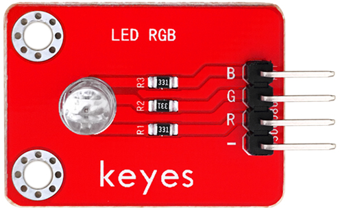
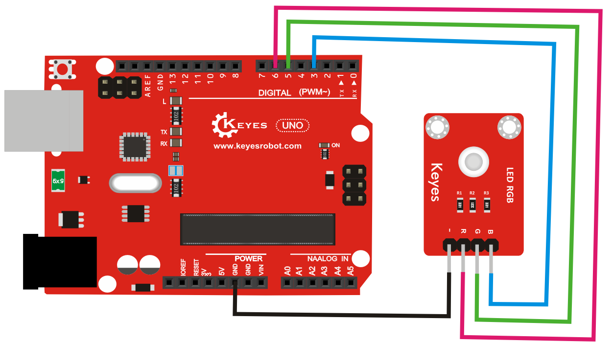

# KE0032 Keyes 插件RGB模块教程



## **1. 模块介绍**

Keyes 插件RGB模块（KE0032）是一款集成了红、绿、蓝三色LED的模块，通过控制三个引脚（R、G、B）可以实现多种颜色的组合显示。模块内置限流电阻，适合直接与Arduino等微控制器连接，广泛用于RGB灯光控制、颜色显示等场景。

---

## **2. 模块特点**

- **三色LED**：支持红、绿、蓝三种颜色，可通过PWM调节亮度，混合出多种颜色。
- **简单易用**：仅需4个引脚（GND、R、G、B）即可控制。
- **内置限流电阻**：无需额外添加电阻，保护LED。
- **兼容性强**：适用于Arduino、树莓派等主流开发板。

---

## **3. 规格参数**

| 参数            | 值                     |
|-----------------|------------------------|
| 工作电压        | 3.3V - 5V             |
| LED颜色         | 红色、绿色、蓝色      |
| 接口类型        | 4针接口（GND, R, G, B） |
| 模块尺寸        | 19mm x 15mm           |
| 工作电流        | 每个颜色约20mA         |
| 内置电阻        | 220Ω                  |

---

## **4. 工作原理**

RGB模块的核心是一个三色LED灯（红、绿、蓝），通过控制R、G、B三个引脚的电平，可以分别点亮对应的颜色。通过PWM信号调节每个引脚的占空比，可以实现颜色的混合和亮度的调节。

- **红色灯亮**：R引脚高电平，G和B引脚低电平。
- **绿色灯亮**：G引脚高电平，R和B引脚低电平。
- **蓝色灯亮**：B引脚高电平，R和G引脚低电平。
- **混合颜色**：同时向多个引脚施加高电平或PWM信号。

---

## **5. 接口说明**

模块有4个引脚：
1. **GND**：接地。
2. **R**：控制红色LED的引脚。
3. **G**：控制绿色LED的引脚。
4. **B**：控制蓝色LED的引脚。

---

## **6. 连接图**

以下是KE0032模块与Arduino UNO的连接示意图：

| KE0032模块引脚 | Arduino引脚 |
| -------------- | ----------- |
| GND            | GND         |
| R              | D6          |
| G              | D5          |
| B              | D3          |

连接图如下：



---

## **7. 示例代码**

以下是一个Arduino示例代码，用于控制RGB模块显示红色、绿色、蓝色和混合颜色。

```cpp
// 定义引脚
#define RED_PIN 3
#define GREEN_PIN 5
#define BLUE_PIN 6

void setup() {
  // 设置引脚为输出模式
  pinMode(RED_PIN, OUTPUT);
  pinMode(GREEN_PIN, OUTPUT);
  pinMode(BLUE_PIN, OUTPUT);
}

void loop() {
  // 红色
  digitalWrite(RED_PIN, HIGH);
  digitalWrite(GREEN_PIN, LOW);
  digitalWrite(BLUE_PIN, LOW);
  delay(1000); // 延迟1秒

  // 绿色
  digitalWrite(RED_PIN, LOW);
  digitalWrite(GREEN_PIN, HIGH);
  digitalWrite(BLUE_PIN, LOW);
  delay(1000); // 延迟1秒

  // 蓝色
  digitalWrite(RED_PIN, LOW);
  digitalWrite(GREEN_PIN, LOW);
  digitalWrite(BLUE_PIN, HIGH);
  delay(1000); // 延迟1秒

  // 混合颜色（紫色）
  digitalWrite(RED_PIN, HIGH);
  digitalWrite(GREEN_PIN, LOW);
  digitalWrite(BLUE_PIN, HIGH);
  delay(1000); // 延迟1秒

  // 关闭所有灯
  digitalWrite(RED_PIN, LOW);
  digitalWrite(GREEN_PIN, LOW);
  digitalWrite(BLUE_PIN, LOW);
  delay(1000); // 延迟1秒
}
```

---

## **8. 实验现象**

运行上述代码后，RGB模块会按照以下顺序显示：
1. 红色亮1秒。
2. 绿色亮1秒。
3. 蓝色亮1秒。
4. 紫色亮1秒（红蓝混合）。
5. 熄灭1秒。

循环重复上述过程。

---

## **9. 注意事项**

1. **电压范围**：确保模块工作在3.3V-5V范围内，避免损坏LED。

2. **限流保护**：模块已内置限流电阻，无需额外添加电阻。

3. **引脚连接**：确保GND正确连接，否则LED无法正常工作。

4. **PWM调节**：如果需要调节亮度或实现更多颜色，可以使用PWM信号控制R、G、B引脚。

	

5. **避免短路**：在连接模块时，注意避免引脚短路。

---

## **10. 参考链接**

以下是一些有助于开发的参考链接：
- [Arduino官网](https://www.arduino.cc/)
- [Keyes官网](http://www.keyes-robot.com/)
- [Arduino PWM教程](https://www.arduino.cc/en/Tutorial/PWM)
- [RGB LED原理介绍](https://en.wikipedia.org/wiki/RGB_LED)

