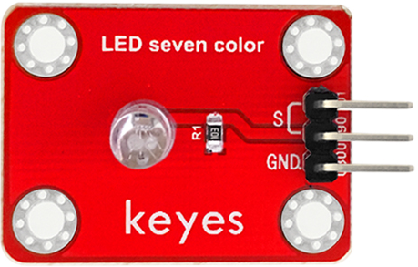
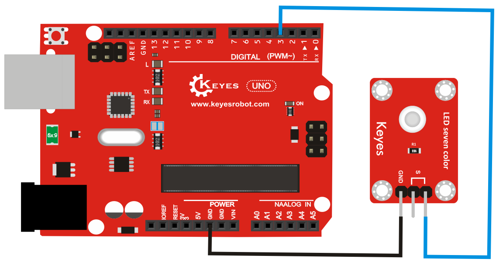
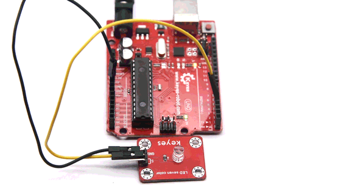

# **KE0033 Keyes 7彩自动闪烁模块详细教程**



---

## **1. 概述**

本模块由 **F5MM 七彩发光二极管** 制成，具有自动闪烁功能。模块的两个信号端（S）是连通的，当任一信号端接高电平，GND接地时，模块的LED会发出粉、黄、绿三色光，并通过三色闪烁产生七彩的效果。模块自带4个定位孔，方便将模块固定在其他设备上，适合用于装饰、指示灯或电子实验。

---

## **2. 模块特点**

- **七彩效果**：通过粉、黄、绿三色光的快速闪烁，产生七彩视觉效果。
- **高亮度LED**：采用高亮度LED灯珠，光线柔和。
- **固定方便**：模块自带4个定位孔，便于安装。
- **兼容性强**：适用于Arduino、树莓派等开发板，也可单独使用。

---

## **3. 规格参数**

| 参数            | 值                     |
|-----------------|------------------------|
| 发光颜色        | 粉、黄、绿（高亮度）  |
| 镜头类型        | 白色雾状              |
| 接口类型        | 3PIN接口（只需接两个） |
| 输入信号        | 3.3V - 5V             |

---

## **4. 工作原理**

KE0033模块的核心是一个F5MM七彩发光二极管。模块的两个信号端（S）是连通的，当任一信号端接高电平，GND接地时，LED会自动开始闪烁。LED通过粉、黄、绿三色光的快速切换，产生七彩的视觉效果。

---

## **5. 接口说明**

模块有3个引脚，但只需连接其中两个：
1. **S**：信号引脚（接开发板的IO口）。
2. **GND**：电源负极（接地）。

---

## **6. 连接图**

以下是KE0033模块与Arduino UNO的连接示意图：

| KE0033模块引脚 | Arduino引脚 |
|----------------|-------------|
| S              | IO口）|
| GND            | GND         |

连接图如下：



如果不使用Arduino，也可以直接将模块的S引脚连接到电源正极（如USB供电模块或电池），GND引脚连接到电源负极。

---

## **7. 示例代码**

```cpp
// 定义模块的电源引脚
#define MODULE_POWER_PIN 3

void setup() {
  // 设置电源引脚为输出模式
  pinMode(MODULE_POWER_PIN, OUTPUT);
}

void loop() {
  // 打开模块电源
  digitalWrite(MODULE_POWER_PIN, HIGH);
  delay(5000); // 模块运行5秒

  // 关闭模块电源
  digitalWrite(MODULE_POWER_PIN, LOW);
  delay(5000); // 模块关闭5秒
}
```

在此代码中，模块的S引脚需要连接到Arduino的数字引脚（如D9），通过控制高低电平实现模块的开关。

---

## **8. 实验现象**



1. 当模块接通电源后，LED灯会自动开始闪烁。
2. LED灯会按照粉、黄、绿三色光的快速切换，产生七彩的视觉效果。
3. 颜色变化平滑且自动，无需外部干预。

---

## **9. 注意事项**

1. **电压范围**：确保模块工作在3.3V-5V范围内，避免损坏LED。
2. **连接正确**：确保S和GND连接正确，否则模块无法正常工作。
3. **避免短路**：在连接模块时，注意避免引脚短路。


---

## **10. 参考链接**

以下是一些有助于开发的参考链接：
- [Arduino官网](https://www.arduino.cc/)
- [Keyes官网](http://www.keyes-robot.com/)
- [LED工作原理介绍](https://en.wikipedia.org/wiki/LED_circuit)

