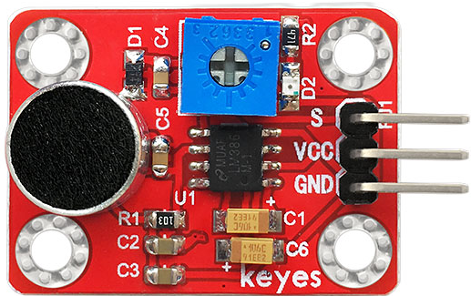
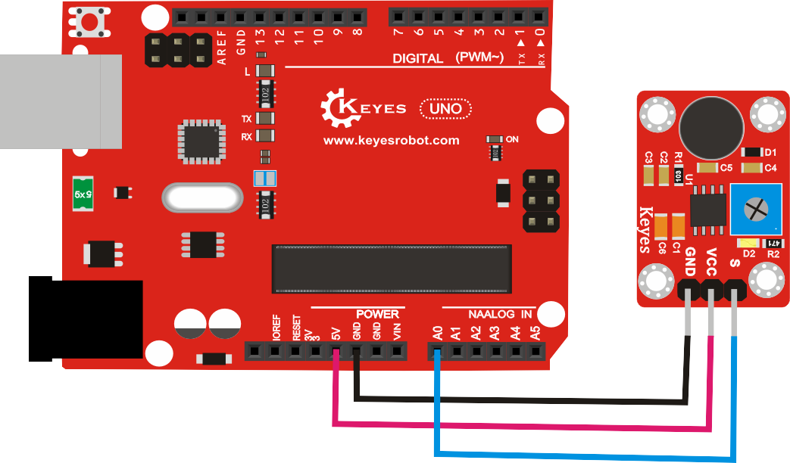
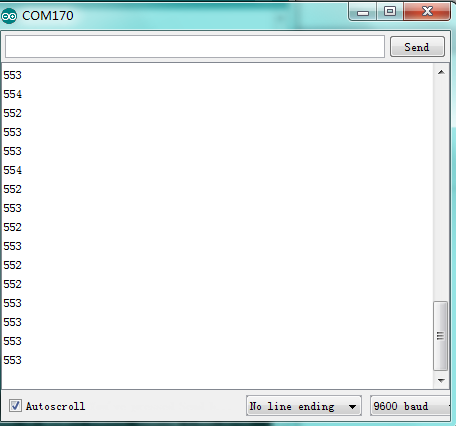
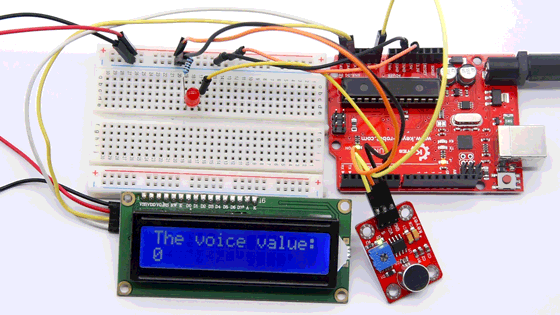

# **KE0034 Keyes 麦克风声音传感器模块详细教程**



---

## **1. 概述**

KE0034 Keyes 麦克风声音传感器模块是一款基于电容式麦克风的声音检测模块，能够检测环境中的声音强度变化。模块通过麦克风采集声音信号，并通过内置的信号放大电路将声音信号转换为模拟信号输出（S）。适用于声音检测、语音识别、声音触发等场景。

---

## **2. 模块特点**

- **声音检测**：能够检测环境中的声音强度变化。
- **模拟信号输出**：通过S引脚输出声音信号的模拟电压值。
- **灵敏度可调**：通过板载电位器调节灵敏度。
- **简单易用**：兼容Arduino、树莓派等开发板。

---

## **3. 规格参数**

| 参数            | 值                     |
|-----------------|------------------------|
| 工作电压        | 3.3V - 5V             |
| 输出信号        | 模拟信号（S）          |
| 灵敏度调节      | 支持（通过电位器）     |
| 接口类型        | 3PIN接口（VCC, GND, S） |

---

## **4. 工作原理**

KE0034模块通过电容式麦克风采集环境中的声音信号，并通过内置的信号放大电路将声音信号放大。模块通过S引脚输出声音信号的模拟电压值，反映声音强度的变化。通过板载电位器可以调节声音检测的灵敏度。

---

## **5. 接口说明**

模块有3个引脚：
1. **VCC**：电源正极（3.3V-5V）。
2. **GND**：电源负极（接地）。
3. **S**：模拟信号输出（连接开发板的模拟输入引脚）。

---

## **6. 连接图**

以下是KE0034模块与Arduino UNO的连接示意图：

| KE0034模块引脚 | Arduino引脚 |
|----------------|-------------|
| VCC            | 5V          |
| GND            | GND         |
| S              | A0          |

连接图如下：



---

## **7. 示例代码**

以下是使用KE0034模块的Arduino示例代码，读取模拟信号（S）并在串口监视器中显示声音强度的变化：

```cpp
// 定义模拟信号引脚
#define SIGNAL_PIN A0  // S连接到模拟引脚A0

void setup() {
  // 初始化串口通信
  Serial.begin(9600);
}

void loop() {
  // 读取模拟信号
  int signalValue = analogRead(SIGNAL_PIN);
  
  // 打印模拟信号值
  Serial.print("Sound Signal: ");
  Serial.println(signalValue);
  
  delay(500); // 延迟500ms
}
```

---

## **8. 实验现象**

1. **模拟信号（S）**：
   - S引脚输出的模拟电压值会随着声音强度的变化而变化。
   - 在串口监视器中可以看到模拟信号的实时变化。
   - 当环境声音较大时，S的输出值会增大；当环境声音较小时，S的输出值会减小。



---

## **9. 注意事项**

1. **电压范围**：确保模块工作在3.3V-5V范围内，避免损坏模块。
2. **灵敏度调节**：通过旋转板载电位器调节声音检测的灵敏度。
3. **避免干扰**：模块对环境噪声较敏感，建议在安静环境下测试。
4. **固定模块**：模块运行时建议固定在稳定的位置，避免震动影响检测效果。

---

## **10. 应用场景**



- **声音触发**：如声音控制的灯光、报警器等。
- **语音识别**：作为语音识别系统的前端声音采集模块。
- **环境监测**：检测环境中的声音强度变化。

---

## **11. 参考链接**

以下是一些有助于开发的参考链接：
- [Arduino官网](https://www.arduino.cc/)
- [Keyes官网](http://www.keyes-robot.com/)
- [麦克风工作原理介绍](https://en.wikipedia.org/wiki/Microphone)

---

如果需要继续其他模块的教程或有其他问题，请告诉我！

