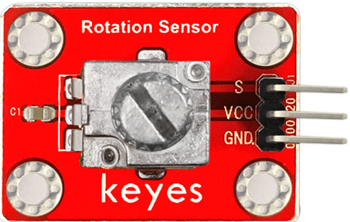
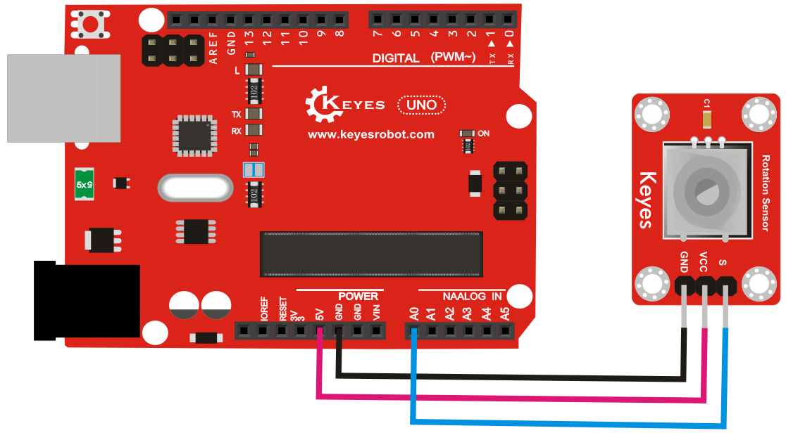
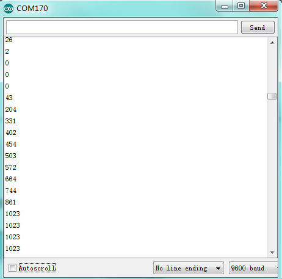

# **KE0036 Keyes 可调电位器模块**



---

## **1. 介绍**

KE0036 Keyes 可调电位器模块是一款基于旋转电位器的模拟输入模块，适用于 Arduino、树莓派等开发板。通过旋转电位器，可以输出一个可调的模拟信号（A0），用于控制亮度、音量、速度等参数。模块设计简单，易于使用，适合初学者学习模拟信号的输入与处理。

---

## **2. 特点**

- **模拟信号输出**：通过旋转电位器输出一个可调的模拟电压信号。
- **高兼容性**：兼容 Arduino、树莓派等开发板。
- **简单易用**：模块设计紧凑，适合快速原型开发。
- **精准调节**：通过旋转电位器实现精确的模拟信号调节。

---

## **3. 规格参数**

| 参数            | 值                     |
|-----------------|------------------------|
| **工作电压**    | 3.3V - 5V（DC）        |
| **输出信号**    | 模拟信号（A0）         |
| **接口类型**    | 3PIN接口（VCC, GND, A0） |
| **电位器类型**  | 10K欧姆旋转电位器       |
| **工作温度范围**| -10℃ ～ +70℃          |
| **重量**        | 3.5g                   |

---

## **4. 工作原理**

KE0036 可调电位器模块的核心是一个 10K 欧姆的旋转电位器。通过旋转电位器的旋钮，可以改变电位器的分压比，从而输出一个可调的模拟电压信号（A0）。输出电压范围为 0V 到 VCC（通常为 5V），具体电压值与旋钮的旋转角度成正比。

---

## **5. 接口说明**

模块有3个引脚：
1. **VCC**：电源正极（3.3V-5V）。
2. **GND**：电源负极（接地）。
3. **A0**：模拟信号输出（连接开发板的模拟输入引脚）。

---

## **6. 连接图**

以下是 KE0036 模块与 Arduino UNO 的连接示意图：

| KE0036模块引脚 | Arduino引脚 |
|----------------|-------------|
| VCC            | 5V          |
| GND            | GND         |
| A0             | A0          |

连接图如下：



---

## **7. 示例代码**

以下是用于测试 KE0036 模块的 Arduino 示例代码：

```cpp
void setup() {
  Serial.begin(9600); // 设置串口波特率为9600
}

void loop() {
  int sensorValue = analogRead(A0); // 读取A0引脚的模拟信号值
  Serial.println(sensorValue); // 打印读取到的数值
  delay(500); // 延迟500ms
}
```

---

## **8. 实验现象**

1. **测试步骤**：
   - 按照连接图接线，将模块连接到 Arduino。
   - 将代码烧录到 Arduino 开发板中。
   - 上电后，打开 Arduino IDE 的串口监视器，设置波特率为 9600。
   - 旋转电位器的旋钮，观察串口监视器中显示的数值变化。

2. **实验现象**：
   - 当电位器旋钮旋转到最小位置时，串口监视器显示的数值接近 0。
   - 当电位器旋钮旋转到最大位置时，串口监视器显示的数值接近 1023（对应 5V）。
   - 旋钮在中间位置时，显示的数值为 0 到 1023 之间的某个值。
   
   

---

## **9. 注意事项**

1. **电压范围**：确保模块工作在 3.3V-5V 范围内，避免损坏模块。
2. **旋钮调节**：旋转电位器时请勿用力过猛，以免损坏旋钮。
3. **固定模块**：建议将模块固定在稳定的位置，避免震动影响测试结果。
4. **环境影响**：模块对电源电压较敏感，建议使用稳定的电源供电。

---

## **10. 应用场景**

- **亮度调节**：用于 LED 灯的亮度控制。
- **音量调节**：用于音频设备的音量控制。
- **速度控制**：用于电机的速度调节。
- **模拟输入学习**：适合初学者学习模拟信号的输入与处理。

---

## **11. 参考链接**

以下是一些有助于开发的参考链接：
- [Arduino官网](https://www.arduino.cc/)
- [Keyes官网](http://www.keyes-robot.com/)
- [电位器工作原理介绍](https://en.wikipedia.org/wiki/Potentiometer)

---

如果需要补充其他内容或有其他问题，请告诉我！

