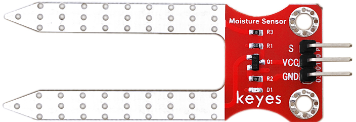
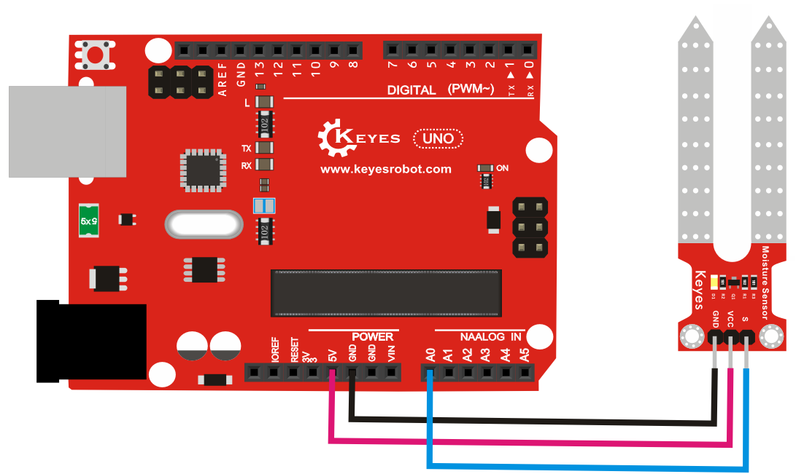
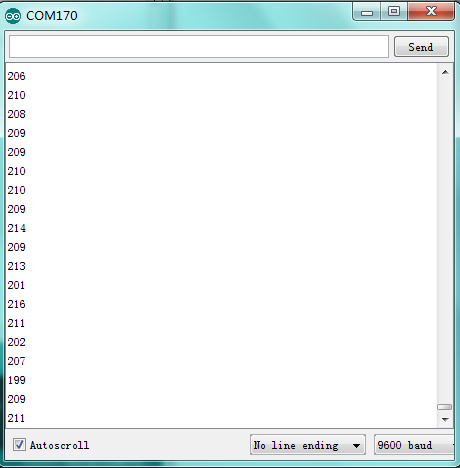
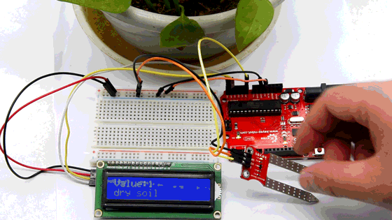

# **KE0038 Keyes 土壤湿度传感器模块详细教程**



---

## **1. 介绍**

KE0038 Keyes 土壤湿度传感器是一款基于模拟信号输出的传感器模块，专为 Arduino 等开发板设计。它通过感应板上的焊盘孔检测土壤的湿度，并输出相应的模拟信号。模块采用红色环保 PCB 板，设计简单，易于使用，适用于土壤湿度检测、农业灌溉控制等场景。

---

## **2. 特点**

- **土壤湿度检测**：通过感应板上的焊盘孔检测土壤的湿度。
- **模拟信号输出**：通过 A0 引脚输出土壤湿度的模拟电压值。
- **高兼容性**：兼容 Arduino、树莓派等开发板。
- **环保设计**：采用红色环保 PCB 板，耐用且稳定。
- **易于固定**：模块自带两个定位孔，方便安装。

---

## **3. 规格参数**

| 参数            | 值                     |
|-----------------|------------------------|
| **工作电压**    | 3.3V - 5V（DC）        |
| **接口类型**    | 3PIN接口（VCC, GND, A0） |
| **输出信号**    | 模拟信号               |
| **工作温度范围**| -10℃ ～ +70℃          |
| **重量**        | 3.0g                   |

---

## **4. 工作原理**

KE0038 土壤湿度传感器模块通过感应板上的焊盘孔检测土壤的湿度。当土壤湿度较高时，感应板的电阻值会降低，从而输出较高的模拟信号（A0）。输出的电压值与土壤湿度成正比，土壤越湿润，输出电压越高。

---

## **5. 接口说明**

模块有3个引脚：
1. **VCC**：电源正极（3.3V-5V）。
2. **GND**：电源负极（接地）。
3. **A0**：模拟信号输出（连接开发板的模拟输入引脚）。

---

## **6. 连接图**

以下是 KE0038 模块与 Arduino UNO 的连接示意图：

| KE0038模块引脚 | Arduino引脚 |
|----------------|-------------|
| VCC            | 5V          |
| GND            | GND         |
| A0             | A0          |

连接图如下：



---

## **7. 示例代码**

以下是用于测试 KE0038 模块的 Arduino 示例代码：

```cpp
void setup() {
  Serial.begin(9600); // 设置串口波特率为9600
}

void loop() {
  int sensorValue = analogRead(A0); // 读取A0引脚的模拟信号值
  Serial.println(sensorValue); // 打印读取到的数值
  delay(500); // 延迟500ms
}
```

---

## **8. 实验现象**

1. **测试步骤**：
   - 按照连接图接线，将模块连接到 Arduino。
   - 将代码烧录到 Arduino 开发板中。
   - 上电后，打开 Arduino IDE 的串口监视器，设置波特率为 9600。
   - 将传感器插入湿润或干燥的土壤中，观察串口监视器中显示的数值变化。

2. **实验现象**：
   - 当传感器插入干燥土壤时，串口监视器显示的数值较低。
   - 当传感器插入湿润土壤时，串口监视器显示的数值较高。
   - 土壤越湿润，显示的数值越大（最大值接近 1023，对应 5V）。
   
   

---

## **9. 注意事项**

1. **电压范围**：确保模块工作在 3.3V-5V 范围内，避免损坏模块。
2. **清洁传感器表面**：使用后建议清洁传感器表面，避免土壤残留影响检测效果。
3. **避免短路**：传感器表面可能会有湿气残留，使用时需注意避免引脚短路。
4. **固定模块**：通过模块上的定位孔将其固定在稳定的位置，避免震动影响测试结果。
5. **土壤类型**：不同类型的土壤可能会影响传感器的灵敏度，建议在实际使用前进行校准。

---

## **10. 应用场景**

- **土壤湿度检测**：监测土壤湿度，用于农业灌溉控制。

	

- **植物养护**：检测植物盆栽的土壤湿度，提醒浇水。

- **环境监测**：用于土壤湿度的实时监测。

- **智能农业**：结合其他传感器实现智能农业系统。

---

## **11. 参考链接**

以下是一些有助于开发的参考链接：
- [Arduino官网](https://www.arduino.cc/)
- [Keyes官网](http://www.keyes-robot.com/)
- [土壤湿度传感器工作原理介绍](https://en.wikipedia.org/wiki/Soil_moisture_sensor)
