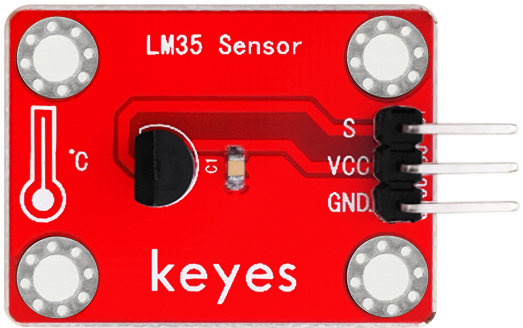
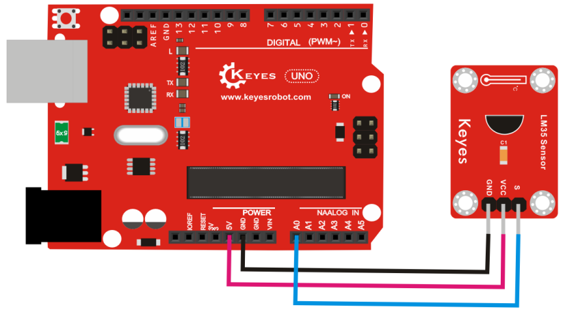
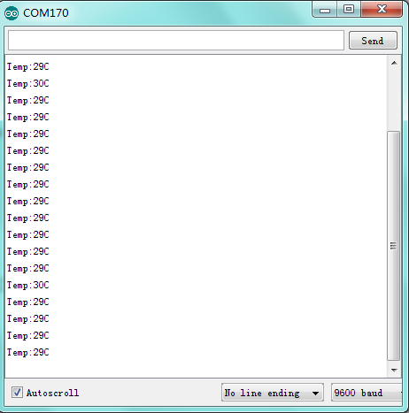

# **KE0039 Keyes LM35 温度传感器模块详细教程**



---

## **1. 介绍**

KE0039 Keyes LM35 温度传感器模块是一款基于 LM35 精密温度传感器芯片的模块，专为 Arduino 等开发板设计。LM35 是一种线性模拟温度传感器，其输出电压与温度成正比，具有高精度和低功耗的特点。模块采用红色环保 PCB 板，设计简单，易于使用，适用于环境温度监测、智能家居、工业控制等场景。

---

## **2. 特点**

- **高精度**：LM35 温度传感器具有 ±0.5℃ 的高精度。
- **线性输出**：输出电压与温度成正比，便于计算。
- **低功耗**：功耗低，适合长时间运行。
- **高兼容性**：兼容 Arduino、树莓派等开发板。
- **环保设计**：采用红色环保 PCB 板，耐用且稳定。
- **易于固定**：模块自带两个定位孔，方便安装。

---

## **3. 规格参数**

| 参数            | 值                     |
|-----------------|------------------------|
| **工作电压**    | 3.3V - 5V（DC）        |
| **接口类型**    | 3PIN接口（VCC, GND, A0） |
| **输出信号**    | 模拟信号               |
| **测量范围**    | 0℃ ～ +100℃           |
| **精度**        | ±0.5℃（25℃时）        |
| **线性度**      | 10mV/℃                |
| **工作温度范围**| -55℃ ～ +150℃         |
| **重量**        | 3.0g                   |

---

## **4. 工作原理**

LM35 是一种线性模拟温度传感器，其输出电压与温度成正比。每升高 1℃，输出电压增加 10mV。例如：
- 0℃ 时，输出电压为 0V；
- 25℃ 时，输出电压为 250mV；
- 100℃ 时，输出电压为 1V。

通过读取传感器的模拟信号（A0），可以根据公式计算温度值：
```
温度 (℃) = 输出电压 (mV) / 10
```

---

## **5. 接口说明**

模块有3个引脚：
1. **VCC**：电源正极（3.3V-5V）。
2. **GND**：电源负极（接地）。
3. **A0**：模拟信号输出（连接开发板的模拟输入引脚）。

---

## **6. 连接图**

以下是 KE0039 模块与 Arduino UNO 的连接示意图：

| KE0039模块引脚 | Arduino引脚 |
|----------------|-------------|
| VCC            | 5V          |
| GND            | GND         |
| A0             | A0          |

连接图如下：



---

## **7. 示例代码**

以下是用于测试 KE0039 模块的 Arduino 示例代码：

```cpp
void setup() {
  Serial.begin(9600); // 设置串口波特率为9600
}

void loop() {
  int sensorValue = analogRead(A0); // 读取A0引脚的模拟信号值
  float voltage = sensorValue * (5.0 / 1023.0); // 将模拟信号转换为电压值
  float temperature = voltage * 100; // 根据LM35的线性度计算温度值
  Serial.print("Temperature: ");
  Serial.print(temperature);
  Serial.println(" °C");
  delay(1000); // 延迟1秒
}
```

---

## **8. 实验现象**

1. **测试步骤**：
   - 按照连接图接线，将模块连接到 Arduino。
   - 将代码烧录到 Arduino 开发板中。
   - 上电后，打开 Arduino IDE 的串口监视器，设置波特率为 9600。
   - 将传感器置于不同温度环境中，观察串口监视器中显示的温度值。

2. **实验现象**：
   - 在室温环境下，串口监视器显示的温度值接近实际室温（如 25℃）。
   
   	
   
   - 当传感器接触到热源（如手指或热水）时，显示的温度值升高。
   
   - 当传感器接触到冷源（如冰块）时，显示的温度值降低。

---

## **9. 注意事项**

1. **电压范围**：确保模块工作在 3.3V-5V 范围内，避免损坏模块。
2. **环境温度**：LM35 的测量范围为 0℃ ～ +100℃，超出范围可能导致测量不准确。
3. **避免短路**：传感器表面可能会接触湿气或液体，使用时需注意避免引脚短路。
4. **固定模块**：通过模块上的定位孔将其固定在稳定的位置，避免震动影响测试结果。
5. **校准**：如果需要更高精度的测量，建议对传感器进行校准。

---

## **10. 应用场景**

- **环境温度监测**：用于室内或室外环境温度的实时监测。
- **智能家居**：用于空调、暖气等设备的温度控制。
- **工业控制**：用于工业设备的温度监测与报警。
- **农业监测**：用于温室或农田的温度监测。
- **科研实验**：用于温度相关实验的数据采集。

---

## **11. 参考链接**

以下是一些有助于开发的参考链接：
- [Arduino官网](https://www.arduino.cc/)
- [Keyes官网](http://www.keyes-robot.com/)
- [LM35温度传感器工作原理介绍](https://en.wikipedia.org/wiki/LM35)

---

如果需要补充其他内容或有其他问题，请告诉我！
