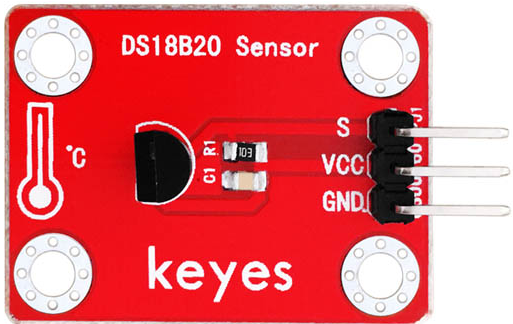
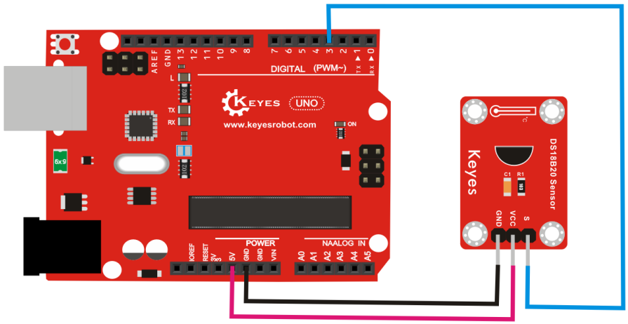
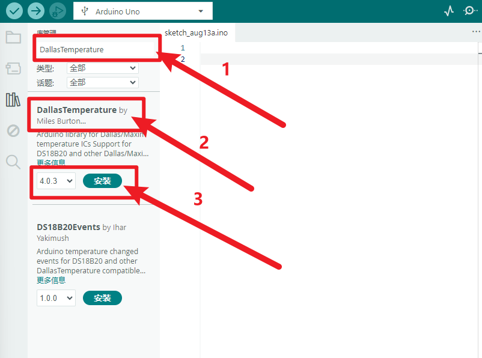
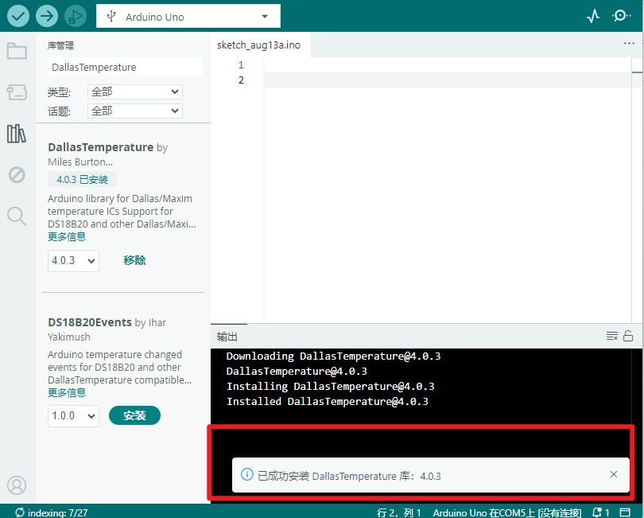
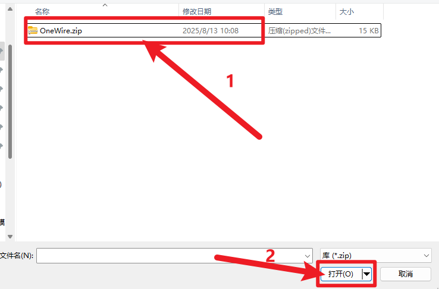
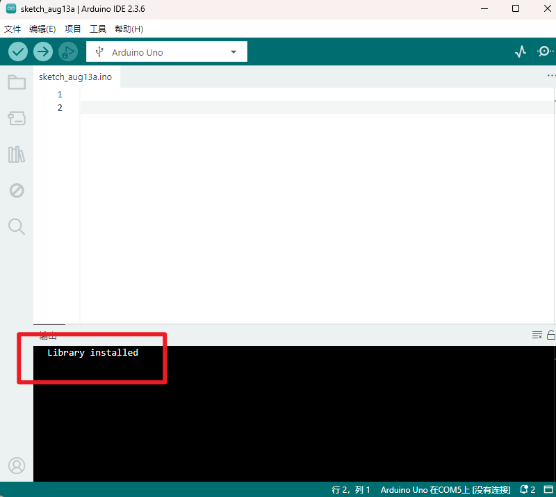

# **KE0040 Keyes 18B20 温度传感器模块详细教程**



---

## **1. 介绍**

KE0040 Keyes 18B20 温度传感器模块是一款基于 DS18B20 数字温度传感器芯片的模块，专为 Arduino 等开发板设计。18B20 是一种高精度的数字温度传感器，支持单总线通信，能够提供 9 至 12 位的温度数据，具有防水和抗干扰能力。模块采用红色环保 PCB 板，设计简单，易于使用，适用于环境温度监测、智能家居、工业控制等场景。

---

## **2. 特点**

- **高精度**：支持 9 至 12 位的温度数据，精度可达 ±0.5℃。
- **数字输出**：通过单总线通信输出温度数据，抗干扰能力强。
- **宽测量范围**：支持 -55℃ 至 +125℃ 的温度测量。
- **高兼容性**：兼容 Arduino、树莓派等开发板。
- **环保设计**：采用红色环保 PCB 板，耐用且稳定。
- **易于固定**：模块自带两个定位孔，方便安装。

---

## **3. 规格参数**

| 参数            | 值                     |
|-----------------|------------------------|
| **工作电压**    | 3.3V - 5V（DC）        |
| **接口类型**    | 3PIN接口（VCC, GND, S） |
| **输出信号**    | 数字信号（单总线通信） |
| **测量范围**    | -55℃ ～ +125℃         |
| **精度**        | ±0.5℃（-10℃ ～ +85℃） |
| **分辨率**      | 9 至 12 位可调         |
| **工作温度范围**| -55℃ ～ +125℃         |
| **重量**        | 3.5g                   |

---

## **4. 工作原理**

DS18B20 是一种数字温度传感器，采用单总线通信协议。传感器内部集成了温度测量电路和数字信号处理电路，能够将温度转换为数字信号并通过单根数据线（S）传输给主控设备。模块通过 VCC 和 GND 提供电源，S引脚用于数据通信。

---

## **5. 接口说明**

模块有3个引脚：
1. **VCC**：电源正极（3.3V-5V）。
2. **GND**：电源负极（接地）。
3. **S**：数据引脚（连接开发板的数字输入/输出引脚）。

---

## **6. 连接图**

以下是 KE0040 模块与 Arduino UNO 的连接示意图：

| KE0040模块引脚 | Arduino引脚 |
| -------------- | ----------- |
| VCC            | 5V          |
| GND            | GND         |
| S              | D3          |

连接图如下：



---

## **7. 示例代码**

以下是用于测试 KE0040 模块的 Arduino 示例代码，需安装 **OneWire** 和 **DallasTemperature** 库：

#### **安装库**
1.安装**DallasTemperature** 库

- 打开Arduino IDE，点击“项目”，选择“管理库”。

  

- 方框输入“ DallasTemperature”，选择“DallasTemperature”，点击“安装”。

  

- 安装成功出现的界面。

  

2.导入**OneWire**库 。

- 下载库文件：[OneWire](./资料/KE0040.7z)

- 首先选择“项目”，选择“导入库”，再选择“添加.ZIP库”。

  

- 找到下载资料的存放位置，打开文件夹找到库文件，选择要导入的库，点击“打开”。

  

- 安装成功出现的界面。

  

#### **代码**

```cpp
#include <OneWire.h>
#include <DallasTemperature.h>

// 定义引脚
#define ONE_WIRE_BUS 3 // S引脚连接到数字引脚3

OneWire oneWire(ONE_WIRE_BUS); // 初始化OneWire对象
DallasTemperature sensors(&oneWire); // 初始化DallasTemperature对象

void setup() {
  Serial.begin(9600); // 设置串口波特率为9600
  sensors.begin();    // 启动温度传感器
}

void loop() {
  sensors.requestTemperatures(); // 请求温度数据
  float temperature = sensors.getTempCByIndex(0); // 获取第一个传感器的温度
  Serial.print("Temperature: ");
  Serial.print(temperature);
  Serial.println(" °C");
  delay(1000); // 延迟1秒
}
```

---

## **8. 实验现象**

1. **测试步骤**：
   - 按照连接图接线，将模块连接到 Arduino。
   - 将代码烧录到 Arduino 开发板中。
   - 上电后，打开 Arduino IDE 的串口监视器，设置波特率为 9600。
   - 将传感器置于不同温度环境中，观察串口监视器中显示的温度值。

2. **实验现象**：
   
   - 在室温环境下，串口监视器显示的温度值接近实际室温（如 25℃）。
   - 当传感器接触到热源（如手指或热水）时，显示的温度值升高。
   - 当传感器接触到冷源（如冰块）时，显示的温度值降低。
   
   

---

## **9. 注意事项**

1. **电压范围**：确保模块工作在 3.3V-5V 范围内，避免损坏模块。
2. **环境温度**：DS18B20 的测量范围为 -55℃ ～ +125℃，超出范围可能导致测量不准确。
3. **单总线通信**：确保 S 引脚连接到支持单总线通信的数字引脚。
4. **固定模块**：通过模块上的定位孔将其固定在稳定的位置，避免震动影响测试结果。
5. **校准**：如果需要更高精度的测量，建议对传感器进行校准。

---

## **10. 应用场景**

- **环境温度监测**：用于室内或室外环境温度的实时监测。
- **智能家居**：用于空调、暖气等设备的温度控制。
- **工业控制**：用于工业设备的温度监测与报警。
- **农业监测**：用于温室或农田的温度监测。
- **科研实验**：用于温度相关实验的数据采集。

---

## **11. 参考链接**

以下是一些有助于开发的参考链接：
- [DS18B20温度传感器工作原理介绍](https://en.wikipedia.org/wiki/DS18B20)

---

如果需要补充其他内容或有其他问题，请告诉我！
