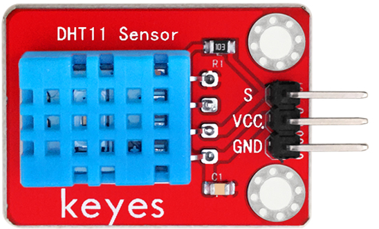
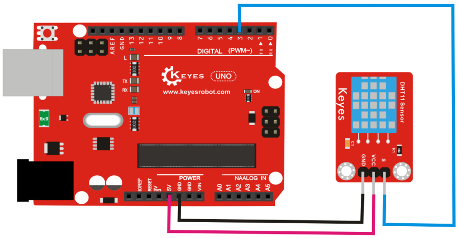
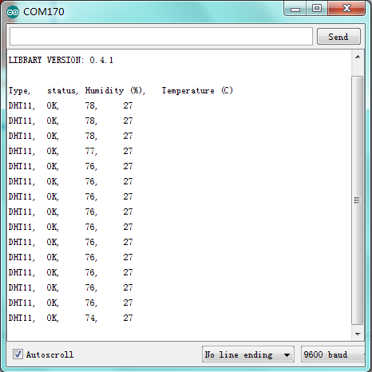

# KE0041 Keyes DHT11 温湿度传感器模块



---

## **1. 介绍**

KE0041 Keyes DHT11 温湿度传感器模块是一款基于 DHT11 数字温湿度传感器芯片的模块，专为 Arduino 等开发板设计。DHT11 是一种高性价比的温湿度传感器，能够提供数字化的温度和湿度数据，具有良好的稳定性和可靠性。模块采用红色环保 PCB 板，设计简单，易于使用，适用于环境监测、智能家居、农业控制等场景。

---

## **2. 特点**

- **温湿度检测**：同时检测环境温度和湿度。
- **数字输出**：通过单总线通信输出温湿度数据。
- **高性价比**：适合对精度要求不高的场景。
- **高兼容性**：兼容 Arduino、树莓派等开发板。
- **环保设计**：采用红色环保 PCB 板，耐用且稳定。
- **易于固定**：模块自带两个定位孔，方便安装。

---

## **3. 规格参数**

| 参数            | 值                     |
|-----------------|------------------------|
| **工作电压**    | 3.3V - 5V（DC）        |
| **接口类型**    | 3PIN接口（VCC, GND, DATA） |
| **输出信号**    | 数字信号（单总线通信） |
| **温度测量范围**| 0℃ ～ +50℃            |
| **湿度测量范围**| 20% ～ 90% RH          |
| **温度精度**    | ±2℃                   |
| **湿度精度**    | ±5% RH                 |
| **工作温度范围**| 0℃ ～ +50℃            |
| **重量**        | 3.5g                   |

---

## **4. 工作原理**

DHT11 是一种数字温湿度传感器，内部集成了温湿度测量元件和信号处理电路。传感器通过单总线通信协议将温湿度数据传输给主控设备。模块通过 VCC 和 GND 提供电源，DATA 引脚用于数据通信。

---

## **5. 接口说明**

模块有3个引脚：
1. **VCC**：电源正极（3.3V-5V）。
2. **GND**：电源负极（接地）。
3. **DATA**：数据引脚（连接开发板的数字输入/输出引脚）。

---

## **6. 连接图**

以下是 KE0041 模块与 Arduino UNO 的连接示意图：

| KE0041模块引脚 | Arduino引脚 |
| -------------- | ----------- |
| VCC            | 5V          |
| GND            | GND         |
| DATA           | D3          |

连接图如下：



---

## **7. 示例代码**

以下是用于测试 KE0041 模块的 Arduino 示例代码，需安装 **DHT** 库：

#### **安装库**
1. 打开 Arduino IDE，点击 **工具 > 管理库**。
2. 搜索 **DHT sensor library**，安装由 Adafruit 提供的库。

#### **代码**
```cpp
#include <DHT.h>

// 定义引脚和传感器类型
#define DHTPIN 3      // DATA引脚连接到数字引脚3
#define DHTTYPE DHT11 // 使用DHT11传感器

DHT dht(DHTPIN, DHTTYPE); // 初始化DHT对象

void setup() {
  Serial.begin(9600); // 设置串口波特率为9600
  dht.begin();        // 启动DHT传感器
}

void loop() {
  // 读取湿度
  float humidity = dht.readHumidity();
  // 读取温度（摄氏度）
  float temperature = dht.readTemperature();

  // 检查是否读取失败
  if (isnan(humidity) || isnan(temperature)) {
    Serial.println("Failed to read from DHT sensor!");
    return;
  }

  // 打印温湿度数据
  Serial.print("Humidity: ");
  Serial.print(humidity);
  Serial.print(" %\t");
  Serial.print("Temperature: ");
  Serial.print(temperature);
  Serial.println(" °C");

  delay(2000); // 延迟2秒
}
```

---

## **8. 实验现象**

1. **测试步骤**：
   - 按照连接图接线，将模块连接到 Arduino。
   - 将代码烧录到 Arduino 开发板中。
   - 上电后，打开 Arduino IDE 的串口监视器，设置波特率为 9600。
   - 将传感器置于不同温湿度环境中，观察串口监视器中显示的温湿度值。

2. **实验现象**：
   - 在室温环境下，串口监视器显示的温湿度值接近实际环境值（如 25℃ 和 50% RH）。
   
   	
   
   - 当传感器接触到热源（如手指或热水）时，显示的温度值升高。
   
   - 当传感器接触到冷源（如冰块）时，显示的温度值降低。
   
   - 湿度值会随环境湿度的变化而变化。

---

## **9. 注意事项**

1. **电压范围**：确保模块工作在 3.3V-5V 范围内，避免损坏模块。
2. **环境温度**：DHT11 的测量范围为 0℃ ～ +50℃，超出范围可能导致测量不准确。
3. **单总线通信**：确保 DATA 引脚连接到支持单总线通信的数字引脚。
4. **固定模块**：通过模块上的定位孔将其固定在稳定的位置，避免震动影响测试结果。
5. **校准**：如果需要更高精度的测量，建议对传感器进行校准。

---

## **10. 应用场景**

- **环境监测**：用于室内或室外环境温湿度的实时监测。
- **智能家居**：用于空调、加湿器等设备的温湿度控制。
- **农业监测**：用于温室或农田的温湿度监测。
- **科研实验**：用于温湿度相关实验的数据采集。
- **工业控制**：用于工业设备的温湿度监测与报警。

---

## **11. 参考链接**

以下是一些有助于开发的参考链接：
- [Arduino官网](https://www.arduino.cc/)
- [Keyes官网](http://www.keyes-robot.com/)
- [DHT11温湿度传感器工作原理介绍](https://en.wikipedia.org/wiki/DHT11)

---

如果需要补充其他内容或有其他问题，请告诉我！
