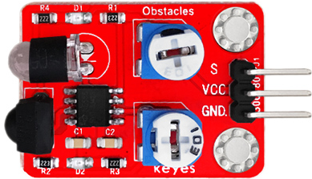
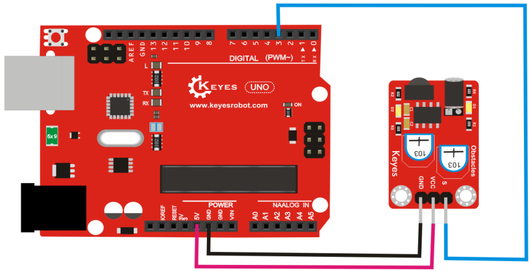

# KE0042 Keyes 避障传感器模块



---

## **1. 介绍**

KE0042 Keyes 避障传感器是一款基于红外反射原理的模块，专为 Arduino 等开发板设计。它通过红外发射和接收检测前方障碍物的存在，并输出数字信号。模块采用红色环保 PCB 板，设计简单，易于使用，适用于智能小车、机器人避障、物体检测等场景。

---

## **2. 特点**

- **红外检测**：通过红外发射和接收检测障碍物。
- **数字信号输出**：输出高低电平信号，便于开发板读取。
- **灵敏度可调**：通过板载电位器调节检测距离。
- **高兼容性**：兼容 Arduino、树莓派等开发板。
- **环保设计**：采用红色环保 PCB 板，耐用且稳定。
- **易于固定**：模块自带两个定位孔，方便安装。

---

## **3. 规格参数**

| 参数            | 值                     |
|-----------------|------------------------|
| **工作电压**    | 3.3V - 5V（DC）        |
| **接口类型**    | 3PIN接口（VCC, GND, OUT） |
| **输出信号**    | 数字信号（高/低电平）  |
| **检测距离**    | 2cm ～ 30cm（可调）    |
| **工作角度**    | 35°                    |
| **灵敏度调节**  | 支持（通过电位器）     |
| **工作温度范围**| -10℃ ～ +50℃          |
| **重量**        | 3.5g                   |

---

## **4. 工作原理**

KE0042 避障传感器通过红外发射管发射红外光，当红外光遇到障碍物时会反射回来，被红外接收管接收。模块内部的比较器电路会根据接收到的红外信号强弱判断是否有障碍物，并输出高低电平信号：
- **无障碍物**：OUT 引脚输出高电平。
- **有障碍物**：OUT 引脚输出低电平。

通过调节板载电位器，可以改变检测距离的灵敏度。

---

## **5. 接口说明**

模块有3个引脚：
1. **VCC**：电源正极（3.3V-5V）。
2. **GND**：电源负极（接地）。
3. **OUT**：数字信号输出（连接开发板的数字输入引脚）。

---

## **6. 连接图**

以下是 KE0042 模块与 Arduino UNO 的连接示意图：

| KE0042模块引脚 | Arduino引脚 |
| -------------- | ----------- |
| VCC            | 5V          |
| GND            | GND         |
| OUT            | D3          |

连接图如下：



---

## **7. 示例代码**

以下是用于测试 KE0042 模块的 Arduino 示例代码：

```cpp
// 定义引脚
#define SENSOR_PIN 3 // OUT引脚连接到数字引脚3

void setup() {
  pinMode(SENSOR_PIN, INPUT); // 设置传感器引脚为输入模式
  Serial.begin(9600);         // 设置串口波特率为9600
}

void loop() {
  int sensorValue = digitalRead(SENSOR_PIN); // 读取传感器的数字信号
  if (sensorValue == LOW) {
    Serial.println("Obstacle detected!"); // 检测到障碍物
  } else {
    Serial.println("No obstacle."); // 无障碍物
  }
  delay(500); // 延迟500ms
}
```

---

## **8. 实验现象**

1. **测试步骤**：
   - 按照连接图接线，将模块连接到 Arduino。
   - 将代码烧录到 Arduino 开发板中。
   - 上电后，打开 Arduino IDE 的串口监视器，设置波特率为 9600。
   - 将障碍物（如手掌）放置在传感器前方，观察串口监视器中显示的结果。

2. **实验现象**：
   - 当传感器前方无障碍物时，串口监视器显示 "No obstacle."。
   - 当传感器前方有障碍物时，串口监视器显示 "Obstacle detected!"。
   - 调节电位器可以改变传感器的检测距离。

---

## **9. 注意事项**

1. **电压范围**：确保模块工作在 3.3V-5V 范围内，避免损坏模块。
2. **环境光干扰**：强光环境可能会影响传感器的检测效果，建议在室内或光线适中的环境中使用。
3. **检测距离**：通过调节电位器可以改变检测距离，建议根据实际需求进行调整。
4. **固定模块**：通过模块上的定位孔将其固定在稳定的位置，避免震动影响检测结果。
5. **障碍物材质**：传感器对反射率较高的物体（如白色物体）检测效果更好，对反射率较低的物体（如黑色物体）检测效果较差。

---

## **10. 应用场景**

- **智能小车**：用于机器人或小车的避障功能。
- **物体检测**：检测物体的存在或移动。
- **自动门控制**：检测是否有人靠近以控制门的开关。
- **安全报警**：用于检测障碍物或入侵者。
- **工业自动化**：用于生产线上的物体检测。

---

## **11. 参考链接**

以下是一些有助于开发的参考链接：
- [Arduino官网](https://www.arduino.cc/)
- [Keyes官网](http://www.keyes-robot.com/)
- [红外避障传感器工作原理介绍](https://en.wikipedia.org/wiki/Infrared_sensor)

---

如果需要补充其他内容或有其他问题，请告诉我！
