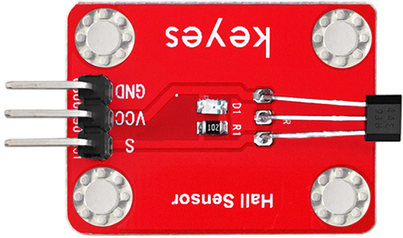
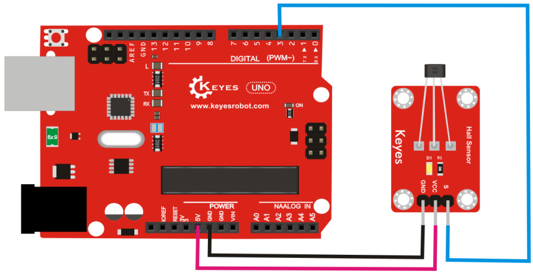

# **KE0043 Keyes 霍尔传感器模块详细教程**



---

## **1. 介绍**

KE0043 Keyes 霍尔传感器模块是一款基于霍尔效应的磁场检测模块，专为 Arduino 等开发板设计。它能够检测磁场的存在，并输出数字信号。模块采用红色环保 PCB 板，设计简单，易于使用，适用于磁场检测、转速测量、位置检测等场景。

---

## **2. 特点**

- **磁场检测**：通过霍尔效应检测磁场的存在。
- **数字信号输出**：输出高低电平信号，便于开发板读取。
- **灵敏度高**：对磁场变化响应迅速。
- **高兼容性**：兼容 Arduino、树莓派等开发板。
- **环保设计**：采用红色环保 PCB 板，耐用且稳定。
- **易于固定**：模块自带两个定位孔，方便安装。

---

## **3. 规格参数**

| 参数            | 值                     |
|-----------------|------------------------|
| **工作电压**    | 3.3V - 5V（DC）        |
| **接口类型**    | 3PIN接口（VCC, GND, OUT） |
| **输出信号**    | 数字信号（高/低电平）  |
| **检测范围**    | 磁场强度检测           |
| **工作温度范围**| -40℃ ～ +85℃          |
| **重量**        | 3.5g                   |

---

## **4. 工作原理**

霍尔传感器基于霍尔效应工作，当磁场靠近传感器时，传感器内部的霍尔元件会感应到磁场并产生电压信号。模块内部的比较器电路会根据霍尔元件的输出信号判断是否有磁场，并输出高低电平信号：
- **无磁场**：OUT 引脚输出高电平。
- **有磁场**：OUT 引脚输出低电平。

---

## **5. 接口说明**

模块有3个引脚：
1. **VCC**：电源正极（3.3V-5V）。
2. **GND**：电源负极（接地）。
3. **OUT**：数字信号输出（连接开发板的数字输入引脚）。

---

## **6. 连接图**

以下是 KE0043 模块与 Arduino UNO 的连接示意图：

| KE0043模块引脚 | Arduino引脚 |
| -------------- | ----------- |
| VCC            | 5V          |
| GND            | GND         |
| OUT            | D3          |

连接图如下：



---

## **7. 示例代码**

以下是用于测试 KE0043 模块的 Arduino 示例代码：

```cpp
// 定义引脚
#define SENSOR_PIN 3 // OUT引脚连接到数字引脚3

void setup() {
  pinMode(SENSOR_PIN, INPUT); // 设置传感器引脚为输入模式
  Serial.begin(9600);         // 设置串口波特率为9600
}

void loop() {
  int sensorValue = digitalRead(SENSOR_PIN); // 读取传感器的数字信号
  if (sensorValue == LOW) {
    Serial.println("Magnetic field detected!"); // 检测到磁场
  } else {
    Serial.println("No magnetic field."); // 无磁场
  }
  delay(500); // 延迟500ms
}
```

---

## **8. 实验现象**

1. **测试步骤**：
   - 按照连接图接线，将模块连接到 Arduino。
   - 将代码烧录到 Arduino 开发板中。
   - 上电后，打开 Arduino IDE 的串口监视器，设置波特率为 9600。
   - 将磁铁靠近传感器，观察串口监视器中显示的结果。

2. **实验现象**：
   - 当传感器周围无磁场时，串口监视器显示 "No magnetic field."。
   - 当磁铁靠近传感器时，串口监视器显示 "Magnetic field detected!"。
   - 磁铁越靠近传感器，信号变化越明显。

---

## **9. 注意事项**

1. **电压范围**：确保模块工作在 3.3V-5V 范围内，避免损坏模块。
2. **磁场强度**：传感器对磁场强度有一定的灵敏度范围，建议使用强磁铁进行测试。
3. **固定模块**：通过模块上的定位孔将其固定在稳定的位置，避免震动影响检测结果。
4. **环境干扰**：避免在强电磁干扰环境中使用，以免影响检测效果。

---

## **10. 应用场景**

- **磁场检测**：检测磁场的存在或变化。
- **转速测量**：用于检测旋转设备的转速（如风扇、电机）。
- **位置检测**：检测物体的位置或移动。
- **智能家居**：用于门窗磁性开关的检测。
- **工业控制**：用于磁场相关的工业设备监测。

---

## **11. 参考链接**

以下是一些有助于开发的参考链接：
- [Arduino官网](https://www.arduino.cc/)
- [Keyes官网](http://www.keyes-robot.com/)
- [霍尔效应传感器工作原理介绍](https://en.wikipedia.org/wiki/Hall_effect_sensor)

---

如果需要补充其他内容或有其他问题，请告诉我！
