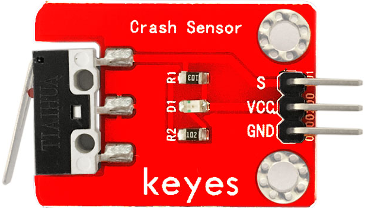
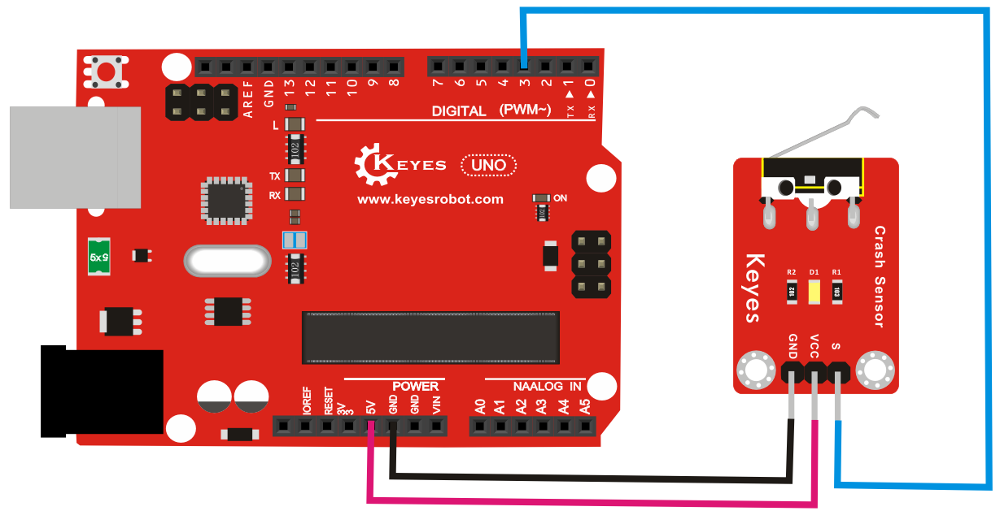

# **KE0044 Keyes 碰撞传感器模块详细教程**



---

## **1. 介绍**

KE0044 Keyes 碰撞传感器是一款基于机械开关原理的模块，专为 Arduino 等开发板设计。它通过检测物理碰撞或振动来触发开关信号，并输出数字信号。模块采用红色环保 PCB 板，设计简单，易于使用，适用于智能小车、机器人碰撞检测、振动报警等场景。

---

## **2. 特点**

- **碰撞检测**：通过机械开关检测物理碰撞或振动。
- **数字信号输出**：输出高低电平信号，便于开发板读取。
- **灵敏度高**：对轻微碰撞或振动响应迅速。
- **高兼容性**：兼容 Arduino、树莓派等开发板。
- **环保设计**：采用红色环保 PCB 板，耐用且稳定。
- **易于固定**：模块自带两个定位孔，方便安装。

---

## **3. 规格参数**

| 参数            | 值                     |
|-----------------|------------------------|
| **工作电压**    | 3.3V - 5V（DC）        |
| **接口类型**    | 3PIN接口（VCC, GND,S） |
| **输出信号**    | 数字信号（高/低电平）  |
| **检测方式**    | 碰撞或振动触发         |
| **工作温度范围**| -40℃ ～ +85℃          |
| **重量**        | 3.5g                   |

---

## **4. 工作原理**

KE0044 碰撞传感器通过内部的机械开关检测碰撞或振动。当传感器受到外力碰撞或振动时，内部的机械开关会闭合，输出低电平信号；当没有碰撞或振动时，开关断开，输出高电平信号。

---

## **5. 接口说明**

模块有3个引脚：
1. **VCC**：电源正极（3.3V-5V）。
2. **GND**：电源负极（接地）。
3. **S**：数字信号输出（连接开发板的数字输入引脚）。

---

## **6. 连接图**

以下是 KE0044 模块与 Arduino UNO 的连接示意图：

| KE0044模块引脚 | Arduino引脚 |
| -------------- | ----------- |
| VCC            | 5V          |
| GND            | GND         |
| S              | D3          |

连接图如下：



---

## **7. 示例代码**

以下是用于测试 KE0044 模块的 Arduino 示例代码：

```cpp
// 定义引脚
#define SENSOR_PIN 3 // S引脚连接到数字引脚3

void setup() {
  pinMode(SENSOR_PIN, INPUT); // 设置传感器引脚为输入模式
  Serial.begin(9600);         // 设置串口波特率为9600
}

void loop() {
  int sensorValue = digitalRead(SENSOR_PIN); // 读取传感器的数字信号
  if (sensorValue == LOW) {
    Serial.println("Collision detected!"); // 检测到碰撞
  } else {
    Serial.println("No collision."); // 无碰撞
  }
  delay(500); // 延迟500ms
}
```

---

## **8. 实验现象**

1. **测试步骤**：
   - 按照连接图接线，将模块连接到 Arduino。
   - 将代码烧录到 Arduino 开发板中。
   - 上电后，打开 Arduino IDE 的串口监视器，设置波特率为 9600。
   - 用手轻轻敲击传感器或让其受到振动，观察串口监视器中显示的结果。

2. **实验现象**：
   - 当传感器未受到碰撞或振动时，串口监视器显示 "No collision."。
   - 当传感器受到碰撞或振动时，串口监视器显示 "Collision detected!"。

---

## **9. 注意事项**

1. **电压范围**：确保模块工作在 3.3V-5V 范围内，避免损坏模块。
2. **固定模块**：通过模块上的定位孔将其固定在稳定的位置，避免误触发。
3. **环境干扰**：避免在强震动或高噪声环境中使用，以免误触发。
4. **机械开关寿命**：由于内部是机械开关，长期频繁使用可能会导致开关磨损。

---

### **10. 应用场景**
- **智能小车**：用于机器人或小车的碰撞检测。
- **振动报警**：检测振动或碰撞并触发报警。
- **物体检测**：检测物体的碰撞或接触。
- **工业控制**：用于检测设备的振动或碰撞状态。
- **安全监控**：用于门窗的碰撞检测。

---

## **11. 参考链接**

以下是一些有助于开发的参考链接：
- [碰撞传感器工作原理介绍](https://en.wikipedia.org/wiki/Vibration_sensor)

---

如果需要补充其他内容或有其他问题，请告诉我！
