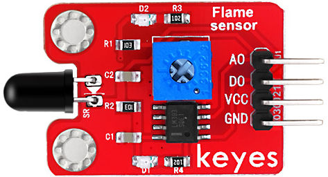

# **KE0045 Keyes 火焰传感器模块**



---

## **1. 介绍**

KE0045 Keyes 火焰传感器是一款基于红外光敏二极管的模块，专为 Arduino 等开发板设计。它能够检测火焰或其他波长在 760nm～1100nm 范围内的光源，并输出数字或模拟信号。模块采用红色环保 PCB 板，设计简单，易于使用，适用于火焰检测、火灾报警等场景。

---

## **2. 特点**

- **火焰检测**：通过红外光敏二极管检测火焰或特定波长的光源。
- **双信号输出**：支持数字信号和模拟信号输出。
- **灵敏度可调**：通过板载电位器调节检测灵敏度。
- **高兼容性**：兼容 Arduino、树莓派等开发板。
- **环保设计**：采用红色环保 PCB 板，耐用且稳定。
- **易于固定**：模块自带两个定位孔，方便安装。

---

## **3. 规格参数**

| 参数            | 值                     |
|-----------------|------------------------|
| **工作电压**    | 3.3V - 5V（DC）        |
| **接口类型**    | 4PIN接口（VCC, GND, D0, A0） |
| **输出信号**    | 数字信号（D0）和模拟信号（A0） |
| **检测范围**    | 760nm ～ 1100nm 波长的光源 |
| **检测角度**    | 60°                    |
| **灵敏度调节**  | 支持（通过电位器）     |
| **工作温度范围**| -25℃ ～ +85℃          |
| **重量**        | 3.5g                   |

---

## **4. 工作原理**

KE0045 火焰传感器通过红外光敏二极管检测火焰或特定波长的光源。当火焰或光源靠近传感器时，红外光敏二极管会感应到光信号，并输出相应的电压信号。模块内部的比较器电路会根据电压信号判断是否有火焰，并输出数字信号（D0）：
- **无火焰**：D0 引脚输出高电平。
- **有火焰**：D0 引脚输出低电平。

同时，A0 引脚输出模拟信号，表示检测到的光强度。

---

## **5. 接口说明**

模块有4个引脚：
1. **VCC**：电源正极（3.3V-5V）。
2. **GND**：电源负极（接地）。
3. **D0**：数字信号输出（连接开发板的数字输入引脚）。
4. **A0**：模拟信号输出（连接开发板的模拟输入引脚）。

---

## **6. 连接图**

以下是 KE0045 模块与 Arduino UNO 的连接示意图：

| KE0045模块引脚 | Arduino引脚 |
|----------------|-------------|
| VCC            | 5V          |
| GND            | GND         |
| D0             | D2          |
| A0             | A0          |

连接图如下：

```
Arduino UNO         KE0045模块
   5V   ------------>  VCC
   GND  ------------>  GND
   D2   ------------>  D0
   A0   ------------>  A0
```

---

## **7. 示例代码**

以下是用于测试 KE0045 模块的 Arduino 示例代码：

#### **数字信号检测（D0）**
```cpp
// 定义引脚
#define FLAME_SENSOR_PIN 2 // D0引脚连接到数字引脚2

void setup() {
  pinMode(FLAME_SENSOR_PIN, INPUT); // 设置传感器引脚为输入模式
  Serial.begin(9600);               // 设置串口波特率为9600
}

void loop() {
  int sensorValue = digitalRead(FLAME_SENSOR_PIN); // 读取传感器的数字信号
  if (sensorValue == LOW) {
    Serial.println("Flame detected!"); // 检测到火焰
  } else {
    Serial.println("No flame."); // 无火焰
  }
  delay(500); // 延迟500ms
}
```

#### **模拟信号检测（A0）**
```cpp
// 定义引脚
#define FLAME_SENSOR_ANALOG A0 // A0引脚连接到模拟输入引脚A0

void setup() {
  Serial.begin(9600); // 设置串口波特率为9600
}

void loop() {
  int sensorValue = analogRead(FLAME_SENSOR_ANALOG); // 读取传感器的模拟信号
  Serial.print("Flame intensity: ");
  Serial.println(sensorValue); // 打印火焰强度值
  delay(500); // 延迟500ms
}
```

---

## **8. 实验现象**

1. **测试步骤**：
   - 按照连接图接线，将模块连接到 Arduino。
   - 将代码烧录到 Arduino 开发板中。
   - 上电后，打开 Arduino IDE 的串口监视器，设置波特率为 9600。
   - 使用打火机或蜡烛点燃火焰，并将其靠近传感器，观察串口监视器中显示的结果。

2. **实验现象**：
   - 当传感器前方无火焰时，串口监视器显示 "No flame." 或较低的模拟信号值。
   - 当火焰靠近传感器时，串口监视器显示 "Flame detected!" 或较高的模拟信号值。
   - 调节电位器可以改变传感器的灵敏度。

---

## **9. 注意事项**

1. **电压范围**：确保模块工作在 3.3V-5V 范围内，避免损坏模块。
2. **检测距离**：火焰传感器的检测距离与火焰的大小和强度有关，建议在 30cm 范围内使用。
3. **环境光干扰**：强光环境可能会影响传感器的检测效果，建议在光线适中的环境中使用。
4. **固定模块**：通过模块上的定位孔将其固定在稳定的位置，避免震动影响检测结果。
5. **安全使用**：在实验中使用火焰时，请注意防火安全，避免引发火灾。

---

## **10. 应用场景**

- **火焰检测**：用于火焰的实时检测。
- **火灾报警**：结合报警器实现火灾报警功能。
- **智能机器人**：用于机器人火焰检测和灭火任务。
- **工业控制**：用于工业设备的火焰监测。
- **科研实验**：用于火焰相关实验的数据采集。

---

## **11. 参考链接**

以下是一些有助于开发的参考链接：
- [Arduino官网](https://www.arduino.cc/)
- [Keyes官网](http://www.keyes-robot.com/)
- [火焰传感器工作原理介绍](https://en.wikipedia.org/wiki/Flame_sensor)

---

如果需要补充其他内容或有其他问题，请告诉我！
