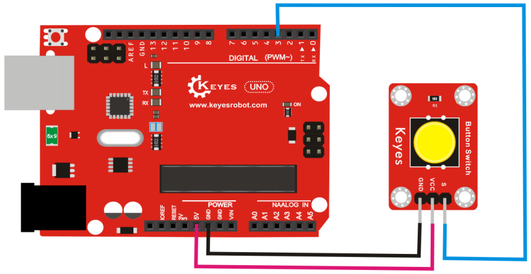

# **KE0046 Keyes 按钮开关模块**


---

## **1. 介绍**

KE0046 Keyes 按钮开关模块是一款基于机械按键的模块，专为 Arduino 等开发板设计。它通过按下按钮触发开关信号，并输出数字信号。模块采用红色环保 PCB 板，设计简单，易于使用，适用于用户输入、状态控制、开关检测等场景。

---

## **2. 特点**

- **按钮输入**：通过机械按钮实现开关信号输入。
- **数字信号输出**：输出高低电平信号，便于开发板读取。
- **高兼容性**：兼容 Arduino、树莓派等开发板。
- **环保设计**：采用红色环保 PCB 板，耐用且稳定。
- **易于固定**：模块自带两个定位孔，方便安装。

---

## **3. 规格参数**

| 参数            | 值                     |
|-----------------|------------------------|
| **工作电压**    | 3.3V - 5V（DC）        |
| **接口类型**    | 3PIN接口（VCC, GND, OUT） |
| **输出信号**    | 数字信号（高/低电平）  |
| **按钮类型**    | 机械按钮               |
| **工作温度范围**| -40℃ ～ +85℃          |
| **重量**        | 3.5g                   |

---

## **4. 工作原理**

KE0046 按钮开关模块通过机械按钮实现开关信号的输入。当按钮未按下时，模块输出高电平；当按钮被按下时，模块输出低电平。模块内部通过一个上拉电阻确保未按下时的稳定高电平。

---

## **5. 接口说明**

模块有3个引脚：
1. **VCC**：电源正极（3.3V-5V）。
2. **GND**：电源负极（接地）。
3. **OUT**：数字信号输出（连接开发板的数字输入引脚）。

---

## **6. 连接图**

以下是 KE0046 模块与 Arduino UNO 的连接示意图：

| KE0046模块引脚 | Arduino引脚 |
| -------------- | ----------- |
| VCC            | 5V          |
| GND            | GND         |
| OUT            | D3          |

连接图如下：



---

## **7. 示例代码**

以下是用于测试 KE0046 模块的 Arduino 示例代码：

```cpp
// 定义引脚
#define BUTTON_PIN 3 // OUT引脚连接到数字引脚3

void setup() {
  pinMode(BUTTON_PIN, INPUT); // 设置按钮引脚为输入模式
  Serial.begin(9600);         // 设置串口波特率为9600
}

void loop() {
  int buttonState = digitalRead(BUTTON_PIN); // 读取按钮的数字信号
  if (buttonState == LOW) {
    Serial.println("Button pressed!"); // 按钮被按下
  } else {
    Serial.println("Button released."); // 按钮未按下
  }
  delay(100); // 延迟100ms
}
```

---

## **8. 实验现象**

1. **测试步骤**：
   - 按照连接图接线，将模块连接到 Arduino。
   - 将代码烧录到 Arduino 开发板中。
   - 上电后，打开 Arduino IDE 的串口监视器，设置波特率为 9600。
   - 按下按钮并松开，观察串口监视器中显示的结果。

2. **实验现象**：
   - 当按钮未按下时，串口监视器显示 "Button released."。
   - 当按钮被按下时，串口监视器显示 "Button pressed!"。

---

## **9. 注意事项**

1. **电压范围**：确保模块工作在 3.3V-5V 范围内，避免损坏模块。
2. **机械按钮抖动**：机械按钮在按下或松开时可能会产生抖动信号，建议在代码中加入去抖处理（如延时或软件滤波）。
3. **固定模块**：通过模块上的定位孔将其固定在稳定的位置，避免误触发。
4. **按钮寿命**：机械按钮有一定的使用寿命，长期频繁使用可能会导致按钮磨损。

---

## **10. 应用场景**

- **用户输入**：用于用户输入信号的检测。
- **状态控制**：用于控制设备的开关状态。
- **开关检测**：检测按钮的按下或松开状态。
- **智能小车**：用于机器人或小车的手动控制。
- **工业控制**：用于设备的手动启动或停止。

---

## **11. 参考链接**

以下是一些有助于开发的参考链接：
- [Arduino官网](https://www.arduino.cc/)
- [Keyes官网](http://www.keyes-robot.com/)
- [按钮开关工作原理介绍](https://en.wikipedia.org/wiki/Switch)

---

如果需要补充其他内容或有其他问题，请告诉我！
