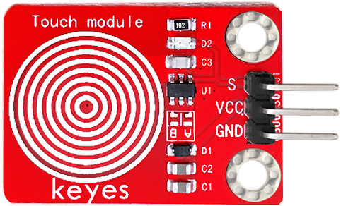
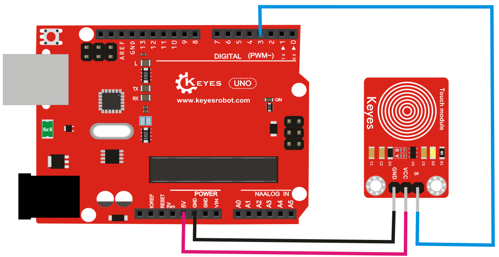

# **KE0047 Keyes 电容触摸传感器模块详细教程**



---

## **1. 介绍**

KE0047 Keyes 电容触摸传感器模块是一款基于电容感应原理的模块，专为 Arduino 等开发板设计。它通过检测人体触摸引起的电容变化来输出数字信号。模块采用红色环保 PCB 板，设计简单，易于使用，适用于触摸开关、智能家居、交互设备等场景。

---

## **2. 特点**

- **触摸检测**：通过电容感应检测人体触摸。
- **数字信号输出**：输出高低电平信号，便于开发板读取。
- **灵敏度高**：对轻微触摸响应迅速。
- **高兼容性**：兼容 Arduino、树莓派等开发板。
- **环保设计**：采用红色环保 PCB 板，耐用且稳定。
- **易于固定**：模块自带两个定位孔，方便安装。

---

## **3. 规格参数**

| 参数            | 值                     |
|-----------------|------------------------|
| **工作电压**    | 3.3V - 5V（DC）        |
| **接口类型**    | 3PIN接口（VCC, GND, S） |
| **输出信号**    | 数字信号（高/低电平）  |
| **触摸类型**    | 电容式触摸             |
| **工作温度范围**| -40℃ ～ +85℃          |
| **重量**        | 3.5g                   |

---

## **4. 工作原理**

KE0047 电容触摸传感器模块通过电容感应原理检测人体触摸。当人体触摸模块上的触摸区域时，人体与模块之间形成一个小电容，模块内部的电路会检测到电容的变化，并输出低电平信号；当没有触摸时，模块输出高电平信号。

---

## **5. 接口说明**

模块有3个引脚：
1. **VCC**：电源正极（3.3V-5V）。
2. **GND**：电源负极（接地）。
3. **S**：数字信号输出（连接开发板的数字输入引脚）。

---

## **6. 连接图**

以下是 KE0047 模块与 Arduino UNO 的连接示意图：

| KE0047模块引脚 | Arduino引脚 |
| -------------- | ----------- |
| VCC            | 5V          |
| GND            | GND         |
| S              | D3          |

连接图如下：



---

## **7. 示例代码**

以下是用于测试 KE0047 模块的 Arduino 示例代码：

```cpp
// 定义引脚
#define TOUCH_SENSOR_PIN 3 // S引脚连接到数字引脚3

void setup() {
  pinMode(TOUCH_SENSOR_PIN, INPUT); // 设置触摸传感器引脚为输入模式
  Serial.begin(9600);               // 设置串口波特率为9600
}

void loop() {
  int touchState = digitalRead(TOUCH_SENSOR_PIN); // 读取传感器的数字信号
  if (touchState == LOW) {
    Serial.println("Touch detected!"); // 检测到触摸
  } else {
    Serial.println("No touch."); // 无触摸
  }
  delay(100); // 延迟100ms
}
```

---

## **8. 实验现象**

1. **测试步骤**：
   - 按照连接图接线，将模块连接到 Arduino。
   - 将代码烧录到 Arduino 开发板中。
   - 上电后，打开 Arduino IDE 的串口监视器，设置波特率为 9600。
   - 用手指触摸模块上的触摸区域，观察串口监视器中显示的结果。

2. **实验现象**：
   - 当没有触摸模块时，串口监视器显示 "No touch."。
   - 当手指触摸模块时，串口监视器显示 "Touch detected!"。

---

## **9. 注意事项**

1. **电压范围**：确保模块工作在 3.3V-5V 范围内，避免损坏模块。
2. **触摸灵敏度**：模块对触摸的灵敏度较高，建议避免误触发。
3. **固定模块**：通过模块上的定位孔将其固定在稳定的位置，避免震动影响检测结果。
4. **环境干扰**：避免在强电磁干扰环境中使用，以免影响检测效果。
5. **触摸区域**：确保触摸模块的指定区域，避免误操作。

---

## **10. 应用场景**

- **触摸开关**：用于设备的触摸式开关控制。
- **智能家居**：用于灯光、门锁等智能设备的触摸控制。
- **交互设备**：用于人机交互界面的触摸输入。
- **工业控制**：用于工业设备的触摸式启动或停止。
- **教育实验**：用于学习电容触摸原理的教学实验。

---

## **11. 参考链接**

以下是一些有助于开发的参考链接：
- [电容触摸传感器工作原理介绍](https://en.wikipedia.org/wiki/Touch_sensor)

---

如果需要补充其他内容或有其他问题，请告诉我！
