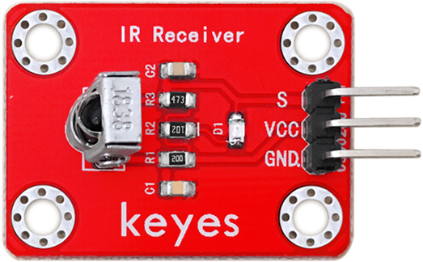
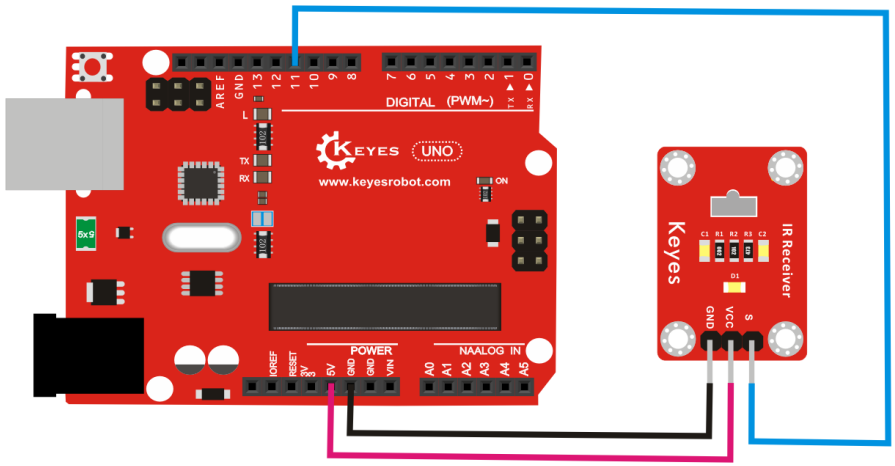
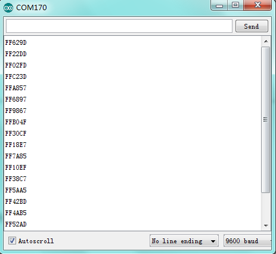

# KE0048 Keyes 红外接收传感器模块



---

## **1. 介绍**

KE0048 Keyes 红外接收传感器模块是一款基于红外接收头的模块，专为 Arduino 等开发板设计。它能够接收红外遥控信号，并将其解码为数字信号输出。模块采用红色环保 PCB 板，设计简单，易于使用，适用于红外遥控信号接收、智能家居、机器人控制等场景。

---

## **2. 特点**

- **红外信号接收**：通过红外接收头接收红外遥控信号。
- **数字信号输出**：输出解码后的数字信号，便于开发板读取。
- **高兼容性**：兼容 Arduino、树莓派等开发板。
- **环保设计**：采用红色环保 PCB 板，耐用且稳定。
- **易于固定**：模块自带两个定位孔，方便安装。

---

## **3. 规格参数**

| 参数            | 值                     |
|-----------------|------------------------|
| **工作电压**    | 3.3V - 5V（DC）        |
| **接口类型**    | 3PIN接口（VCC, GND, OUT） |
| **输出信号**    | 数字信号（高/低电平）  |
| **接收距离**    | 5m ～ 10m（视环境而定） |
| **接收角度**    | ±45°                  |
| **工作频率**    | 38kHz                  |
| **工作温度范围**| -25℃ ～ +85℃          |
| **重量**        | 3.5g                   |

---

## **4. 工作原理**

KE0048 红外接收传感器模块通过红外接收头接收 38kHz 的红外信号，并将其解码为数字信号输出。当接收到红外信号时，模块输出低电平；当没有信号时，模块输出高电平。通过结合 Arduino 和红外遥控库，可以解码遥控器的按键信号。

---

## **5. 接口说明**

模块有3个引脚：
1. **VCC**：电源正极（3.3V-5V）。
2. **GND**：电源负极（接地）。
3. **OUT**：数字信号输出（连接开发板的数字输入引脚）。

---

## **6. 连接图**

以下是 KE0048 模块与 Arduino UNO 的连接示意图：

| KE0048模块引脚 | Arduino引脚 |
| -------------- | ----------- |
| VCC            | 5V          |
| GND            | GND         |
| OUT            | D11         |

连接图如下：



---

## **7. 示例代码**

以下是用于测试 KE0048 模块的 Arduino 示例代码，需安装 **IRremote** 库：

#### **安装 IRremote 库**
1. 打开 Arduino IDE，点击 **工具 > 管理库**。
2. 搜索 **IRremote**，安装由 **shirriff** 提供的库。

#### **代码**
```cpp
#include <IRremote.h>

// 定义红外接收引脚
#define RECV_PIN 11

IRrecv irrecv(RECV_PIN); // 创建红外接收对象
decode_results results;  // 创建解码结果对象

void setup() {
  Serial.begin(9600);    // 设置串口波特率为9600
  irrecv.enableIRIn();   // 启动红外接收
  Serial.println("IR Receiver is ready");
}

void loop() {
  if (irrecv.decode(&results)) { // 如果接收到红外信号
    Serial.print("IR Code: ");
    Serial.println(results.value, HEX); // 打印接收到的红外代码（16进制）
    irrecv.resume(); // 准备接收下一个信号
  }
}
```

---

## **8. 实验现象**

1. **测试步骤**：
   - 按照连接图接线，将模块连接到 Arduino。
   - 将代码烧录到 Arduino 开发板中。
   - 上电后，打开 Arduino IDE 的串口监视器，设置波特率为 9600。
   - 使用红外遥控器对准传感器，按下任意按键，观察串口监视器中显示的结果。

2. **实验现象**：
   - 当没有按下遥控器按键时，串口监视器无输出。
   
   - 当按下遥控器按键时，串口监视器显示对应的红外代码（16进制）。
   
   	

---

## **9. 注意事项**

1. **电压范围**：确保模块工作在 3.3V-5V 范围内，避免损坏模块。
2. **接收距离**：模块的接收距离与环境光线和遥控器的发射功率有关，建议在室内光线适中的环境中使用。
3. **接收角度**：模块的接收角度为 ±45°，请确保遥控器对准传感器。
4. **固定模块**：通过模块上的定位孔将其固定在稳定的位置，避免震动影响检测结果。
5. **环境干扰**：避免在强光或红外干扰较多的环境中使用，以免影响接收效果。

---

## **10. 应用场景**

- **红外遥控**：用于接收红外遥控器的信号。
- **智能家居**：用于家电的红外遥控控制。
- **机器人控制**：通过红外遥控器控制机器人动作。
- **教育实验**：用于学习红外通信原理的教学实验。
- **工业控制**：用于红外信号的远程控制。

---

## **11. 参考链接**

以下是一些有助于开发的参考链接：
- [Arduino官网](https://www.arduino.cc/)
- [Keyes官网](http://www.keyes-robot.com/)
- [红外接收传感器工作原理介绍](https://en.wikipedia.org/wiki/Infrared_receiver)

---

如果需要补充其他内容或有其他问题，请告诉我！
