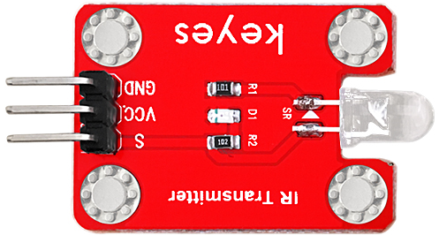
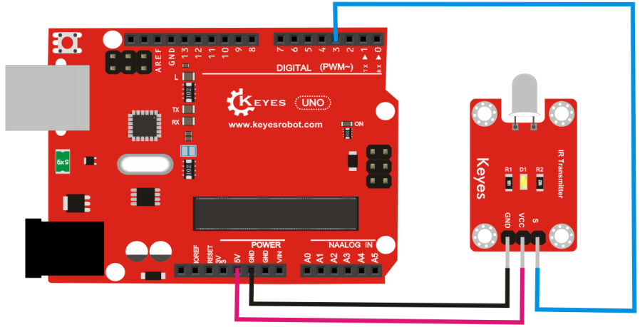

# **KE0049 Keyes 红外发射传感器模块详细教程**



---

## **1. 介绍**

KE0049 Keyes 红外发射传感器模块是一款基于红外发射二极管的模块，专为 Arduino 等开发板设计。它能够发射 38kHz 的红外信号，用于红外通信、遥控信号发送等场景。模块采用红色环保 PCB 板，设计简单，易于使用，适用于智能家居、机器人控制、红外通信等场景。

---

## **2. 特点**

- **红外信号发射**：通过红外发射二极管发送 38kHz 的红外信号。
- **高兼容性**：兼容 Arduino、树莓派等开发板。
- **环保设计**：采用红色环保 PCB 板，耐用且稳定。
- **易于固定**：模块自带两个定位孔，方便安装。
- **简单易用**：通过数字信号控制红外发射。

---

## **3. 规格参数**

| 参数            | 值                     |
|-----------------|------------------------|
| **工作电压**    | 3.3V - 5V（DC）        |
| **接口类型**    | 3PIN接口（VCC, GND, SIG） |
| **发射频率**    | 38kHz                  |
| **发射距离**    | 5m ～ 10m（视环境而定） |
| **发射角度**    | ±20°                  |
| **工作温度范围**| -25℃ ～ +85℃          |
| **重量**        | 3.5g                   |

---

## **4. 工作原理**

KE0049 红外发射传感器模块通过红外发射二极管发送 38kHz 的红外信号。通过 Arduino 或其他开发板控制模块的信号引脚，可以实现红外信号的发送。结合红外接收模块（如 KE0048），可以实现红外通信或遥控功能。

---

## **5. 接口说明**

模块有3个引脚：
1. **VCC**：电源正极（3.3V-5V）。
2. **GND**：电源负极（接地）。
3. **SIG**：信号输入（连接开发板的数字输出引脚）。

---

## **6. 连接图**

以下是 KE0049 模块与 Arduino UNO 的连接示意图：

| KE0049模块引脚 | Arduino引脚 |
|----------------|-------------|
| VCC            | 5V          |
| GND            | GND         |
| SIG            | D3          |

连接图如下：



---

## **7. 示例代码**

以下是用于测试 KE0049 模块的 Arduino 示例代码，需安装 **IRremote** 库：

#### **安装 IRremote 库**
1. 打开 Arduino IDE，点击 **工具 > 管理库**。
2. 搜索 **IRremote**，安装由 **shirriff** 提供的库。

#### **代码**
```cpp
#include <IRremote.h>

// 定义红外发射引脚
#define IR_SEND_PIN 3

IRsend irsend; // 创建红外发送对象

void setup() {
  Serial.begin(9600); // 设置串口波特率为9600
  Serial.println("IR Transmitter is ready");
}

void loop() {
  // 发送红外信号（示例代码发送 NEC 协议的 0xF7C03F）
  irsend.sendNEC(0xF7C03F, 32); // 发送 NEC 协议的 32 位数据
  Serial.println("IR signal sent!");
  delay(2000); // 每隔2秒发送一次
}
```

---

## **8. 实验现象**

1. **测试步骤**：
   - 按照连接图接线，将模块连接到 Arduino。
   - 将代码烧录到 Arduino 开发板中。
   - 上电后，模块会每隔 2 秒发送一次红外信号。
   - 使用红外接收模块（如 KE0048）或红外接收设备（如电视机、空调等）验证信号是否被接收。

2. **实验现象**：
   - 如果使用 KE0048 红外接收模块，串口监视器会显示接收到的红外代码。
   - 如果对准电视机或其他红外接收设备，设备可能会响应（如电视机开关）。

---

## **9. 注意事项**

1. **电压范围**：确保模块工作在 3.3V-5V 范围内，避免损坏模块。
2. **发射距离**：模块的发射距离与环境光线和接收设备的灵敏度有关，建议在室内光线适中的环境中使用。
3. **发射角度**：模块的发射角度为 ±20°，请确保对准接收设备。
4. **固定模块**：通过模块上的定位孔将其固定在稳定的位置，避免震动影响发射效果。
5. **环境干扰**：避免在强光或红外干扰较多的环境中使用，以免影响发射效果。

---

## **10. 应用场景**

- **红外遥控**：用于发送红外遥控信号。
- **智能家居**：用于控制家电（如电视、空调等）。
- **机器人控制**：通过红外信号控制机器人动作。
- **红外通信**：与红外接收模块配合实现数据通信。
- **教育实验**：用于学习红外通信原理的教学实验。

---

## **11. 参考链接**

以下是一些有助于开发的参考链接：
- [Arduino官网](https://www.arduino.cc/)
- [Keyes官网](http://www.keyes-robot.com/)
- [红外发射传感器工作原理介绍](https://en.wikipedia.org/wiki/Infrared_transmitter)

---

如果需要补充其他内容或有其他问题，请告诉我！
