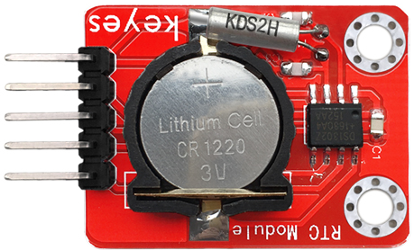
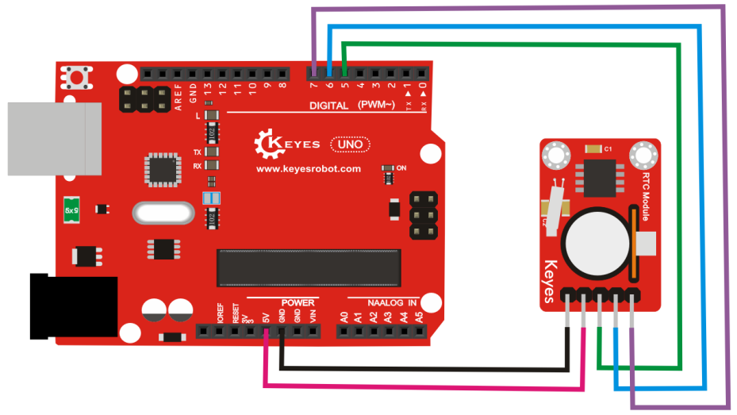
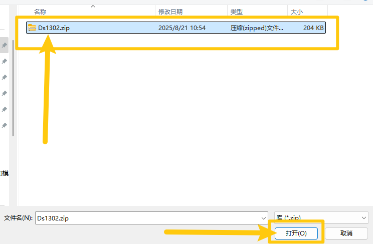
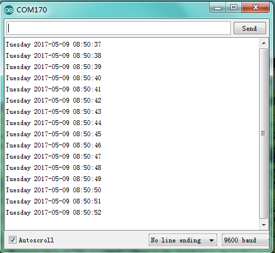

# **KE0050 Keyes DS1302 时钟模块详细教程**



---

## **1. 介绍**

KE0050 Keyes 1302 时钟模块是一款基于 DS1302 实时时钟芯片的模块，专为 Arduino 等开发板设计。它能够记录当前的时间（年、月、日、时、分、秒）并保持时间的准确性，即使断电也能通过备用电池继续运行。模块采用红色环保 PCB 板，设计简单，易于使用，适用于时钟显示、定时控制、数据记录等场景。

---

## **2. 特点**

- **实时时钟功能**：支持年、月、日、时、分、秒的时间记录。
- **低功耗运行**：支持备用电池，断电后仍可保持时间运行。
- **高兼容性**：兼容 Arduino、树莓派等开发板。
- **环保设计**：采用红色环保 PCB 板，耐用且稳定。
- **易于固定**：模块自带两个定位孔，方便安装。

---

## **3. 规格参数**

| 参数            | 值                     |
|-----------------|------------------------|
| **工作电压**    | 3.3V - 5V（DC）        |
| **接口类型**    | 5PIN接口（VCC, GND, CLK, DAT, RST） |
| **芯片型号**    | DS1302                 |
| **时间精度**    | ±2ppm（25℃）          |
| **备用电池**    | CR2032（3V）           |
| **工作温度范围**| -40℃ ～ +85℃          |
| **重量**        | 3.5g                   |

---

## **4. 工作原理**

DS1302 是一款低功耗的实时时钟芯片，支持年、月、日、时、分、秒的时间记录。通过串行通信接口（CLK、DAT、RST），可以与 Arduino 等开发板进行通信，读取或设置时间数据。模块内置备用电池插槽，断电后仍可保持时间运行。

---

## **5. 接口说明**

模块有5个引脚：
1. **VCC**：电源正极（3.3V-5V）。
2. **GND**：电源负极（接地）。
3. **CLK**：时钟信号引脚（连接开发板的数字引脚）。
4. **DAT**：数据引脚（连接开发板的数字引脚）。
5. **RST**：复位引脚（连接开发板的数字引脚）。

---

## **6. 连接图**

以下是 KE0050 模块与 Arduino UNO 的连接示意图：

| KE0050模块引脚 | Arduino引脚 |
| -------------- | ----------- |
| VCC            | 5V          |
| GND            | GND         |
| CLK            | D5          |
| DAT            | D6          |
| RST            | D7          |

连接图如下：



---

## **7. 示例代码**

以下是用于测试 KE0050 模块的 Arduino 示例代码，需安装库：

- 下载库文件：[DS1302](./资料/KE0050.7z)

- 打开Arduino IDE，选择“项目”，选择“导入库”，再选择“添加.ZIP库”。

  

- 找到下载资料的存放位置，打开文件夹找到库文件，选择要导入的库，点击“打开”。

  

- 安装成功界面。

  

#### **代码**

```cpp
#include "Ds1302.h"

// 定义引脚（根据实际接线修改）
#define PIN_ENA 5   // RST引脚
#define PIN_CLK 7   // 时钟引脚
#define PIN_DAT 6   // 数据引脚

Ds1302 rtc(PIN_ENA, PIN_CLK, PIN_DAT);
Ds1302::DateTime dt;  // 明确指定为Ds1302类内的DateTime类型

void setup() {
  Serial.begin(9600);
  rtc.init();
  rtc.start();  // 确保时钟启动

  // 可选：设置初始时间（使用枚举使代码更直观）
  /*
  dt.year = 25;             // 2025年
  dt.month = Ds1302::MONTH_AUG;  // 8月（使用枚举）
  dt.day = 19;              // 19日
  dt.hour = 16;             // 16时
  dt.minute = 45;           // 45分
  dt.second = 0;            // 0秒
  dt.dow = Ds1302::DOW_TUE; // 星期二（使用枚举）
  rtc.setDateTime(&dt);
  */

  Serial.println("时间格式：年-月-日 时:分:秒 星期");
  Serial.println("----------------------------");
}

void loop() {
  rtc.getDateTime(&dt);  // 读取时间到结构体

  // 打印日期（年份补全为4位）
  Serial.print("20");
  printTwoDigits(dt.year);
  Serial.print("-");
  printTwoDigits(dt.month);
  Serial.print("-");
  printTwoDigits(dt.day);
  Serial.print(" ");

  // 打印时间
  printTwoDigits(dt.hour);
  Serial.print(":");
  printTwoDigits(dt.minute);
  Serial.print(":");
  printTwoDigits(dt.second);
  Serial.print("  ");

  // 打印星期（转换为中文）
  Serial.print("星期");
  switch(dt.dow) {
    case Ds1302::DOW_MON: Serial.print("一"); break;
    case Ds1302::DOW_TUE: Serial.print("二"); break;
    case Ds1302::DOW_WED: Serial.print("三"); break;
    case Ds1302::DOW_THU: Serial.print("四"); break;
    case Ds1302::DOW_FRI: Serial.print("五"); break;
    case Ds1302::DOW_SAT: Serial.print("六"); break;
    case Ds1302::DOW_SUN: Serial.print("日"); break;
  }

  Serial.println();
  delay(1000);
}

// 补0函数（确保两位数显示）
void printTwoDigits(uint8_t num) {
  if (num < 10) Serial.print("0");
  Serial.print(num);
}
```

---

## **8. 实验现象**

1. **测试步骤**：
   - 按照连接图接线，将模块连接到 Arduino。
   - 将代码烧录到 Arduino 开发板中。
   - 上电后，打开 Arduino IDE 的串口监视器，设置波特率为 9600。
   - 如果需要设置时间，取消代码中 `rtc.setTime` 和 `rtc.setDate` 的注释，运行一次后再注释掉。

2. **实验现象**：
   - 串口监视器会显示当前的时间和日期。
   
   	
   
   - 时间会每秒更新一次，即使断电后，时间也会保持运行。

---

## **9. 注意事项**

1. **电压范围**：确保模块工作在 3.3V-5V 范围内，避免损坏模块。
2. **备用电池**：请确保模块上安装了 CR2032 电池，以便断电后保持时间运行。
3. **时间设置**：首次使用时需要通过代码设置时间，之后无需重复设置。
4. **固定模块**：通过模块上的定位孔将其固定在稳定的位置，避免震动影响连接。
5. **环境干扰**：避免在强电磁干扰环境中使用，以免影响通信稳定性。

---

## **10. 应用场景**

- **时钟显示**：用于制作电子时钟或时间显示设备。
- **定时控制**：用于定时开关设备或任务调度。
- **数据记录**：用于记录数据的时间戳（如温湿度记录）。
- **智能家居**：用于时间相关的自动化控制。
- **教育实验**：用于学习实时时钟模块的工作原理。

---

## **11. 参考链接**

以下是一些有助于开发的参考链接：
- [DS1302芯片工作原理介绍](https://datasheets.maximintegrated.com/en/ds/DS1302.pdf)

