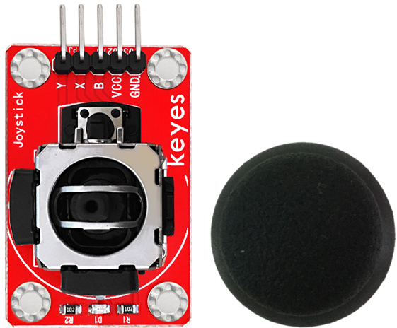
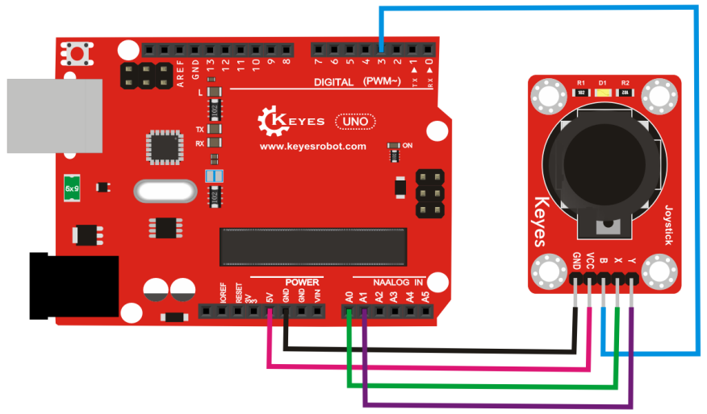

# KE0051 Keyes 摇杆模块传感器



---

## **1. 介绍**

KE0051 Keyes 摇杆模块是一款基于双轴电位器和按钮开关的传感器模块，专为 Arduino 等开发板设计。它可以检测摇杆在 X 和 Y 两个方向上的模拟电压变化，以及按下摇杆时的数字信号输出。模块采用红色环保 PCB 板，设计简单，易于使用，适用于游戏控制器、机器人控制、交互设备等场景。

---

## **2. 特点**

- **双轴检测**：支持 X 和 Y 两个方向的模拟信号输出。
- **按键功能**：支持按下摇杆时的数字信号输出。
- **高兼容性**：兼容 Arduino、树莓派等开发板。
- **环保设计**：采用红色环保 PCB 板，耐用且稳定。
- **易于固定**：模块自带两个定位孔，方便安装。

---

## **3. 规格参数**

| 参数            | 值                     |
|-----------------|------------------------|
| **工作电压**    | 3.3V - 5V（DC）        |
| **接口类型**    | 5PIN接口（VCC, GND, VRx, VRy, SW） |
| **输出信号**    | 模拟信号（VRx, VRy），数字信号（SW） |
| **摇杆类型**    | 双轴电位器 + 按键      |
| **工作温度范围**| -40℃ ～ +85℃          |
| **重量**        | 5g                     |

---

## **4. 工作原理**

KE0051 摇杆模块通过内部的双轴电位器检测摇杆在 X 和 Y 两个方向上的位移，并输出对应的模拟电压信号（VRx 和 VRy）。当摇杆处于中间位置时，输出电压为电源电压的一半；当摇杆向某个方向移动时，输出电压会随之变化。此外，摇杆还带有一个按键开关，当按下摇杆时，SW 引脚输出低电平信号。

---

## **5. 接口说明**

模块有5个引脚：
1. **VCC**：电源正极（3.3V-5V）。
2. **GND**：电源负极（接地）。
3. **VRx**：X 轴方向的模拟信号输出。
4. **VRy**：Y 轴方向的模拟信号输出。
5. **SW**：按键开关的数字信号输出。

---

## **6. 连接图**

以下是 KE0051 模块与 Arduino UNO 的连接示意图：

| KE0051模块引脚 | Arduino引脚 |
| -------------- | ----------- |
| VCC            | 5V          |
| GND            | GND         |
| VRx            | A0          |
| VRy            | A1          |
| SW             | D3          |

连接图如下：



---

## **7. 示例代码**

以下是用于测试 KE0051 模块的 Arduino 示例代码：

```cpp
// 定义引脚
#define VRx_PIN A0 // X轴模拟信号引脚
#define VRy_PIN A1 // Y轴模拟信号引脚
#define SW_PIN 3   // 按键数字信号引脚

void setup() {
  pinMode(SW_PIN, INPUT_PULLUP); // 设置按键引脚为输入模式，并启用上拉电阻
  Serial.begin(9600);            // 设置串口波特率为9600
}

void loop() {
  // 读取 X 和 Y 轴的模拟信号
  int xValue = analogRead(VRx_PIN);
  int yValue = analogRead(VRy_PIN);

  // 读取按键的数字信号
  int buttonState = digitalRead(SW_PIN);

  // 打印 X 和 Y 轴的值
  Serial.print("X-axis: ");
  Serial.print(xValue);
  Serial.print(" | Y-axis: ");
  Serial.print(yValue);

  // 打印按键状态
  if (buttonState == LOW) {
    Serial.println(" | Button: Pressed");
  } else {
    Serial.println(" | Button: Released");
  }

  delay(100); // 延迟100ms
}
```

---

## **8. 实验现象**

1. **测试步骤**：
   - 按照连接图接线，将模块连接到 Arduino。
   - 将代码烧录到 Arduino 开发板中。
   - 上电后，打开 Arduino IDE 的串口监视器，设置波特率为 9600。
   - 移动摇杆并按下摇杆，观察串口监视器中显示的结果。

2. **实验现象**：
   - 当摇杆处于中间位置时，X 和 Y 轴的值接近 512（5V 电压下）。
   - 当摇杆向某个方向移动时，X 或 Y 轴的值会在 0 到 1023 之间变化。
   - 当按下摇杆时，串口监视器显示 "Button: Pressed"。

---

## **9. 注意事项**

1. **电压范围**：确保模块工作在 3.3V-5V 范围内，避免损坏模块。
2. **模拟信号范围**：X 和 Y 轴的模拟信号范围为 0-1023（5V 电压下）。
3. **按键抖动**：机械按键在按下或松开时可能会产生抖动信号，建议在代码中加入去抖处理。
4. **固定模块**：通过模块上的定位孔将其固定在稳定的位置，避免误触发。
5. **环境干扰**：避免在强电磁干扰环境中使用，以免影响信号稳定性。

---

## **10. 应用场景**

- **游戏控制器**：用于制作游戏手柄或控制器。
- **机器人控制**：用于控制机器人或机械臂的运动。
- **交互设备**：用于人机交互界面的输入设备。
- **教育实验**：用于学习模拟信号和数字信号的处理。
- **工业控制**：用于控制设备的方向或状态。

---

## **11. 参考链接**

以下是一些有助于开发的参考链接：
- [Arduino官网](https://www.arduino.cc/)
- [Keyes官网](http://www.keyes-robot.com/)
- [摇杆模块工作原理介绍](https://en.wikipedia.org/wiki/Joystick)

---

如果需要补充其他内容或有其他问题，请告诉我！
