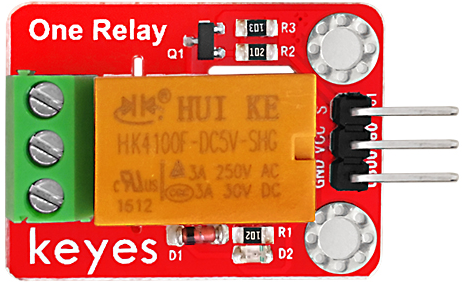
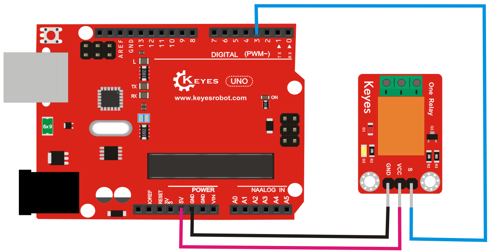

# **KE0052 Keyes 5V 单路继电器模块详细教程**



---

## **1. 介绍**

KE0052 Keyes 5V 单路继电器模块是一款基于电磁继电器的模块，专为 Arduino 等开发板设计。它可以通过高低电平信号控制高电压、大电流的设备开关，实现电路的隔离和导通。模块采用红色环保 PCB 板，设计简单，易于使用，适用于智能家居、工业控制、自动化设备等场景。

---

## **2. 特点**

- **高电压控制**：支持控制高达 250V AC 或 30V DC 的设备。
- **高电平触发**：通过高电平信号控制继电器的开关。
- **光电隔离**：内置光耦隔离，增强电路的安全性和稳定性。
- **高兼容性**：兼容 Arduino、树莓派等开发板。
- **环保设计**：采用红色环保 PCB 板，耐用且稳定。
- **易于固定**：模块自带两个定位孔，方便安装。

---

## **3. 规格参数**

| 参数            | 值                     |
|-----------------|------------------------|
| **工作电压**    | 5V（DC）               |
| **触发电压**    | 高电平触发（5V）     |
| **继电器类型**  | 单路继电器             |
| **控制电压**    | 最大 250V AC 或 30V DC |
| **控制电流**    | 最大 10A               |
| **接口类型**    | 3PIN接口（VCC, GND, IN）+ 3PIN继电器接口（COM, NO, NC） |
| **工作温度范围**| -40℃ ～ +85℃          |
| **重量**        | 10g                    |

---

## **4. 工作原理**

KE0052 单路继电器模块通过高电平信号触发继电器的开关。当输入引脚（IN）接收到高电平信号时，继电器吸合，连接常开端（NO）和公共端（COM）；当输入引脚为低电平时，继电器断开，连接常闭端（NC）和公共端（COM）。模块内置光耦隔离，确保控制电路与高压电路的安全隔离。

---

## **5. 接口说明**

模块有两组接口：
1. **控制接口（3PIN）**：
   - **VCC**：电源正极（5V）。
   - **GND**：电源负极（接地）。
   - **IN**：控制信号输入（高电平触发）。

2. **继电器接口（3PIN）**：
   - **COM**：公共端。
   - **NO**：常开端（继电器吸合时与 COM 连接）。
   - **NC**：常闭端（继电器断开时与 COM 连接）。

---

## **6. 连接图**

以下是 KE0052 模块与 Arduino UNO 的连接示意图：

| KE0052模块引脚 | Arduino引脚 |
| -------------- | ----------- |
| VCC            | 5V          |
| GND            | GND         |
| IN             | D3          |

继电器接口连接示例：（负载一端先连接到电源负极，负载正极接入COM,再另外取一根线接入电源正极，另一端接入NO或者NC，两者区别如下）
- **COM**：连接负载的一端。
- **NO**：连接电源正极（继电器吸合时通电）。
- **NC**：连接电源正极（继电器断开时通电）。

连接图如下：



---

## **7. 示例代码**

以下是用于测试 KE0052 模块的 Arduino 示例代码：

```cpp
// 定义引脚
#define RELAY_PIN 3 // 继电器控制引脚

void setup() {
  pinMode(RELAY_PIN, OUTPUT); // 设置继电器引脚为输出模式
  Serial.begin(9600);         // 设置串口波特率为9600
  Serial.println("Relay Module Test");
}

void loop() {
  Serial.println("Relay ON");
  digitalWrite(RELAY_PIN, HIGH); // 高电平触发继电器吸合
  delay(2000);                  // 延迟2秒

  Serial.println("Relay OFF");
  digitalWrite(RELAY_PIN, LOW); // 低电平关闭继电器
  delay(2000);                   // 延迟2秒
}
```

---

## **8. 实验现象**

1. **测试步骤**：
   - 按照连接图接线，将模块连接到 Arduino。
   - 将代码烧录到 Arduino 开发板中。
   - 上电后，继电器会每隔 2 秒吸合和断开一次，同时可以听到继电器的“咔哒”声。

2. **实验现象**：
   - 当继电器吸合时，常开端（NO）与公共端（COM）连接，负载通电。
   - 当继电器断开时，常闭端（NC）与公共端（COM）连接，负载断电。

---

## **9. 注意事项**

1. **电压范围**：确保模块工作在 5V 电压范围内，避免损坏模块。
2. **负载限制**：继电器的最大控制电压为 250V AC 或 30V DC，最大电流为 10A，请勿超出范围。
3. **高电平触发**：模块为高电平触发，请确保控制信号为 5V 时继电器吸合。
4. **光耦隔离**：模块内置光耦隔离，但在操作高压电路时仍需注意安全，避免触电。
5. **固定模块**：通过模块上的定位孔将其固定在稳定的位置，避免震动影响继电器的工作。
6. **防止反接**：接线时注意正负极，避免反接损坏模块。

---

## **10. 应用场景**

- **智能家居**：用于控制灯光、风扇等家电设备。
- **工业控制**：用于控制电机、阀门等工业设备。
- **自动化设备**：用于实现自动开关控制。
- **安防系统**：用于控制报警器或其他安防设备。
- **教育实验**：用于学习继电器的工作原理和控制方法。

---

## **11. 参考链接**

以下是一些有助于开发的参考链接：
- [Arduino官网](https://www.arduino.cc/)
- [Keyes官网](http://www.keyes-robot.com/)
- [继电器工作原理介绍](https://en.wikipedia.org/wiki/Relay)

---

如遇问题，请先再次参照教程仔细检查，多次检查并操作发现问题依旧存在请联系客服！！！
