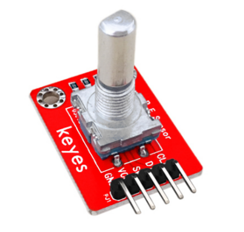

# **KE0053 Keyes 旋转编码器模块详细教程**


---

## **1. 介绍**

KE0053 Keyes 旋转编码器模块是一款基于机械旋转编码器的模块，专为 Arduino 等开发板设计。它可以检测旋钮的旋转方向和旋转步数，并带有按键功能。模块采用红色环保 PCB 板，设计简单，易于使用，适用于音量调节、菜单选择、机器人控制等场景。



---

## **2. 特点**

- **旋转检测**：支持检测旋钮的旋转方向和步数。
- **按键功能**：支持按下旋钮时的数字信号输出。
- **高兼容性**：兼容 Arduino、树莓派等开发板。
- **环保设计**：采用红色环保 PCB 板，耐用且稳定。
- **易于固定**：模块自带两个定位孔，方便安装。

---

## **3. 规格参数**

| 参数            | 值                     |
|-----------------|------------------------|
| **工作电压**    | 3.3V - 5V（DC）        |
| **接口类型**    | 5PIN接口（VCC, GND, CLK, DT, SW） |
| **输出信号**    | 数字信号（CLK, DT, SW） |
| **旋转类型**    | 增量型旋转编码器       |
| **工作温度范围**| -40℃ ～ +85℃          |
| **重量**        | 5g                     |

---

## **4. 工作原理**

KE0053 旋转编码器模块通过机械旋转编码器检测旋钮的旋转方向和步数。旋转编码器有两个输出信号引脚（CLK 和 DT），当旋钮旋转时，这两个引脚会输出相位差为 90° 的脉冲信号。通过检测信号的相位差，可以判断旋转方向和步数。此外，模块还带有一个按键开关（SW），当按下旋钮时，SW 引脚输出低电平信号。

---

## **5. 接口说明**

模块有5个引脚：
1. **VCC**：电源正极（3.3V-5V）。
2. **GND**：电源负极（接地）。
3. **CLK**：时钟信号输出（旋转编码器的信号引脚）。
4. **DT**：数据信号输出（旋转编码器的信号引脚）。
5. **SW**：按键开关的数字信号输出。

---

## **6. 连接图**

以下是 KE0053 模块与 Arduino UNO 的连接示意图：

| KE0053模块引脚 | Arduino引脚 |
|----------------|-------------|
| VCC            | 5V          |
| GND            | GND         |
| CLK            | D2          |
| DT             | D3          |
| SW             | D4          |

连接图如下：

```
Arduino UNO         KE0053模块
   5V   ------------>  VCC
   GND  ------------>  GND
   D2   ------------>  CLK
   D3   ------------>  DT
   D4   ------------>  SW
```

---

## **7. 示例代码**

以下是用于测试 KE0053 模块的 Arduino 示例代码：

```cpp
// 定义引脚
#define CLK_PIN 2 // CLK引脚
#define DT_PIN 3  // DT引脚
#define SW_PIN 4  // SW引脚

int lastCLKState; // 上一次的CLK状态
int counter = 0;  // 旋转计数器

void setup() {
  pinMode(CLK_PIN, INPUT); // 设置CLK引脚为输入模式
  pinMode(DT_PIN, INPUT);  // 设置DT引脚为输入模式
  pinMode(SW_PIN, INPUT_PULLUP); // 设置SW引脚为输入模式，并启用上拉电阻

  Serial.begin(9600); // 设置串口波特率为9600
  lastCLKState = digitalRead(CLK_PIN); // 读取初始CLK状态
  Serial.println("Rotary Encoder Test");
}

void loop() {
  // 检测旋转
  int currentCLKState = digitalRead(CLK_PIN);
  if (currentCLKState != lastCLKState) { // 如果CLK状态发生变化
    if (digitalRead(DT_PIN) != currentCLKState) {
      counter++; // 顺时针旋转
    } else {
      counter--; // 逆时针旋转
    }
    Serial.print("Counter: ");
    Serial.println(counter);
  }
  lastCLKState = currentCLKState;

  // 检测按键
  if (digitalRead(SW_PIN) == LOW) { // 按键被按下
    Serial.println("Button Pressed");
    delay(200); // 防止按键抖动
  }
}
```

---

## **8. 实验现象**

1. **测试步骤**：
   - 按照连接图接线，将模块连接到 Arduino。
   - 将代码烧录到 Arduino 开发板中。
   - 上电后，打开 Arduino IDE 的串口监视器，设置波特率为 9600。
   - 旋转旋钮并按下旋钮，观察串口监视器中显示的结果。

2. **实验现象**：
   - 当顺时针旋转旋钮时，串口监视器显示的计数器值增加。
   - 当逆时针旋转旋钮时，串口监视器显示的计数器值减少。
   - 当按下旋钮时，串口监视器显示 "Button Pressed"。

---

## **9. 注意事项**

1. **电压范围**：确保模块工作在 3.3V-5V 范围内，避免损坏模块。
2. **按键抖动**：机械按键在按下或松开时可能会产生抖动信号，建议在代码中加入去抖处理。
3. **旋转抖动**：机械旋转编码器可能会产生抖动信号，建议通过软件滤波处理。
4. **固定模块**：通过模块上的定位孔将其固定在稳定的位置，避免误触发。
5. **环境干扰**：避免在强电磁干扰环境中使用，以免影响信号稳定性。

---

## **10. 应用场景**

- **音量调节**：用于音响设备的音量调节。
- **菜单选择**：用于电子设备的菜单导航和选择。
- **机器人控制**：用于控制机器人或机械臂的运动。
- **教育实验**：用于学习旋转编码器的工作原理和信号处理。
- **工业控制**：用于设备的参数调节或状态控制。

---

## **11. 参考链接**

以下是一些有助于开发的参考链接：
- [Arduino官网](https://www.arduino.cc/)
- [Keyes官网](http://www.keyes-robot.com/)
- [旋转编码器工作原理介绍](https://en.wikipedia.org/wiki/Rotary_encoder)

---

如果需要补充其他内容或有其他问题，请告诉我！
