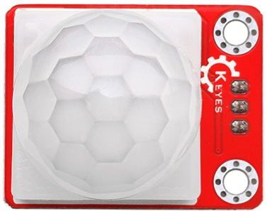
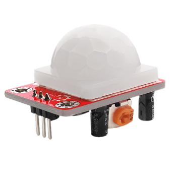
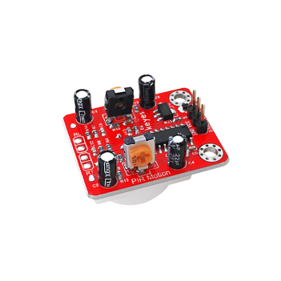
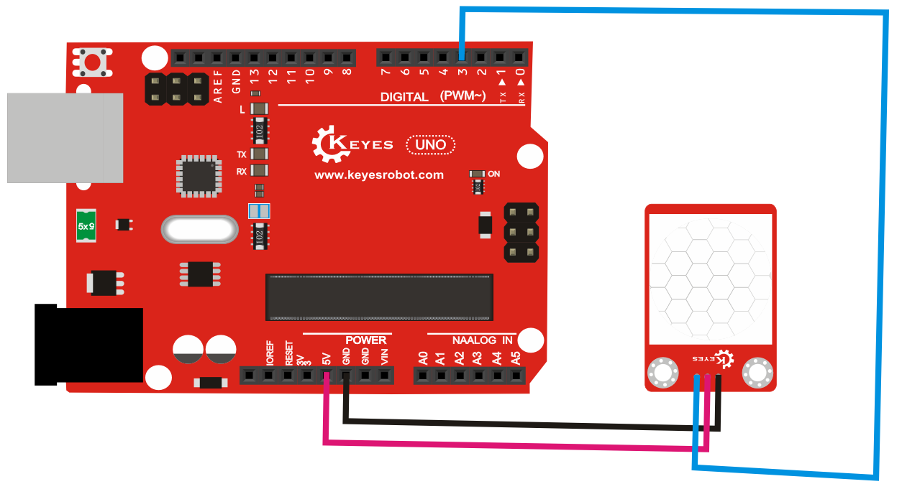

# **KE0054 Keyes 人体红外热释电传感器模块详细教程**



---

## **1. 介绍**

KE0054 Keyes 人体红外热释电传感器模块是一款基于热释电红外传感器的模块，专为 Arduino 等开发板设计。它能够检测人体或其他热源的红外辐射变化，并输出高低电平信号。模块采用红色环保 PCB 板，设计简单，易于使用，适用于安防报警、智能家居、自动化控制等场景。



---

## **2. 特点**

- **人体感应**：通过检测人体红外辐射变化，判断是否有人体活动。
- **高灵敏度**：对人体红外信号的检测灵敏度高，响应速度快。
- **低功耗**：适合电池供电的低功耗应用。
- **高兼容性**：兼容 Arduino、树莓派等开发板。
- **环保设计**：采用红色环保 PCB 板，耐用且稳定。
- **易于固定**：模块自带两个定位孔，方便安装。

---

## **3. 规格参数**

| 参数            | 值                     |
|-----------------|------------------------|
| **工作电压**    | 4.5V - 20V（DC）       |
| **工作电流**    | <50μA                  |
| **输出信号**    | 数字信号（高/低电平）  |
| **感应距离**    | 3m ～ 7m（可调）       |
| **感应角度**    | ≤100°                  |
| **延迟时间**    | 0.5s ～ 200s（可调）   |
| **工作温度范围**| -15℃ ～ +70℃          |
| **重量**        | 5g                     |

---

## **4. 工作原理**

KE0054 人体红外热释电传感器模块通过热释电红外传感器检测人体或其他热源的红外辐射。当人体进入传感器的感应范围时，模块会输出高电平信号；当人体离开感应范围后，模块会输出低电平信号。模块内置的电位器可以调节感应距离和延迟时间。

---

## **5. 接口说明**

模块有3个引脚：
1. **VCC**：电源正极（4.5V-20V）。
2. **GND**：电源负极（接地）。
3. **OUT**：数字信号输出（高/低电平）。

---

## **6. 连接图**

以下是 KE0054 模块与 Arduino UNO 的连接示意图：

| KE0054模块引脚 | Arduino引脚 |
| -------------- | ----------- |
| VCC            | 5V          |
| GND            | GND         |
| OUT            | D3          |

连接图如下：



---

## **7. 示例代码**

以下是用于测试 KE0054 模块的 Arduino 示例代码：

```cpp
// 定义引脚
#define PIR_PIN 3 // 人体红外传感器的输出引脚

void setup() {
  pinMode(PIR_PIN, INPUT); // 设置传感器引脚为输入模式
  Serial.begin(9600);      // 设置串口波特率为9600
  Serial.println("PIR Sensor Test");
}

void loop() {
  int pirState = digitalRead(PIR_PIN); // 读取传感器的数字信号
  if (pirState == HIGH) {
    Serial.println("Motion Detected!"); // 检测到人体活动
  } else {
    Serial.println("No Motion."); // 无人体活动
  }
  delay(500); // 延迟500ms
}
```

---

## **8. 实验现象**

1. **测试步骤**：
   - 按照连接图接线，将模块连接到 Arduino。
   - 将代码烧录到 Arduino 开发板中。
   - 上电后，打开 Arduino IDE 的串口监视器，设置波特率为 9600。
   - 在传感器前移动身体，观察串口监视器中显示的结果。

2. **实验现象**：
   - 当有人体活动时，串口监视器显示 "Motion Detected!"。
   - 当没有人体活动时，串口监视器显示 "No Motion."。

---

## **9. 注意事项**

1. **电压范围**：确保模块工作在 4.5V-20V 范围内，避免损坏模块。
2. **感应范围**：模块的感应距离和延迟时间可以通过电位器调节，具体调节方法如下：
   - **感应距离调节**：调节模块上的“距离电位器”，顺时针增加距离，逆时针减少距离。
   - **延迟时间调节**：调节模块上的“时间电位器”，顺时针增加延迟时间，逆时针减少延迟时间。
3. **环境干扰**：避免在强光、强电磁干扰环境中使用，以免影响检测效果。
4. **固定模块**：通过模块上的定位孔将其固定在稳定的位置，避免震动影响检测结果。
5. **预热时间**：模块上电后需要 10-30 秒的预热时间，期间输出可能不稳定。

---

## **10. 应用场景**

- **安防报警**：用于检测人体活动的安防报警系统。
- **智能家居**：用于自动控制灯光、风扇等家电设备。
- **自动化设备**：用于检测人体接近的自动门、自动售货机等。
- **机器人控制**：用于机器人感知人体活动。
- **教育实验**：用于学习红外传感器的工作原理和应用。

---

## **11. 参考链接**

以下是一些有助于开发的参考链接：
- [Arduino官网](https://www.arduino.cc/)
- [Keyes官网](http://www.keyes-robot.com/)
- [热释电红外传感器工作原理介绍](https://en.wikipedia.org/wiki/Pyroelectric_sensor)

---

如果需要补充其他内容或有其他问题，请告诉我！
