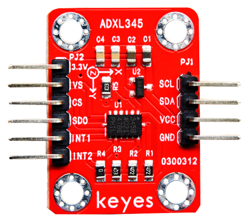
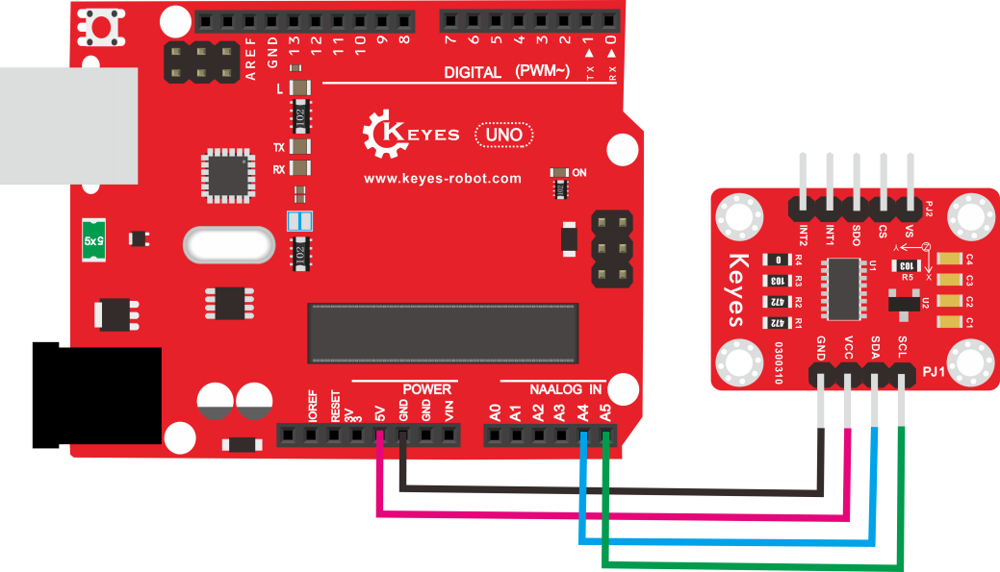
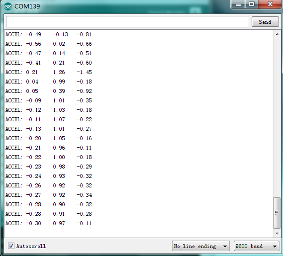

# **KE0055 Keyes ADXL345 加速度传感器模块详细教程**



---

## **1. 介绍**

KE0055 Keyes ADXL345 加速度传感器模块是一款基于 ADXL345 三轴加速度传感器芯片的模块，专为 Arduino 等开发板设计。它能够检测 X、Y、Z 三个方向的加速度，并通过 I2C 或 SPI 接口与开发板通信。模块采用红色环保 PCB 板，设计简单，易于使用，适用于运动检测、姿态控制、震动监测等场景。

---

## **2. 特点**

- **三轴加速度检测**：支持 X、Y、Z 三个方向的加速度测量。
- **高分辨率**：分辨率高达 13 位，测量范围可达 ±16g。
- **多种通信接口**：支持 I2C 和 SPI 通信。
- **低功耗**：适合电池供电的低功耗应用。
- **高兼容性**：兼容 Arduino、树莓派等开发板。
- **环保设计**：采用红色环保 PCB 板，耐用且稳定。

---

## **3. 规格参数**

| 参数            | 值                     |
|-----------------|------------------------|
| **工作电压**    | 3.3V - 5V（DC）        |
| **通信接口**    | I2C（默认地址：0x53），SPI |
| **测量范围**    | ±2g、±4g、±8g、±16g    |
| **分辨率**      | 13 位                  |
| **输出速率**    | 0.1Hz ～ 3200Hz        |
| **工作温度范围**| -40℃ ～ +85℃          |
| **重量**        | 5g                     |

---

## **4. 工作原理**

ADXL345 是一款高分辨率的三轴加速度传感器芯片，能够检测 X、Y、Z 三个方向的加速度。通过 I2C 或 SPI 接口，开发板可以读取传感器的加速度数据。模块支持多种测量范围（±2g、±4g、±8g、±16g），可以根据应用需求进行配置。

---

## **5. 接口说明**

模块有6个引脚：
1. **VCC**：电源正极（3.3V-5V）。
2. **GND**：电源负极（接地）。
3. **SCL**：I2C 时钟信号（或 SPI 时钟信号）。
4. **SDA**：I2C 数据信号（或 SPI 数据信号）。
5. **CS**：SPI 片选信号（低电平激活，I2C 模式下接高电平）。
6. **INT**：中断信号输出（可选）。

---

## **6. 连接图**

以下是 KE0055 模块与 Arduino UNO 的 I2C 接口连接示意图：

| KE0055模块引脚 | Arduino引脚 |
|----------------|-------------|
| VCC            | 5V          |
| GND            | GND         |
| SCL            | A5（Uno 的 I2C 时钟引脚） |
| SDA            | A4（Uno 的 I2C 数据引脚） |
| CS             | 接高电平（I2C 模式） |
| INT            | 可选（根据需要连接到数字引脚） |

连接图如下：



---

## **7. 示例代码**

以下是用于测试 KE0055 模块的 Arduino 示例代码，需安装 **Adafruit_ADXL345** 库：

#### **安装 Adafruit_ADXL345 库**
1. 打开 Arduino IDE，点击 **工具 > 管理库**。
2. 搜索 **Adafruit ADXL345**，安装由 **Adafruit** 提供的库。

#### **代码**
```cpp
#include <Wire.h>
#include <Adafruit_Sensor.h>
#include <Adafruit_ADXL345_U.h>

// 创建 ADXL345 对象
Adafruit_ADXL345_Unified accel = Adafruit_ADXL345_Unified(12345);

void setup() {
  Serial.begin(9600); // 设置串口波特率为9600
  Serial.println("ADXL345 Accelerometer Test");

  // 初始化传感器
  if (!accel.begin()) {
    Serial.println("No ADXL345 detected. Check your wiring!");
    while (1);
  }

  // 设置测量范围为 ±4g
  accel.setRange(ADXL345_RANGE_4_G);
  Serial.println("ADXL345 initialized successfully!");
}

void loop() {
  // 创建事件对象
  sensors_event_t event;
  accel.getEvent(&event);

  // 打印 X、Y、Z 轴加速度值
  Serial.print("X: ");
  Serial.print(event.acceleration.x);
  Serial.print(" m/s^2, Y: ");
  Serial.print(event.acceleration.y);
  Serial.print(" m/s^2, Z: ");
  Serial.print(event.acceleration.z);
  Serial.println(" m/s^2");

  delay(500); // 延迟500ms
}
```

---

## **8. 实验现象**

1. **测试步骤**：
   - 按照连接图接线，将模块连接到 Arduino。
   - 将代码烧录到 Arduino 开发板中。
   - 上电后，打开 Arduino IDE 的串口监视器，设置波特率为 9600。
   - 移动模块，观察串口监视器中显示的 X、Y、Z 轴加速度值。

2. **实验现象**：
   - 当模块静止时，Z 轴的加速度值接近 9.8 m/s²（地球重力加速度）。
   
   - 当模块倾斜或移动时，X、Y、Z 轴的加速度值会发生变化。
   
   	

---

## **9. 注意事项**

1. **电压范围**：确保模块工作在 3.3V-5V 范围内，避免损坏模块。
2. **通信模式**：模块默认使用 I2C 通信模式，若需使用 SPI 模式，请将 CS 引脚接低电平，并修改代码。
3. **测量范围**：根据应用需求设置测量范围（±2g、±4g、±8g、±16g），范围越大，分辨率越低。
4. **固定模块**：通过模块上的定位孔将其固定在稳定的位置，避免震动影响测量结果。
5. **环境干扰**：避免在强电磁干扰环境中使用，以免影响通信稳定性。

---

## **10. 应用场景**

- **运动检测**：用于检测物体的运动状态和加速度。
- **姿态控制**：用于无人机、机器人等设备的姿态控制。
- **震动监测**：用于监测设备的震动或冲击。
- **游戏控制**：用于制作体感游戏控制器。
- **教育实验**：用于学习加速度传感器的工作原理和应用。

---

## **11. 参考链接**

以下是一些有助于开发的参考链接：
- [Arduino官网](https://www.arduino.cc/)
- [Keyes官网](http://www.keyes-robot.com/)
- [ADXL345芯片数据手册](https://www.analog.com/media/en/technical-documentation/data-sheets/ADXL345.pdf)