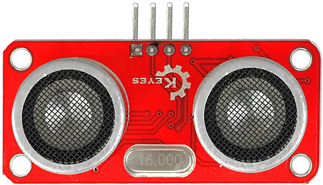
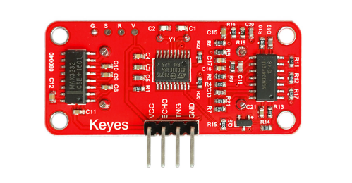
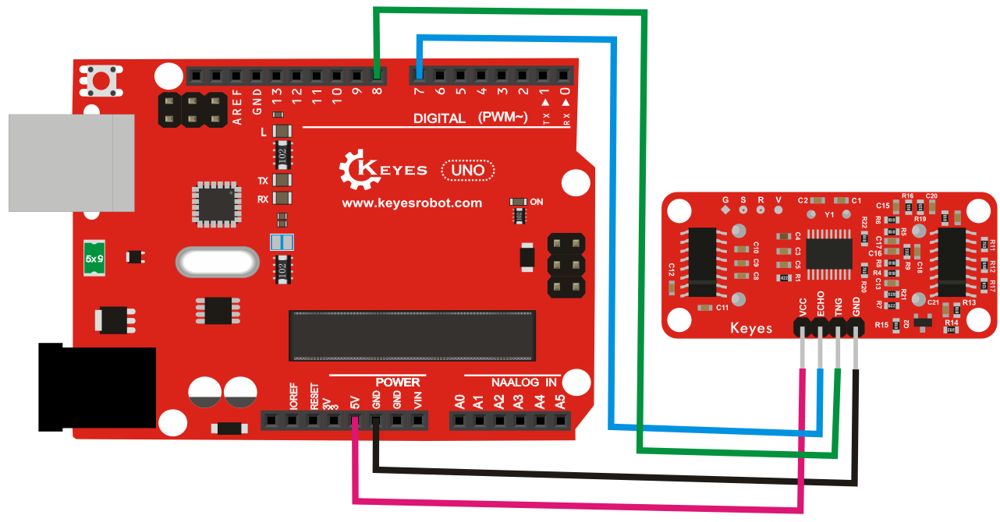
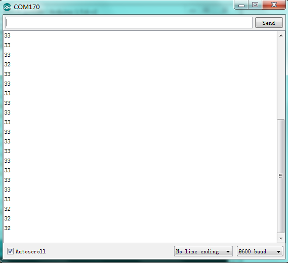

# KE0056 Keyes HC-SR05 超声波传感器模块



---

## **1. 介绍**

KE0056 Keyes HC-SR05 超声波传感器模块是一款基于超声波测距技术的模块，专为 Arduino 等开发板设计。它通过发射超声波并接收反射波来测量物体与传感器之间的距离。模块采用红色环保 PCB 板，设计简单，易于使用，适用于距离测量、避障、自动化控制等场景。

---

## **2. 特点**

- **高精度测距**：测量范围为 2cm 至 450cm，精度可达 3mm。
- **快速响应**：响应时间短，适合实时测量。
- **低功耗**：适合电池供电的低功耗应用。
- **高兼容性**：兼容 Arduino、树莓派等开发板。
- **环保设计**：采用红色环保 PCB 板，耐用且稳定。
- **易于固定**：模块自带两个定位孔，方便安装。

---

## **3. 规格参数**

| 参数            | 值                     |
|-----------------|------------------------|
| **工作电压**    | 5V（DC）               |
| **工作电流**    | <15mA                  |
| **测量范围**    | 2cm ～ 450cm           |
| **测量精度**    | ±3mm                   |
| **发射频率**    | 40kHz                  |
| **接口类型**    | 4PIN接口（VCC, GND, Trig, Echo） |
| **工作温度范围**| -15℃ ～ +70℃          |
| **重量**        | 10g                    |

---

## **4. 工作原理**

HC-SR05 超声波传感器通过 Trig 引脚触发超声波发射器发射 40kHz 的超声波信号。当超声波遇到障碍物时，会反射回来并被接收器接收。模块通过 Echo 引脚输出一个高电平信号，其持续时间与超声波从发射到接收的时间成正比。通过测量 Echo 信号的持续时间，可以计算出物体与传感器之间的距离。

公式如下：
```
距离 (cm) = (Echo 高电平时间 (us) × 声速 (340 m/s)) / 2 / 10000
```

---

## **5. 接口说明**

模块有4个引脚：
1. **VCC**：电源正极（5V）。
2. **GND**：电源负极（接地）。
3. **Trig**：触发信号输入（发送超声波）。
4. **Echo**：回波信号输出（接收超声波）。



---

## **6. 连接图**

以下是 KE0056 模块与 Arduino UNO 的连接示意图：

| KE0056模块引脚 | Arduino引脚 |
| -------------- | ----------- |
| VCC            | 5V          |
| GND            | GND         |
| Trig           | D8          |
| Echo           | D7          |

连接图如下：



---

## **7. 示例代码**

以下是用于测试 KE0056 模块的 Arduino 示例代码：

```cpp
// 定义引脚
#define TRIG_PIN 8 // Trig 引脚
#define ECHO_PIN 7 // Echo 引脚

void setup() {
  pinMode(TRIG_PIN, OUTPUT); // 设置 Trig 引脚为输出模式
  pinMode(ECHO_PIN, INPUT);  // 设置 Echo 引脚为输入模式
  Serial.begin(9600);        // 设置串口波特率为9600
  Serial.println("HC-SR05 Ultrasonic Sensor Test");
}

void loop() {
  // 发送超声波信号
  digitalWrite(TRIG_PIN, LOW);
  delayMicroseconds(2);
  digitalWrite(TRIG_PIN, HIGH);
  delayMicroseconds(10);
  digitalWrite(TRIG_PIN, LOW);

  // 读取 Echo 信号的高电平持续时间
  long duration = pulseIn(ECHO_PIN, HIGH);

  // 计算距离（单位：厘米）
  float distance = (duration * 0.034) / 2;

  // 打印距离
  Serial.print("Distance: ");
  Serial.print(distance);
  Serial.println(" cm");

  delay(500); // 延迟500ms
}
```

---

## **8. 实验现象**

1. **测试步骤**：
   - 按照连接图接线，将模块连接到 Arduino。
   
   - 将代码烧录到 Arduino 开发板中。
   
   - 上电后，打开 Arduino IDE 的串口监视器，设置波特率为 9600。
   
   - 在传感器前放置障碍物，观察串口监视器中显示的距离值。
   
   	
   
2. **实验现象**：
   
   - 当障碍物靠近传感器时，串口监视器显示的距离值减小。
   - 当障碍物远离传感器时，串口监视器显示的距离值增大。

---

## **9. 注意事项**

1. **电压范围**：确保模块工作在 5V 电压范围内，避免损坏模块。
2. **测量范围**：模块的测量范围为 2cm 至 450cm，超出范围可能导致测量不准确。
3. **环境干扰**：避免在强风、强光或高噪声环境中使用，以免影响测量结果。
4. **固定模块**：通过模块上的定位孔将其固定在稳定的位置，避免震动影响测量结果。
5. **测量角度**：模块的测量角度为 15°，请确保障碍物在测量范围内。
6. **延迟时间**：在发送超声波信号后，需等待至少 60ms 再次发送信号，以避免信号干扰。

---

## **10. 应用场景**

- **距离测量**：用于测量物体与传感器之间的距离。
- **避障系统**：用于机器人或无人机的避障功能。
- **自动化控制**：用于自动门、自动水龙头等设备的控制。
- **液位检测**：用于检测液体的高度或液位。
- **教育实验**：用于学习超声波传感器的工作原理和应用。

---

## **11. 参考链接**

以下是一些有助于开发的参考链接：
- [Arduino官网](https://www.arduino.cc/)
- [Keyes官网](http://www.keyes-robot.com/)
- [超声波传感器工作原理介绍](https://en.wikipedia.org/wiki/Ultrasonic_sensor)

