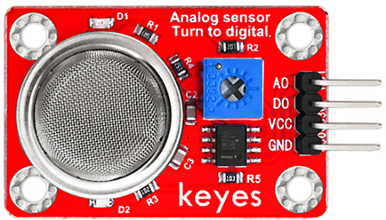
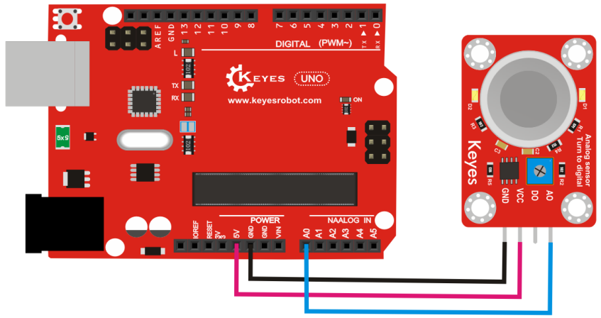

# **KE0057 Keyes MQ-2 烟雾传感器模块**



---

## **1. 介绍**

KE0057 Keyes MQ-2 烟雾传感器模块是一款基于 MQ-2 气体传感器的模块，专为 Arduino 等开发板设计。它能够检测空气中的可燃气体（如液化气、甲烷、丙烷）和烟雾浓度，并输出模拟信号和数字信号。模块采用红色环保 PCB 板，设计简单，易于使用，适用于烟雾报警、气体泄漏检测等场景。

---

## **2. 特点**

- **多气体检测**：支持检测烟雾、液化气、甲烷、丙烷等可燃气体。
- **双输出模式**：支持模拟信号和数字信号输出。
- **灵敏度可调**：通过电位器调节灵敏度。
- **高兼容性**：兼容 Arduino、树莓派等开发板。
- **环保设计**：采用红色环保 PCB 板，耐用且稳定。
- **易于固定**：模块自带两个定位孔，方便安装。

---

## **3. 规格参数**

| 参数            | 值                     |
|-----------------|------------------------|
| **工作电压**    | 5V（DC）               |
| **工作电流**    | 150mA                  |
| **检测气体**    | 烟雾、液化气、甲烷、丙烷等 |
| **输出信号**    | 模拟信号（AOUT），数字信号（DOUT） |
| **灵敏度调节**  | 支持（通过电位器）     |
| **预热时间**    | 20 秒                  |
| **工作温度范围**| -10℃ ～ +50℃          |
| **重量**        | 10g                    |

---

## **4. 工作原理**

MQ-2 气体传感器内部包含一个加热元件和一个电化学传感器。当空气中的可燃气体或烟雾浓度增加时，传感器的电阻会发生变化，从而改变输出电压。模块通过模拟信号（AOUT）输出气体浓度的变化，同时通过数字信号（DOUT）输出是否超过设定的阈值（由电位器调节）。

---

## **5. 接口说明**

模块有4个引脚：
1. **VCC**：电源正极（5V）。
2. **GND**：电源负极（接地）。
3. **AOUT**：模拟信号输出（气体浓度）。
4. **DOUT**：数字信号输出（高/低电平，是否超过阈值）。

---

## **6. 连接图**

以下是 KE0057 模块与 Arduino UNO 的连接示意图：

| KE0057模块引脚 | Arduino引脚 |
|----------------|-------------|
| VCC            | 5V          |
| GND            | GND         |
| AOUT           | A0          |
| DOUT           | D2          |

连接图如下：



---

## **7. 示例代码**

以下是用于测试 KE0057 模块的 Arduino 示例代码：

```cpp
// 定义引脚
#define AOUT_PIN A0 // 模拟信号引脚
#define DOUT_PIN 2  // 数字信号引脚

void setup() {
  pinMode(DOUT_PIN, INPUT); // 设置 DOUT 引脚为输入模式
  Serial.begin(9600);       // 设置串口波特率为9600
  Serial.println("MQ-2 Smoke Sensor Test");
}

void loop() {
  // 读取模拟信号
  int analogValue = analogRead(AOUT_PIN);

  // 读取数字信号
  int digitalValue = digitalRead(DOUT_PIN);

  // 打印模拟信号值
  Serial.print("Analog Value: ");
  Serial.print(analogValue);

  // 打印数字信号状态
  if (digitalValue == LOW) {
    Serial.println(" | Smoke/Gas Detected!");
  } else {
    Serial.println(" | No Smoke/Gas.");
  }

  delay(500); // 延迟500ms
}
```

---

## **8. 实验现象**

1. **测试步骤**：
   - 按照连接图接线，将模块连接到 Arduino。
   - 将代码烧录到 Arduino 开发板中。
   - 上电后，打开 Arduino IDE 的串口监视器，设置波特率为 9600。
   - 在传感器附近点燃火柴或打火机，观察串口监视器中显示的结果。

2. **实验现象**：
   - 当传感器检测到烟雾或可燃气体时，串口监视器显示 "Smoke/Gas Detected!"，同时模拟信号值（Analog Value）增加。
   - 当没有烟雾或可燃气体时，串口监视器显示 "No Smoke/Gas."。

---

## **9. 注意事项**

1. **预热时间**：模块上电后需要 20 秒的预热时间，期间输出可能不稳定。
2. **电压范围**：确保模块工作在 5V 电压范围内，避免损坏模块。
3. **灵敏度调节**：通过模块上的电位器调节灵敏度，顺时针增加灵敏度，逆时针降低灵敏度。
4. **环境干扰**：避免在高湿度或强风环境中使用，以免影响检测效果。
5. **固定模块**：通过模块上的定位孔将其固定在稳定的位置，避免震动影响测量结果。
6. **安全使用**：在测试过程中避免长时间暴露于高浓度可燃气体环境中，以免损坏传感器。

---

## **10. 应用场景**

- **烟雾报警**：用于检测火灾中的烟雾浓度。
- **气体泄漏检测**：用于检测液化气、甲烷、丙烷等可燃气体的泄漏。
- **空气质量监测**：用于监测空气中的烟雾或有害气体浓度。
- **智能家居**：用于制作智能烟雾报警器或气体检测设备。
- **教育实验**：用于学习气体传感器的工作原理和应用。

---

## **11. 参考链接**

以下是一些有助于开发的参考链接：
- [Arduino官网](https://www.arduino.cc/)
- [Keyes官网](http://www.keyes-robot.com/)
- [MQ-2传感器工作原理介绍](https://www.pololu.com/file/0J309/MQ2.pdf)

---

如果需要补充其他内容或有其他问题，请告诉我！
