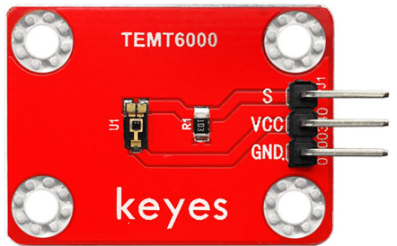
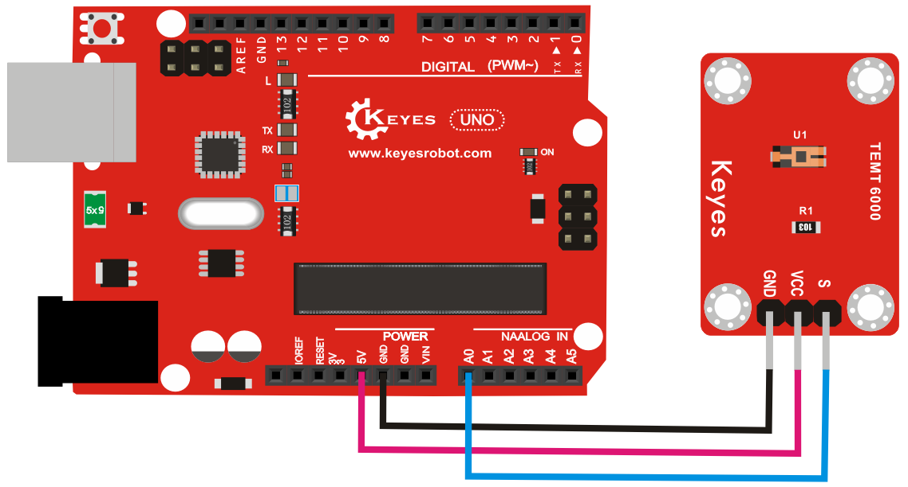
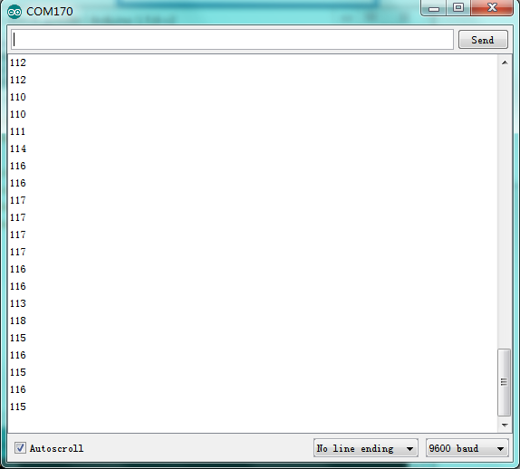

# **KE0065 Keyes TEMT6000 光线传感器模块详细教程**



---

## **1. 介绍**

KE0065 Keyes TEMT6000 光线传感器模块是一款基于 TEMT6000 光敏二极管的模块，专为 Arduino 等开发板设计。它能够检测环境光强度，并输出模拟信号，适用于光线检测、环境光监测、自动亮度调节等场景。模块采用红色环保 PCB 板，设计简单，易于使用。

---

## **2. 特点**

- **光线检测**：能够检测环境光强度。
- **模拟信号输出**：通过模拟信号输出光强度值。
- **高灵敏度**：对可见光范围内的光线响应灵敏。
- **高兼容性**：兼容 Arduino、树莓派等开发板。
- **环保设计**：采用红色环保 PCB 板，耐用且稳定。
- **易于固定**：模块自带两个定位孔，方便安装。

---

## **3. 规格参数**

| 参数            | 值                     |
|-----------------|------------------------|
| **工作电压**    | 3.3V ～ 5V（DC）       |
| **工作电流**    | 0.5mA                  |
| **检测范围**    | 可见光（380nm ～ 780nm）|
| **输出信号**    | 模拟信号（AOUT）       |
| **工作温度范围**| -40℃ ～ +85℃          |
| **重量**        | 5g                     |

---

## **4. 工作原理**

TEMT6000 是一款光敏二极管，能够对可见光范围内的光线强度作出响应。光线越强，输出的模拟电压值越高；光线越弱，输出的模拟电压值越低。通过读取模拟信号（AOUT），可以获取当前环境的光强度。

---

## **5. 接口说明**

模块有3个引脚：
1. **VCC**：电源正极（3.3V 或 5V）。
2. **GND**：电源负极（接地）。
3. **AOUT**：模拟信号输出（光强度值）。

---

## **6. 连接图**

以下是 KE0065 模块与 Arduino UNO 的连接示意图：

| KE0065模块引脚 | Arduino引脚 |
|----------------|-------------|
| VCC            | 5V          |
| GND            | GND         |
| AOUT           | A0          |

连接图如下：



---

## **7. 示例代码**

以下是用于测试 KE0065 模块的 Arduino 示例代码：

```cpp
// 定义引脚
#define AOUT_PIN A0 // 模拟信号引脚

void setup() {
  Serial.begin(9600); // 设置串口波特率为9600
  Serial.println("TEMT6000 Light Sensor Test");
}

void loop() {
  // 读取模拟信号
  int lightValue = analogRead(AOUT_PIN);

  // 打印光强度值
  Serial.print("Light Intensity: ");
  Serial.println(lightValue);

  delay(500); // 延迟500ms
}
```

---

## **8. 实验现象**

1. **测试步骤**：
   - 按照连接图接线，将模块连接到 Arduino。
   
   - 将代码烧录到 Arduino 开发板中。
   
   - 上电后，打开 Arduino IDE 的串口监视器，设置波特率为 9600。
   
   - 调节环境光强度（如用手遮挡传感器或用手电筒照射传感器），观察串口监视器中显示的光强度值。
   
   	
   
2. **实验现象**：
   - 当环境光强度增加时，串口监视器中显示的光强度值（Light Intensity）增大。
   - 当环境光强度减弱时，串口监视器中显示的光强度值（Light Intensity）减小。

---

## **9. 注意事项**

1. **电压范围**：确保模块工作在 3.3V ～ 5V 电压范围内，避免损坏模块。
2. **环境干扰**：避免强红外光源（如太阳光）直接照射传感器，以免影响检测效果。
3. **固定模块**：通过模块上的定位孔将其固定在稳定的位置，避免震动影响测量结果。
4. **线性范围**：TEMT6000 对可见光范围内的光线响应较好，但对红外光和紫外光不敏感。

---

## **10. 应用场景**

- **环境光监测**：用于检测环境光强度。
- **自动亮度调节**：用于智能设备的屏幕亮度自动调节。
- **光线报警器**：用于制作光线强度报警器。
- **智能家居**：用于光线检测和自动化控制。
- **教育实验**：用于学习光敏传感器的工作原理和应用。

---

## **11. 参考链接**

以下是一些有助于开发的参考链接：
- [Arduino官网](https://www.arduino.cc/)
- [Keyes官网](http://www.keyes-robot.com/)
- [TEMT6000传感器数据手册](https://www.vishay.com/docs/81579/temt6000.pdf)

---

如果需要补充其他内容或有其他问题，请告诉我！
