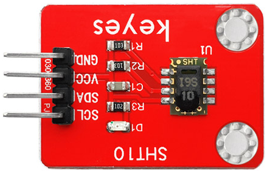
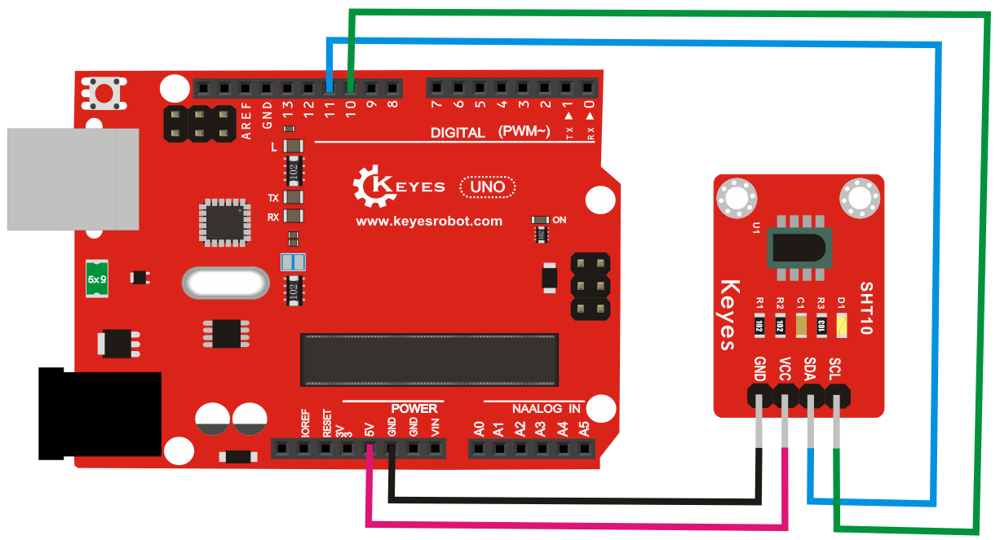
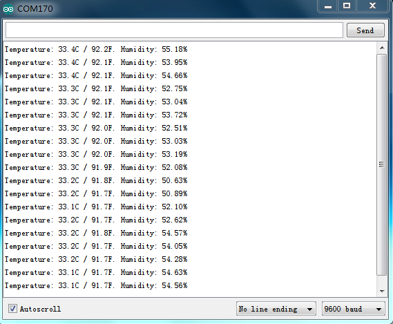

# **KE0067 Keyes SHT10 温湿度传感器模块详细教程**



---

## **1. 介绍**

KE0067 Keyes SHT10 温湿度传感器模块是一款基于 Sensirion SHT10 数字温湿度传感器的模块，专为 Arduino 等开发板设计。它能够检测环境的温度和湿度，并通过数字信号输出数据。模块采用红色环保 PCB 板，设计简单，易于使用，适用于环境监测、智能家居等场景。

---

## **2. 特点**

- **高精度检测**：能够检测环境温度和湿度，精度高。
- **数字信号输出**：通过 I2C 类似的单总线协议输出温湿度数据。
- **高兼容性**：兼容 Arduino、树莓派等开发板。
- **环保设计**：采用红色环保 PCB 板，耐用且稳定。
- **易于固定**：模块自带两个定位孔，方便安装。

---

## **3. 规格参数**

| 参数            | 值                     |
|-----------------|------------------------|
| **工作电压**    | 3.3V ～ 5V（DC）       |
| **工作电流**    | 0.5mA（最大）          |
| **温度检测范围**| -40℃ ～ +123.8℃       |
| **湿度检测范围**| 0% ～ 100% RH          |
| **温度精度**    | ±0.5℃                 |
| **湿度精度**    | ±4.5% RH              |
| **输出信号**    | 数字信号（单总线协议） |
| **工作周期**    | 2 秒                   |
| **重量**        | 5g                     |

---

## **4. 工作原理**

SHT10 是一款数字温湿度传感器，内部包含一个电容式湿度传感器和一个带有 ADC 的温度传感器。传感器通过单总线协议输出温湿度数据，数据格式为数字信号，主控板通过时钟和数据引脚与传感器通信。

---

## **5. 接口说明**

模块有4个引脚：
1. **VCC**：电源正极（3.3V ～ 5V）。
2. **GND**：电源负极（接地）。
3. **DATA**：数据引脚（与主控板通信）。
4. **SCK**：时钟引脚（与主控板通信）。

---

## **6. 连接图**

以下是 KE0067 模块与 Arduino UNO 的连接示意图：

| KE0067模块引脚 | Arduino引脚 |
| -------------- | ----------- |
| VCC            | 5V          |
| GND            | GND         |
| DATA           | D10         |
| SCK            | D11         |

连接图如下：



---

## **7. 示例代码**

以下是用于测试 KE0067 模块的 Arduino 示例代码，需安装 **SHT1x库**。

#### **安装库**

1. 打开 Arduino IDE。
2. 点击 **工具 > 管理库**。
3. 搜索 **SHT1x**，安装 **SHT1x Sensor Library**。

#### **代码**
```cpp
#include <SHT1x.h>

// 定义引脚
#define dataPin 10 // 数据引脚连接到 D10
#define clockPin 11 // 时钟引脚连接到 D11

// 初始化 SHT1x 传感器
SHT1x sht1x(dataPin, clockPin);

void setup() {
  Serial.begin(9600); // 设置串口波特率为9600
  Serial.println("SHT10 Temperature and Humidity Sensor Test");
}

void loop() {
  // 读取温湿度数据
  float temperature = sht1x.readTemperatureC(); // 读取温度（摄氏度）
  float humidity = sht1x.readHumidity();        // 读取湿度

  // 检查是否读取失败
  if (isnan(temperature) || isnan(humidity)) {
    Serial.println("Failed to read from SHT10 sensor!");
    return;
  }

  // 打印温湿度数据
  Serial.print("Temperature: ");
  Serial.print(temperature);
  Serial.println(" *C");

  Serial.print("Humidity: ");
  Serial.print(humidity);
  Serial.println(" %");

  delay(2000); // 每2秒读取一次
}
```

---

## **8. 实验现象**

1. **测试步骤**：
   - 按照连接图接线，将模块连接到 Arduino。
   
   - 将代码烧录到 Arduino 开发板中。
   
   - 上电后，打开 Arduino IDE 的串口监视器，设置波特率为 9600。
   
   - 观察串口监视器中显示的温湿度数据。
   
   	
   
2. **实验现象**：
   - 模块会每隔 2 秒输出一次当前环境的温度和湿度数据。
   - 当环境温度或湿度变化时，串口监视器中的数据会随之变化。

---

## **9. 注意事项**

1. **电压范围**：确保模块工作在 3.3V ～ 5V 电压范围内，避免损坏模块。
2. **工作周期**：SHT10 每次测量需要 2 秒，避免频繁读取数据。
3. **环境干扰**：避免在高湿度或强风环境中使用，以免影响检测效果。
4. **固定模块**：通过模块上的定位孔将其固定在稳定的位置，避免震动影响测量结果。
5. **数据校验**：SHT10 内置 CRC 校验机制，确保数据传输的可靠性。

---

## **10. 应用场景**

- **环境监测**：用于检测室内外温湿度。
- **智能家居**：用于制作温湿度监测设备。
- **农业监控**：用于监测温室或农田的温湿度。
- **工业控制**：用于监测工业环境的温湿度。
- **教育实验**：用于学习温湿度传感器的工作原理和应用。

---

## **11. 参考链接**

以下是一些有助于开发的参考链接：
- [Arduino官网](https://www.arduino.cc/)
- [Keyes官网](http://www.keyes-robot.com/)
- [SHT10传感器数据手册](https://www.sensirion.com/fileadmin/user_upload/customers/sensirion/Dokumente/Humidity_and_Temperature_Sensors/Sensirion_Humidity_Sensors_SHT1x_Datasheet.pdf)

---

如果需要补充其他内容或有其他问题，请告诉我！
