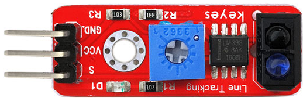
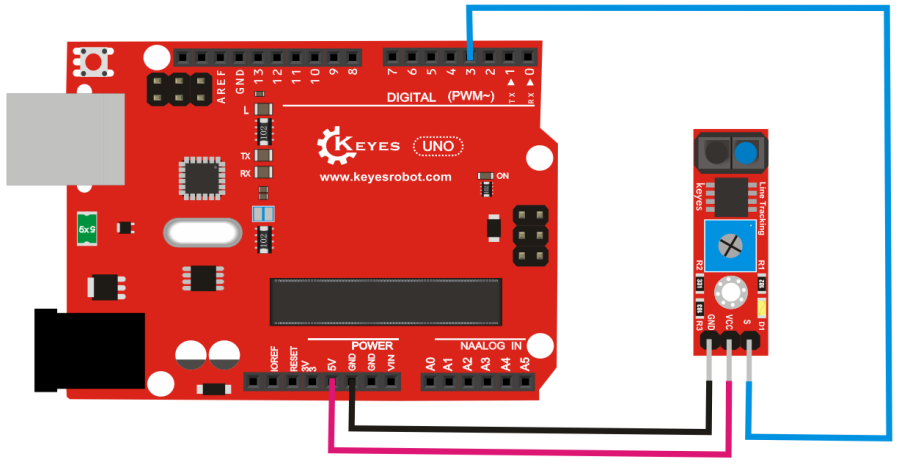

# **KE0068 Keyes 巡线传感器模块详细教程**



---

## **1. 介绍**

KE0068 Keyes 巡线传感器模块是一款基于红外反射原理的传感器模块，专为 Arduino 等开发板设计。它能够检测黑白线条或物体的反射光强度差异，输出数字信号，用于巡线小车、机器人路径识别等场景。模块采用红色环保 PCB 板，设计简单，易于使用。

---

## **2. 特点**

- **红外检测**：通过红外发射和接收检测反射光强度。
- **数字信号输出**：输出高/低电平，表示是否检测到黑线。
- **灵敏度可调**：通过电位器调节灵敏度。
- **高兼容性**：兼容 Arduino、树莓派等开发板。
- **环保设计**：采用红色环保 PCB 板，耐用且稳定。
- **易于固定**：模块自带两个定位孔，方便安装。

---

## **3. 规格参数**

| 参数            | 值                     |
|-----------------|------------------------|
| **工作电压**    | 3.3V ～ 5V（DC）       |
| **工作电流**    | 20mA                   |
| **检测距离**    | 1mm ～ 6mm             |
| **输出信号**    | 数字信号（高/低电平）  |
| **灵敏度调节**  | 支持（通过电位器）     |
| **工作温度范围**| -10℃ ～ +50℃          |
| **重量**        | 5g                     |

---

## **4. 工作原理**

KE0068 巡线传感器通过红外发射管发射红外光，红外接收管接收反射回来的光线。当传感器检测到黑色线条时，由于黑色物体吸收红外光，反射光较弱，输出低电平信号；当检测到白色线条时，反射光较强，输出高电平信号。通过调整电位器，可以改变检测灵敏度。

---

## **5. 接口说明**

模块有3个引脚：
1. **VCC**：电源正极（3.3V ～ 5V）。
2. **GND**：电源负极（接地）。
3. **OUT**：数字信号输出（高/低电平）。

---

## **6. 连接图**

以下是 KE0068 模块与 Arduino UNO 的连接示意图：

| KE0068模块引脚 | Arduino引脚 |
| -------------- | ----------- |
| VCC            | 5V          |
| GND            | GND         |
| OUT            | D3          |

连接图如下：



---

## **7. 示例代码**

以下是用于测试 KE0068 模块的 Arduino 示例代码：

```cpp
// 定义引脚
#define SENSOR_PIN 3 // OUT 引脚连接到 D3

void setup() {
  pinMode(SENSOR_PIN, INPUT); // 设置传感器引脚为输入模式
  Serial.begin(9600);         // 设置串口波特率为9600
  Serial.println("Line Tracking Sensor Test");
}

void loop() {
  // 读取传感器信号
  int sensorValue = digitalRead(SENSOR_PIN);

  // 判断是否检测到黑线
  if (sensorValue == LOW) {
    Serial.println("Black Line Detected!");
  } else {
    Serial.println("No Line Detected.");
  }

  delay(100); // 延迟100ms
}
```

---

## **8. 实验现象**

1. **测试步骤**：
   - 按照连接图接线，将模块连接到 Arduino。
   - 将代码烧录到 Arduino 开发板中。
   - 上电后，打开 Arduino IDE 的串口监视器，设置波特率为 9600。
   - 将传感器对准黑白线条，观察串口监视器中显示的结果。

2. **实验现象**：
   - 当传感器检测到黑线时，串口监视器显示 "Black Line Detected!"。
   - 当传感器检测到白线或无线条时，串口监视器显示 "No Line Detected."。

---

## **9. 注意事项**

1. **电压范围**：确保模块工作在 3.3V ～ 5V 电压范围内，避免损坏模块。
2. **检测距离**：传感器与检测物体的距离应保持在 1mm ～ 6mm 之间，避免检测失效。
3. **灵敏度调节**：通过模块上的电位器调节灵敏度，顺时针增加灵敏度，逆时针降低灵敏度。
4. **环境干扰**：避免强光或红外干扰环境，以免影响检测效果。
5. **固定模块**：通过模块上的定位孔将其固定在稳定的位置，避免震动影响测量结果。

---

## **10. 应用场景**

- **巡线小车**：用于制作巡线机器人或小车。
- **路径识别**：用于机器人路径识别和导航。
- **工业自动化**：用于生产线上的物体检测。
- **智能家居**：用于光线检测和自动化控制。
- **教育实验**：用于学习红外传感器的工作原理和应用。

---

## **11. 参考链接**

以下是一些有助于开发的参考链接：
- [Arduino官网](https://www.arduino.cc/)
- [Keyes官网](http://www.keyes-robot.com/)

如果需要补充其他内容或有其他问题，请告诉我！
