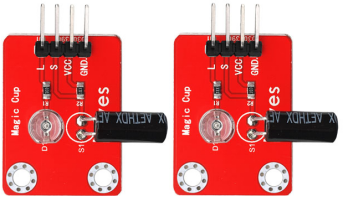
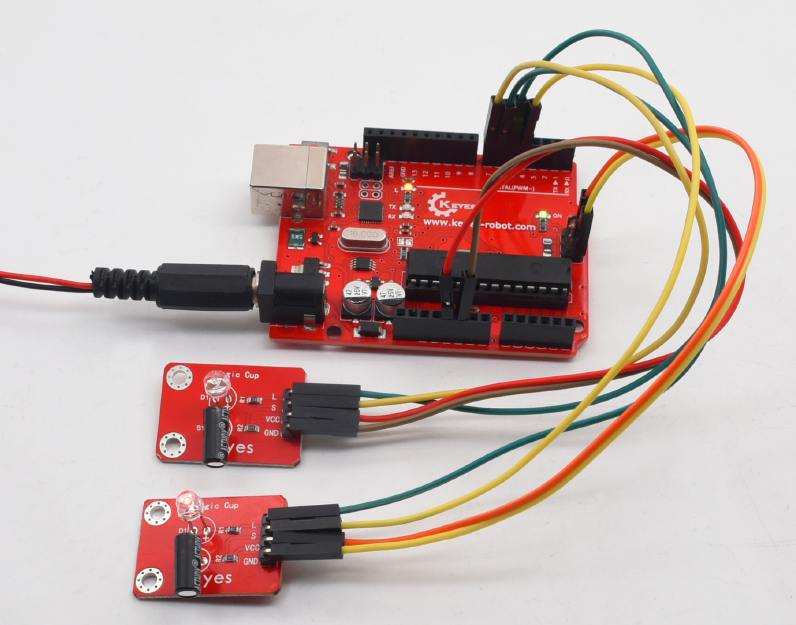

# **KE0070 Keyes 魔术光杯传感器模块**



---

## **1. 介绍**

KE0070 Keyes 魔术光杯传感器模块是一款基于 PWM 调光和滚珠开关触发的传感器模块，适用于 Arduino 等单片机开发板。通过滚珠开关检测倾斜方向，触发 PWM 信号调节 LED 的亮度，实现动态光效。倾斜传感器时，一个 LED 的亮度逐渐变暗，另一个 LED 的亮度逐渐变亮，模拟“光杯倒来倒去”的效果。

模块设计简单，易于使用，兼容 Arduino 系列单片机及其他控制板，适合教育实验、趣味项目和动态灯光效果的开发。

---

## **2. 特点**

- **动态光效**：通过滚珠开关触发，LED 灯亮度动态变化，模拟光线流动效果。
- **PWM 调光**：支持 PWM 信号调节 LED 亮度，占空比范围 0～255。
- **高兼容性**：兼容 Arduino、树莓派等开发板。
- **易于安装**：模块自带3mm 定位孔，方便接线和固定。
- **环保设计**：采用红色环保 PCB 板，耐用且稳定。

---

## **3. 规格参数**

| 参数            | 值                     |
|-----------------|------------------------|
| **工作电压**    | DC 3.3V ～ 5V          |
| **控制信号**    | 数字信号（滚珠开关）+ PWM 信号（LED 调光） |
| **接口**        | 2.54mm |
| **定位孔大小**  | 直径为 3mm             |
| **尺寸**        | 34mm × 27mm × 15mm     |
| **重量**        | 3.2g × 2               |
| **导线长度**    | 200mm                  |

---

## **4. 工作原理**

KE0070 魔术光杯传感器模块通过滚珠开关检测倾斜方向，提供数字信号（高/低电平）。当滚珠开关触发时，Arduino 根据信号调节 PWM 输出，占空比范围为 0～255，用于控制 LED 的亮度。倾斜传感器时，一个 LED 的亮度逐渐变暗，另一个 LED 的亮度逐渐变亮，最终实现动态光效。

---

## **5. 接口说明**

模块有 4 个引脚：
1. **VCC**：电源正极（3.3V ～ 5V）。
2. **GND**：电源负极（接地）。
3. **SWITCH1**：滚珠开关 1 的数字信号输出。
4. **SWITCH2**：滚珠开关 2 的数字信号输出。

---

## **6. 连接图**

以下是 KE0070 模块与 Arduino UNO 的连接示意图：

| 模块引脚         | Arduino 引脚 |
|------------------|-------------|
| **VCC**          | 5V          |
| **GND**          | GND         |
| **SWITCH1**      | D4          |
| **SWITCH2**      | D5          |
| **LED1 (PWM)**   | D6 (PWM)    |
| **LED2 (PWM)**   | D7 (PWM)   |

连接图如下：

 红色 环保/media/img-20230307134752.png)

---

## **7. 示例代码**

以下是用于测试 KE0070 模块的 Arduino 示例代码：

```cpp
// 定义引脚
const int LedPinA = 6; // LED A 连接到 PWM 引脚 D6
const int LedPinB = 7; // LED B 连接到 PWM 引脚 D7
const int SwitchPinA = 4; // 滚珠开关 A 连接到数字引脚 D4
const int SwitchPinB = 5; // 滚珠开关 B 连接到数字引脚 D5

int buttonStateA = 0; // 滚珠开关 A 的状态
int buttonStateB = 0; // 滚珠开关 B 的状态
int brightnessA = 0; // LED A 的亮度
int brightnessB = 255; // LED B 的亮度

void setup() {
  // 初始化引脚模式
  pinMode(LedPinA, OUTPUT); // 设置 LED A 引脚为输出模式
  pinMode(LedPinB, OUTPUT); // 设置 LED B 引脚为输出模式
  pinMode(SwitchPinA, INPUT); // 设置滚珠开关 A 引脚为输入模式
  pinMode(SwitchPinB, INPUT); // 设置滚珠开关 B 引脚为输入模式

  Serial.begin(9600); // 初始化串口通信，波特率为 9600
}

void loop() {
  // 读取滚珠开关 A 的状态
  buttonStateA = digitalRead(SwitchPinA);
  if (buttonStateA == HIGH && brightnessA < 255) {
    brightnessA++; // 增加 LED A 的亮度
  }
  if (buttonStateA == LOW && brightnessA > 0) {
    brightnessA--; // 减少 LED A 的亮度
  }

  // 读取滚珠开关 B 的状态
  buttonStateB = digitalRead(SwitchPinB);
  if (buttonStateB == HIGH && brightnessB > 0) {
    brightnessB--; // 减少 LED B 的亮度
  }
  if (buttonStateB == LOW && brightnessB < 255) {
    brightnessB++; // 增加 LED B 的亮度
  }

  // 输出亮度值到串口监视器
  Serial.print("Brightness A: ");
  Serial.print(brightnessA);
  Serial.print("   Brightness B: ");
  Serial.println(brightnessB);

  // 调节 LED 的亮度
  analogWrite(LedPinA, brightnessA); // 使用 PWM 调节 LED A 的亮度
  analogWrite(LedPinB, brightnessB); // 使用 PWM 调节 LED B 的亮度

  delay(10); // 延迟 10 毫秒，避免过快变化
}
```

---

## **8. 实验现象**

1. **串口监视器输出**：
   - 串口监视器会显示两个 LED 的亮度值（0～255）。
   - 例如：
     ```
     Brightness A: 128   Brightness B: 127
     Brightness A: 129   Brightness B: 126
     ```

2. **LED 亮度变化**：
   
   
   
   - 倾斜传感器时，一个 LED 的亮度逐渐变暗，另一个 LED 的亮度逐渐变亮。
   - 当倾斜方向相反时，亮度变化方向也相反。

---

## **9. 注意事项**

1. **电压范围**：确保模块工作在 3.3V ～ 5V 电压范围内，避免损坏模块。
2. **滚珠开关灵敏度**：滚珠开关的触发可能受倾斜角度影响，确保模块安装稳定。
3. **PWM 调节范围**：PWM 信号的占空比范围为 0～255，对应 LED 的亮度从完全熄灭到最亮。
4. **延迟时间**：`delay(10)` 控制亮度变化的速度，可根据需要调整。

---

## **10. 参考链接**

- [Arduino 官网](https://www.arduino.cc/)
- [Keyes 官网](http://www.keyes-robot.com/)
- [PWM 信号原理](https://en.wikipedia.org/wiki/Pulse-width_modulation)
- [滚珠开关工作原理](https://en.wikipedia.org/wiki/Tilt_switch)

---

如果需要进一步调整代码或有其他问题，请告诉我！
