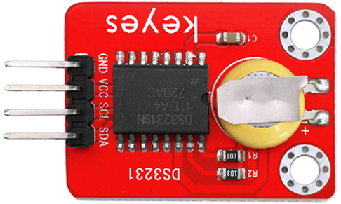
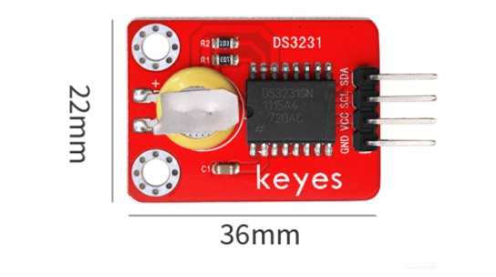
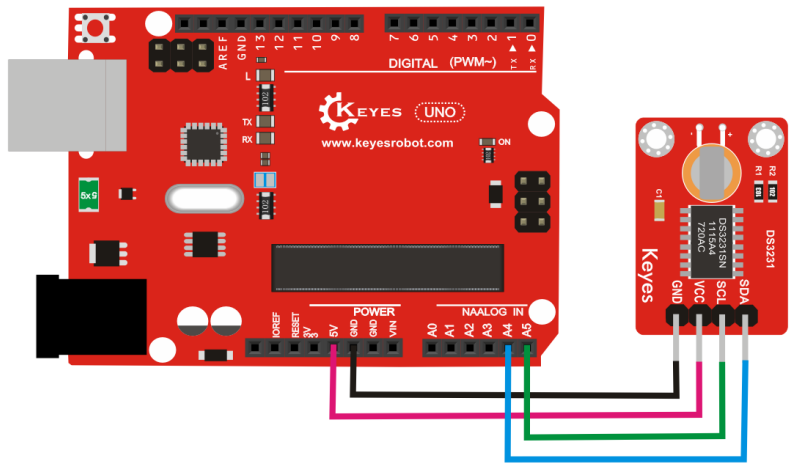
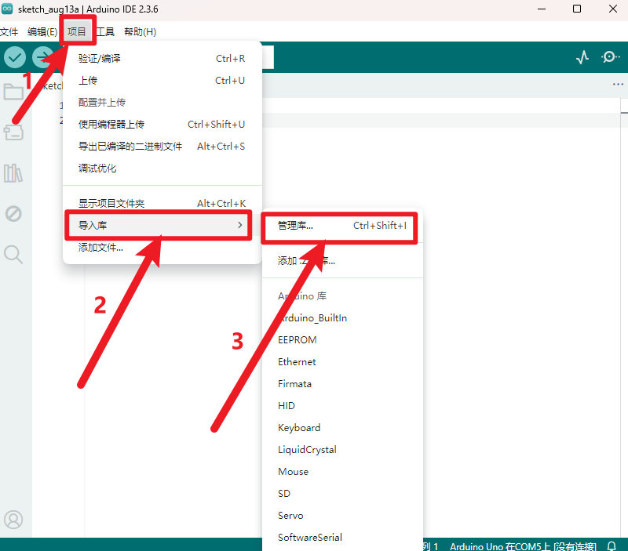
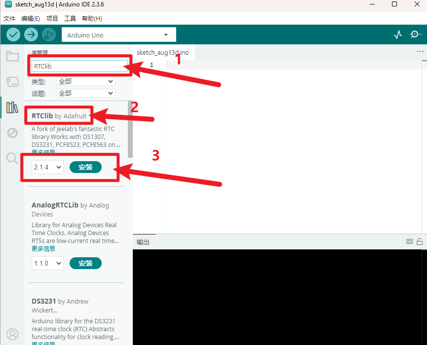
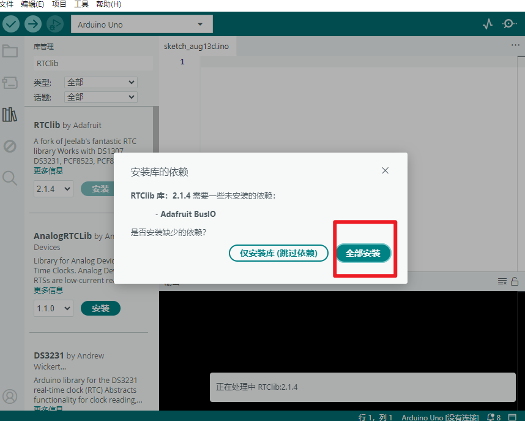
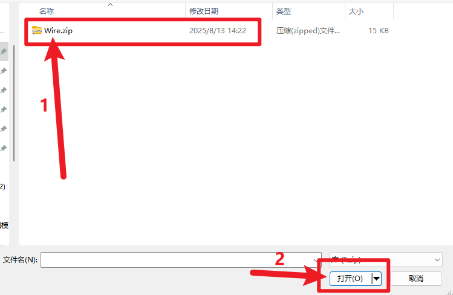

# **KE0071 Keyes 3231 时钟模块详细教程**



---

## **1. 介绍**

KE0071 Keyes 3231 时钟模块是一款基于 DS3231 高精度 RTC（实时时钟）芯片的模块，适用于 Arduino 等单片机开发板。DS3231 是一款 I2C 接口的 RTC 芯片，具有高精度、低功耗的特点，能够提供年、月、日、星期、时、分、秒的时间信息，并支持闰年自动调整。模块自带可充电电池（CR2032），即使断电也能保持时间运行。

该模块广泛应用于需要时间记录的场景，如数据记录仪、定时器、闹钟等。

---

## **2. 特点**

- **高精度**：DS3231 内置温度补偿晶振，精度高达 ±2ppm（0℃ ～ +40℃）。
- **低功耗**：支持备用电池供电，断电后仍可保持时间运行。
- **I2C 接口**：通过 I2C 通信与 Arduino 等开发板连接，使用方便。
- **自动调整**：支持闰年自动调整，提供年、月、日、星期、时、分、秒信息。
- **环保设计**：采用红色环保 PCB 板，耐用且稳定。

---

## **3. 规格参数**

| 参数            | 值                     |
|-----------------|------------------------|
| **工作电压**    | 3.3V ～ 5V             |
| **通信接口**    | I2C（SCL、SDA）        |
| **时钟精度**    | ±2ppm（0℃ ～ +40℃）   |
| **备用电池**    | CR2032 可充电电池      |
| **尺寸**        | 38mm × 22mm × 14mm     |
| **重量**        | 5g                     |



---

## **4. 工作原理**

DS3231 是一款高精度 RTC 芯片，内部集成了温度补偿晶振和电池切换电路。模块通过 I2C 接口与主控板通信，提供当前时间和日期信息。即使在断电情况下，模块也能通过备用电池维持时间运行。通过编程，可以读取或设置时间，并实现定时功能。

---

## **5. 接口说明**

模块有 4 个引脚：
1. **VCC**：电源正极（3.3V ～ 5V）。  
   - 用于为模块供电，支持 3.3V 或 5V 电压。
2. **GND**：电源负极（接地）。  
   - 与 Arduino 或其他控制板的 GND 引脚连接，形成电路的公共地。
3. **SCL**：I2C 时钟信号线（Serial Clock Line）。  
   - 用于 I2C 通信的时钟信号，与 Arduino 的 SCL 引脚连接（如 Arduino UNO 的 A5 引脚）。
4. **SDA**：I2C 数据信号线（Serial Data Line）。  
   - 用于 I2C 通信的数据信号，与 Arduino 的 SDA 引脚连接（如 Arduino UNO 的 A4 引脚）。

---

## **6. 连接图**

以下是 KE0071 模块与 Arduino UNO 的连接示意图：

| KE0071模块引脚 | Arduino引脚 |
|----------------|-------------|
| VCC            | 5V          |
| GND            | GND         |
| SCL            | A5          |
| SDA            | A4          |

连接图如下：



---

## **7. 示例代码**

以下是用于测试 KE0071 模块的 Arduino 示例代码，使用了 **RTClib** 库（需要在 Arduino IDE 中安装该库）。

#### **安装 RTClib 库**

- 打开Arduino IDE，点击“项目”，选择“管理库”。

  

- 方框输入“RTClib”，选择“RTClib”，点击“安装”。

  

- 如果出现以下界面，选择“全部安装”。

  

- 安装成功界面。

  

#### **代码示例**

```cpp
#include <Wire.h>
#include <RTClib.h>

// 创建 RTC 对象
RTC_DS3231 rtc;

void setup() {
  Serial.begin(9600); // 初始化串口通信
  Wire.begin();       // 初始化 I2C 通信

  // 检查 RTC 是否正常工作
  if (!rtc.begin()) {
    Serial.println("Couldn't find RTC");
    while (1);
  }

  // 如果 RTC 停止运行，则设置时间
  if (rtc.lostPower()) {
    Serial.println("RTC lost power, setting the time!");
    // 设置时间为 2025-03-11 12:00:00
    rtc.adjust(DateTime(2025, 3, 11, 12, 0, 0));
  }
}

void loop() {
  // 获取当前时间
  DateTime now = rtc.now();

  // 打印当前时间到串口监视器
  Serial.print("Current Date & Time: ");
  Serial.print(now.year(), DEC);
  Serial.print('/');
  Serial.print(now.month(), DEC);
  Serial.print('/');
  Serial.print(now.day(), DEC);
  Serial.print(" ");
  Serial.print(now.hour(), DEC);
  Serial.print(':');
  Serial.print(now.minute(), DEC);
  Serial.print(':');
  Serial.println(now.second(), DEC);

  delay(1000); // 每秒更新一次
}
```

**如果安装RTClib库，上传代码后报错(代码上传成功不用安装)，请按如下安装Wire库**

- 下载库文件：[Wire](./资料/Wire.7z)

- 打开Arduino IDE，选择“项目”，选择“导入库”，再选择“添加.ZIP库”。

  

- 找到下载资料的存放位置，打开文件夹找到库文件，选择要导入的库，点击“打开”。

  

- 安装成功界面。

## **8. 实验现象**

1. **硬件连接**：
   - 按照连接图将模块与 Arduino UNO 连接。
   - 确保模块上的电池已安装。

2. **烧录代码**：
   - 将代码上传到 Arduino 开发板。

3. **运行测试**：
   - 打开 Arduino IDE 的串口监视器，设置波特率为 9600。
   - 串口监视器会显示当前时间和日期，例如：
     ```
     Current Date & Time: 2025/3/11 12:00:00
     Current Date & Time: 2025/3/11 12:00:01
     Current Date & Time: 2025/3/11 12:00:02
     ```

4. **断电测试**：
   - 断开 Arduino 的电源，等待几分钟后重新上电。
   - 串口监视器会显示正确的时间，证明模块通过备用电池保持了时间运行。

---

## **9. 注意事项**

1. **电压范围**：确保模块工作在 3.3V ～ 5V 电压范围内，避免损坏模块。
2. **备用电池**：模块自带 CR2032 可充电电池，确保电池电量充足。
3. **I2C 地址**：DS3231 的默认 I2C 地址为 `0x68`，如需修改，请参考芯片手册。
4. **库安装**：使用示例代码前，请确保已安装 **RTClib** 库。
5. **时间设置**：首次使用时需要通过代码设置时间，之后模块会自动保持时间运行。

---

## **10. 参考链接**

- [DS3231 数据手册](https://datasheets.maximintegrated.com/en/ds/DS3231.pdf)
- [RTClib 库 GitHub](https://github.com/adafruit/RTClib)

---

如果需要进一步调整代码或有其他问题，请告诉我！
