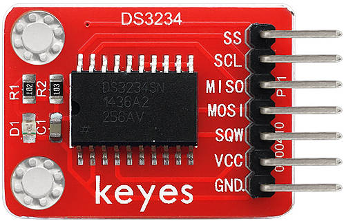
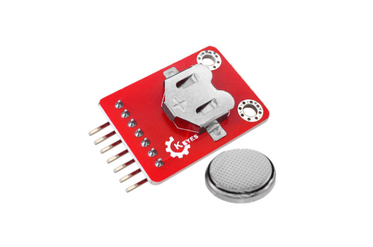
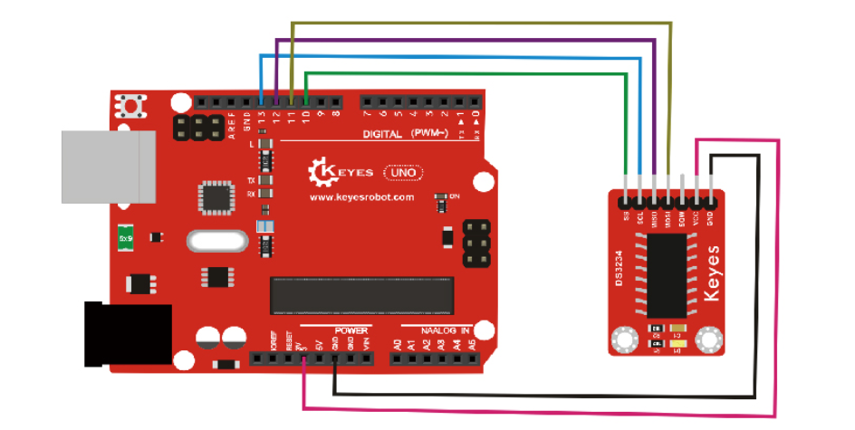

# **KE0072 Keyes DS3234 高精度时钟模块详细教程**



---

## **1. 介绍**

KE0072 Keyes DS3234 高精度时钟模块是一款基于 DS3234 RTC（实时时钟）芯片的模块，适用于 Arduino 等单片机开发板。DS3234 是一款 SPI 接口的 RTC 芯片，具有高精度、低功耗的特点，能够提供年、月、日、星期、时、分、秒的时间信息，并支持闰年自动调整。模块自带可充电电池（CR2032），即使断电也能保持时间运行。



与 DS3231 不同，DS3234 使用 SPI 通信接口，具有更高的通信速度和更强的抗干扰能力，非常适合需要高精度时间记录的场景，如数据记录仪、定时器、闹钟等。

---

## **2. 特点**

- **高精度**：DS3234 内置温度补偿晶振，精度高达 ±2ppm（0℃ ～ +40℃）。
- **低功耗**：支持备用电池供电，断电后仍可保持时间运行。
- **SPI 接口**：通过 SPI 通信与 Arduino 等开发板连接，通信速度快，抗干扰能力强。
- **自动调整**：支持闰年自动调整，提供年、月、日、星期、时、分、秒信息。
- **环保设计**：采用红色环保 PCB 板，耐用且稳定。

---

## **3. 规格参数**

| 参数            | 值                     |
|-----------------|------------------------|
| **工作电压**    | 3.3V ～ 5V             |
| **通信接口**    | SPI（MISO、MOSI、SCK、CS） |
| **时钟精度**    | ±2ppm（0℃ ～ +40℃）   |
| **备用电池**    | CR2032 可充电电池      |
| **尺寸**        | 38mm × 22mm × 14mm     |
| **重量**        | 5g                     |

---

## **4. 工作原理**

DS3234 是一款高精度 RTC 芯片，内部集成了温度补偿晶振和电池切换电路。模块通过 SPI 接口与主控板通信，提供当前时间和日期信息。即使在断电情况下，模块也能通过备用电池维持时间运行。通过编程，可以读取或设置时间，并实现定时功能。

---

## **5. 接口说明**

模块有 6 个引脚：
1. **VCC**：电源正极（3.3V ～ 5V）。  
   - 用于为模块供电，支持 3.3V 或 5V 电压。
2. **GND**：电源负极（接地）。  
   - 与 Arduino 或其他控制板的 GND 引脚连接，形成电路的公共地。
3. **MISO**：SPI 主输入从输出（Master In Slave Out）。  
   - 用于 SPI 通信，接 Arduino 的 MISO 引脚。
4. **MOSI**：SPI 主输出从输入（Master Out Slave In）。  
   - 用于 SPI 通信，接 Arduino 的 MOSI 引脚。
5. **SCL**：SPI 时钟信号（Serial Clock）。  
   - 用于 SPI 通信的时钟信号，接 Arduino 的 SCK 引脚。
6. **SS**：SPI 片选信号（Chip Select）。  
   - 用于选择当前通信的 SPI 从设备，接 Arduino 的任意数字引脚（如 D10）。

---

## **6. 连接图**

以下是 KE0072 模块与 Arduino UNO 的连接示意图：

| KE0072模块引脚 | Arduino引脚 |
| -------------- | ----------- |
| VCC            | 5V          |
| GND            | GND         |
| MISO           | D12         |
| MOSI           | D11         |
| SCL            | D13         |
| SS             | D10         |

连接图如下：



---

## **7. 示例代码**

以下是用于测试 KE0072 模块的 Arduino 示例代码，使用了 **DS3234 库**（需要在 Arduino IDE 中安装该库）。

#### **安装 DS3234 库**
1. 打开 Arduino IDE。
2. 点击 **工具 > 管理库**。
3. 搜索 **DS3234**，点击安装。

#### **代码示例**

```cpp
#include <SPI.h>
#include <DS3234.h>

// 定义 SPI 引脚
#define CS_PIN 10 // 片选引脚

// 创建 DS3234 对象
DS3234 rtc(CS_PIN, SPI);

void setup() {
  Serial.begin(9600); // 初始化串口通信
  SPI.begin();        // 初始化 SPI 通信

  // 初始化 RTC
  rtc.begin();

  // 如果需要设置时间，请取消以下代码的注释
  // rtc.setYear(25);    // 设置年份（2025）
  // rtc.setMonth(3);    // 设置月份（3 月）
  // rtc.setDate(11);    // 设置日期（11 日）
  // rtc.setHour(12);    // 设置小时（12 点）
  // rtc.setMinute(0);   // 设置分钟（0 分）
  // rtc.setSecond(0);   // 设置秒钟（0 秒）
}

void loop() {
  // 获取当前时间
  int year = rtc.getYear();
  int month = rtc.getMonth();
  int date = rtc.getDate();
  int hour = rtc.getHour();
  int minute = rtc.getMinute();
  int second = rtc.getSecond();

  // 打印当前时间到串口监视器
  Serial.print("Current Date & Time: ");
  Serial.print(2000 + year); // 年份从 2000 开始
  Serial.print('/');
  Serial.print(month);
  Serial.print('/');
  Serial.print(date);
  Serial.print(" ");
  Serial.print(hour);
  Serial.print(':');
  Serial.print(minute);
  Serial.print(':');
  Serial.println(second);

  delay(1000); // 每秒更新一次
}
```

---

## **8. 实验现象**

1. **硬件连接**：
   - 按照连接图将模块与 Arduino UNO 连接。
   - 确保模块上的电池已安装。

2. **烧录代码**：
   - 将代码上传到 Arduino 开发板。

3. **运行测试**：
   - 打开 Arduino IDE 的串口监视器，设置波特率为 9600。
   - 串口监视器会显示当前时间和日期，例如：
     ```
     Current Date & Time: 2025/3/11 12:00:00
     Current Date & Time: 2025/3/11 12:00:01
     Current Date & Time: 2025/3/11 12:00:02
     ```

4. **断电测试**：
   - 断开 Arduino 的电源，等待几分钟后重新上电。
   - 串口监视器会显示正确的时间，证明模块通过备用电池保持了时间运行。

---

## **9. 注意事项**

1. **电压范围**：确保模块工作在 3.3V ～ 5V 电压范围内，避免损坏模块。
2. **备用电池**：模块自带 CR2032 可充电电池，确保电池电量充足。
3. **SPI 接口**：DS3234 使用 SPI 通信协议，MISO、MOSI、SCL 和 SS 引脚必须正确连接。
4. **库安装**：使用示例代码前，请确保已安装 **DS3234** 库。
5. **时间设置**：首次使用时需要通过代码设置时间，之后模块会自动保持时间运行。

---

## **10. 参考链接**

- [DS3234 数据手册](https://datasheets.maximintegrated.com/en/ds/DS3234.pdf)
- [DS3234 库 GitHub](https://github.com/rodan/ds3234)

---

如果需要进一步调整代码或有其他问题，请告诉我！
