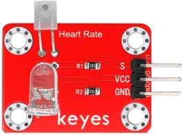
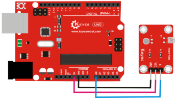
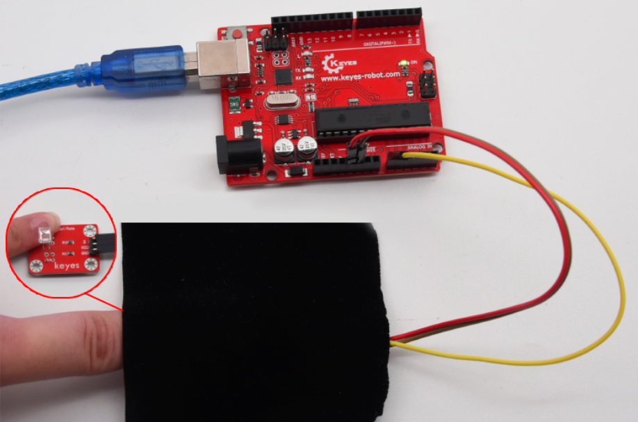
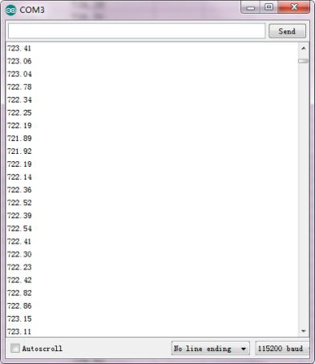
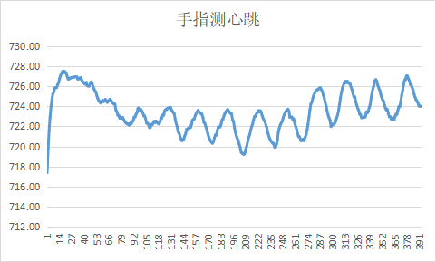

# **KE0073 Keyes 手指测心跳模块**



---

## **1. 概述**

KE0073 Keyes 手指测心跳模块是一款常用的心率检测模块，主要由 **1 个光敏接收器** 和 **1 个红外发射器** 组成。  
- **工作原理**：红外发射器位于手指的一侧，光敏接收器位于手指的另一侧。红外发射器发出的光穿过手指，光敏接收器接收透射光的强度。当血液脉动通过手指时，光敏接收器接收到的光通量会发生微小变化，从而检测到心率信号。  
- **兼容性**：该模块兼容各种单片机控制板，如 Arduino 系列单片机。  
- **测试注意事项**：在测试时，需要用黑布包裹模块和手指，确保在无光环境中测试，否则环境光会干扰检测，导致测试结果不准确。

---

## **2. 规格参数**

| 参数            | 值                     |
|-----------------|------------------------|
| **工作电压**    | DC 3.3V ～ 5V          |
| **接口**        | 间距为 2.54mm          |
| **定位孔大小**  | 直径为 3mm             |
| **控制信号**    | 模拟信号输出           |

---

## **3. 连接图**

#### **不带扩展板的连接图**
| 模块引脚 | Arduino 引脚 |
|----------|--------------|
| **VCC**  | 5V           |
| **GND**  | GND          |
| **OUT**  | A0           |



#### **带有扩展板的连接图**

如果使用扩展板，模块的引脚直接插入扩展板对应的接口，无需额外接线。

---

## **4. 测试代码**

以下是用于测试 KE0073 模块的 Arduino 示例代码：

```cpp
int ledPin = 13;       // 定义板载 LED 引脚
int sensorPin = A0;    // 定义心跳模块的 OUT 引脚连接到 Arduino 的 A0 引脚
double alpha = 0.75;   // 滤波系数
int period = 20;       // 采样周期（毫秒）
double change = 0.0;   // 用于存储信号变化值

void setup() {
  pinMode(ledPin, OUTPUT);  // 设置 LED 引脚为输出模式
  Serial.begin(115200);     // 初始化串口通信，波特率为 115200
}

void loop() {
  static double oldValue = 0;    // 上一次的滤波值
  static double oldChange = 0;   // 上一次的变化值
  int rawValue = analogRead(sensorPin);  // 读取传感器的模拟信号值
  double value = alpha * oldValue + (1 - alpha) * rawValue;  // 滤波处理
  Serial.println(value);  // 将滤波后的信号值打印到串口监视器
  oldValue = value;       // 更新滤波值
  delay(period);          // 延迟一个采样周期
}
```

---

## **5. 测试结果**

1. **硬件连接**：
   - 按照连接图将模块与 Arduino UNO 连接。
   
   - 确保模块的 VCC 和 GND 正确连接。

   - 将手指放置在模块的检测区域，并用黑布包裹模块和手指，避免环境光干扰。
   
   	
   
2. **烧录代码**：
   - 将代码上传到 Arduino 开发板。

3. **运行测试**：
   - 打开 Arduino IDE 的串口监视器，设置波特率为 115200。
   
   - 串口监视器会显示一系列滤波后的信号值，信号值会随着心跳呈现周期性波动。
   
   	
   
4. **数据处理**：
   
   
   
   - 将串口监视器中的数据复制到 Excel 或其他波形绘图工具中，生成心率波形图。
   - 通过观察波形的周期性变化，可以计算出心率（每分钟心跳次数）。

---

## **6. 注意事项**

1. **手指位置**：确保手指完全覆盖模块的检测区域，并保持稳定，避免信号干扰。
2. **环境光干扰**：测试时需要用黑布包裹模块和手指，确保在无光环境中测试，否则环境光会干扰检测结果。
3. **电压范围**：确保模块工作在 3.3V ～ 5V 电压范围内，避免损坏模块。
4. **信号处理**：模块输出的信号为模拟波形，需通过滤波和算法处理才能准确计算心率。
5. **延迟时间**：`delay(period)` 控制信号读取的频率，可根据需要调整。

---

## **7. 参考链接**

- [Arduino 官网](https://www.arduino.cc/)
- [Keyes 官网](http://www.keyes-robot.com/)
- [光电传感器原理](https://en.wikipedia.org/wiki/Photoplethysmogram)

---

如果需要进一步调整代码或有其他问题，请告诉我！
