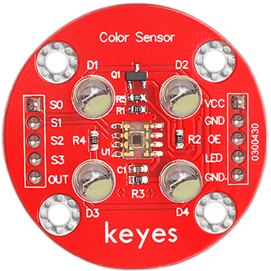
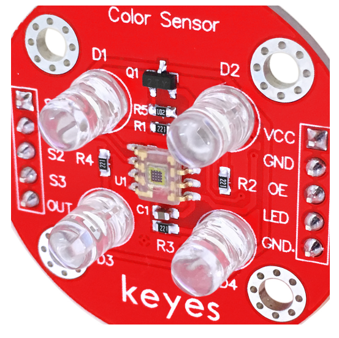
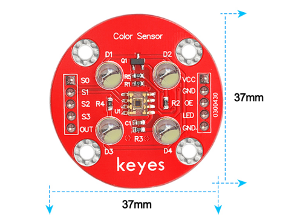
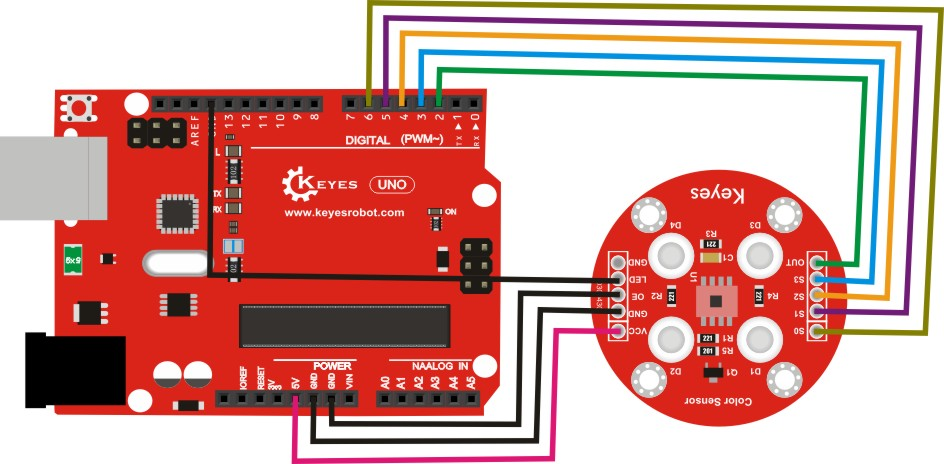
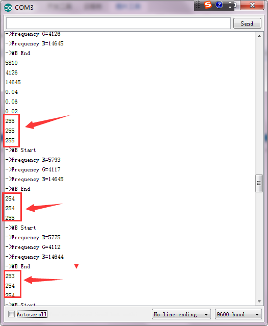
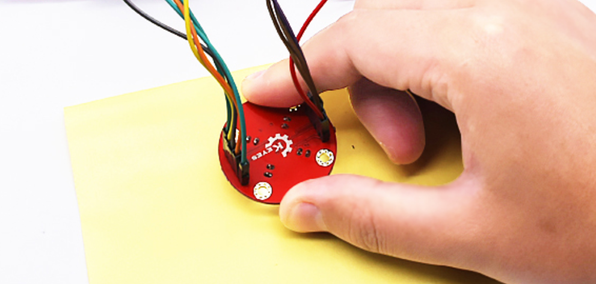

# **KE0074 Keyes TCS3200 颜色传感器教程**



---

## **1. 模块介绍**

KE0074 Keyes TCS3200 颜色传感器是一款基于 TCS3200 芯片的颜色检测模块，能够检测物体表面的颜色并输出对应的 RGB 值。TCS3200 是一种光到频率转换器，内置光电二极管阵列，通过检测红、绿、蓝三种颜色的光强度，将其转换为频率信号输出。模块采用镀金工艺，抗光干扰能力强，适用于静态检测不发光物体的颜色。



#### **应用场景**

- 颜色识别
- 颜色分类
- 智能机器人导航
- 工业自动化检测

---

## **2. 模块特点**

- **高灵敏度**：内置光电二极管阵列，能够检测红、绿、蓝三种颜色的光强度。
- **抗光干扰**：适合多种光线环境，能够在复杂光照条件下稳定工作。
- **静态检测**：适合检测不发光的物体颜色。
- **可编程输出**：支持不同的输出频率比例（100%、20%、2%、关断）。
- **易于固定**：模块自带 4 个定位孔，便于安装在其他设备上。
- **兼容性强**：支持 Arduino、树莓派等开发板。

---

## **3. 规格参数**

| 参数            | 值                     |
|-----------------|------------------------|
| **工作电压**    | 3.3V ～ 5V（DC）       |
| **接口**        | 10PIN 接口             |
| **工作电流**    | 1.4mA                  |
| **检测状态**    | 静态检测               |
| **最佳检测距离**| 10mm                   |
| **重量**        | 5.6g                   |
| **输出频率范围**| 10kHz ～ 12kHz，占空比 50% |



---

## **4. 工作原理**

TCS3200 是一种光到频率转换器，内置 4×4 的光电二极管阵列：
- 4 个检测红光
- 4 个检测绿光
- 4 个检测蓝光
- 4 个无滤光片（全光谱）

通过控制 S2 和 S3 引脚，可以选择检测红、绿、蓝或全光谱光强度。模块将检测到的光强度转换为方波信号，输出频率与光强度成正比。通过读取输出信号的频率，可以计算出颜色的 RGB 值。

---

## **5. 接口说明**

模块有 6 个主要引脚：
1. **VCC**：电源正极（3.3V ～ 5V）。  
   - 用于为模块供电。
2. **GND**：电源负极（接地）。  
   - 与 Arduino 或其他控制板的 GND 引脚连接。
3. **OUT**：方波信号输出。  
   - 输出颜色光强度对应的频率信号，接 Arduino 的数字输入引脚（如 D2）。
4. **S0** 和 **S1**：输出频率比例选择引脚。  
   - 用于选择输出频率比例（100%、20%、2%、关断）。
5. **S2** 和 **S3**：颜色选择引脚。  
   - 用于选择检测红、绿、蓝或全光谱光强度。

---

## **6. 连接图**

以下是 KE0074 模块与 Arduino UNO 的连接示意图：

| 模块引脚 | Arduino 引脚 |
|----------|--------------|
| **VCC**  | 5V           |
| **GND**  | GND          |
| **OUT**  | D2           |
| **S0**   | D6           |
| **S1**   | D5           |
| **S2**   | D4           |
| **S3**   | D3           |

连接图如下：



---

## **7. 示例代码**

以下是用于测试 KE0074 模块的 Arduino 示例代码，检测颜色的 RGB 值并在串口监视器中显示。

#### **代码示例**
```cpp
#include <TimerOne.h> 

#define S0 6   // TCS3200频率比例选择引脚
#define S1 5
#define S2 4   // TCS3200颜色选择引脚
#define S3 3
#define OUT 2  // TCS3200输出信号连接到Arduino中断引脚

int g_count = 0;     // TCS3200输出信号的脉冲计数
int g_array[3];      // 存储RGB脉冲数
int g_flag = 0;      // 滤波器模式标志
float g_SF[3];       // RGB比例因子

// 初始化TCS3200各控制引脚模式
void TSC_Init() {
  pinMode(S0, OUTPUT);
  pinMode(S1, OUTPUT);
  pinMode(S2, OUTPUT);
  pinMode(S3, OUTPUT);
  pinMode(OUT, INPUT);

  digitalWrite(S0, LOW);  
  digitalWrite(S1, HIGH); // 设置比例因子为2%
}

// 选择滤波器模式
void TSC_FilterColor(int Level01, int Level02) {
  digitalWrite(S2, Level01 ? HIGH : LOW); 
  digitalWrite(S3, Level02 ? HIGH : LOW); 
}

// 中断函数，记录TCS3200输出信号的脉冲数
void TSC_Count() {
  g_count++;
}

// 定时器中断函数
void TSC_Callback() {
  switch(g_flag) {
    case 0: 
      Serial.println("->WB Start");
      TSC_FilterColor(LOW, LOW);  // 红光滤波器
      break;
    case 1:
      Serial.print("->Frequency R=");
      Serial.println(g_count);
      g_array[0] = g_count;  // 存储红光脉冲数
      TSC_FilterColor(HIGH, HIGH);   // 绿光滤波器
      break;
    case 2:
      Serial.print("->Frequency G=");
      Serial.println(g_count);
      g_array[1] = g_count;  // 存储绿光脉冲数
      TSC_FilterColor(LOW, HIGH);   // 蓝光滤波器
      break;
    case 3:
      Serial.print("->Frequency B=");
      Serial.println(g_count);
      g_array[2] = g_count;  // 存储蓝光脉冲数
      TSC_FilterColor(HIGH, LOW);   // 无滤波器模式
      Serial.println("->WB End");
      break;
    default:
      g_count = 0;
      break;
  }
  g_count = 0;
  g_flag++;
  Timer1.setPeriod(1000000);  // 设置计数周期为1秒
}

void setup() {
  TSC_Init();
  Serial.begin(9600);
  Timer1.initialize();
  Timer1.attachInterrupt(TSC_Callback);
  attachInterrupt(0, TSC_Count, RISING);

  delay(4000);

  for(int i = 0; i < 3; i++) {
    Serial.println(g_array[i]);
  }

  g_SF[0] = 255.0 / g_array[0];  // 红色比例因子
  g_SF[1] = 255.0 / g_array[1];  // 绿色比例因子
  g_SF[2] = 255.0 / g_array[2];  // 蓝色比例因子

  Serial.println(g_SF[0]);
  Serial.println(g_SF[1]);
  Serial.println(g_SF[2]);
}

void loop() {
  g_flag = 0;
  for(int i = 0; i < 3; i++) {
    Serial.println(int(g_array[i] * g_SF[i]));  // 打印RGB值
  }
  delay(4000);  // 延迟4秒
}
```

---

## **8. 实验现象**

1. **硬件连接**：按照连接图连接模块与 Arduino UNO。

2. **烧录代码**：将代码上传到 Arduino UNO。

3. **运行测试**：
   - 打开 Arduino IDE 的串口监视器，设置波特率为 9600。
   - 初始测试时，按复位键，用白纸先测试，确保 RGB 值都为 255。
   - 将传感器对准不同颜色的物体，串口监视器会显示对应的 RGB 数值。
   - 如果 RGB 值超过 255，则默认值为 255。
   
   

---

## **9. 注意事项**

1. **白平衡校准**：测试前，先用白纸校准，确保 RGB 都为 255。

2. **LED 指示灯**：上电后，4 个 LED 灯应亮起。

3. **RGB 值范围**：如果测试数据超过 255，则默认显示为 255。

4. **最佳检测距离**：建议保持 10mm 的检测距离。

	

5. **环境光干扰**：避免强光或闪烁光源干扰。

---

## **10. 参考链接**

- [Arduino 官网](https://www.arduino.cc/)
- [Keyes 官网](http://www.keyes-robot.com/)
- [TCS3200 数据手册](https://www.ti.com/lit/ds/symlink/tcs3200.pdf)

---

如果需要进一步调整代码或有其他问题，请告诉我！
