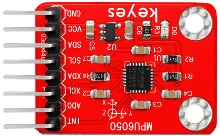
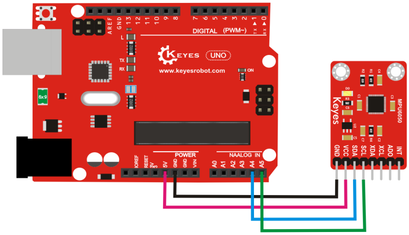
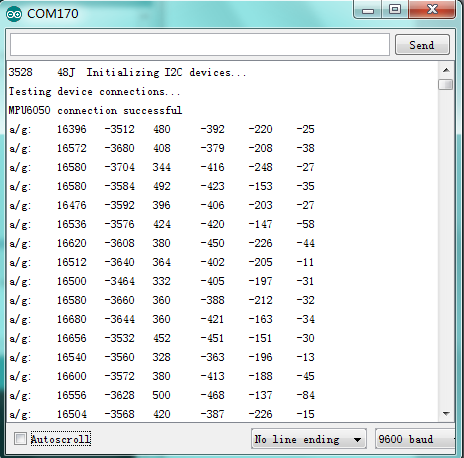

# KE0075 Keyes MPU6050 加速度模块教程



---

## **1. 模块介绍**

KE0075 Keyes MPU6050 加速度模块是一款基于 MPU6050 芯片的六轴传感器模块，集成了三轴加速度计和三轴陀螺仪，能够检测物体的加速度和角速度。模块采用 I2C 接口，支持与 Arduino、树莓派等开发板连接，广泛应用于姿态检测、运动跟踪、机器人控制等领域。

#### **应用场景**
- 姿态检测（如倾斜角度、旋转角度）
- 运动跟踪（如加速度、速度变化）
- 飞行器姿态控制
- 机器人平衡控制

---

## **2. 模块特点**

- **高集成度**：内置三轴加速度计和三轴陀螺仪。
- **低功耗**：支持低功耗模式，适合电池供电设备。
- **高精度**：16 位 ADC 转换器，提供高精度数据。
- **I2C 接口**：支持标准 I2C 通信，便于与开发板连接。
- **环保设计**：采用红色环保 PCB 板，耐用且稳定。

---

## **3. 规格参数**

| 参数            | 值                     |
|-----------------|------------------------|
| **工作电压**    | 3.3V ～ 5V（DC）       |
| **工作电流**    | 3.6mA                  |
| **加速度范围**  | ±2g、±4g、±8g、±16g    |
| **角速度范围**  | ±250°/s、±500°/s、±1000°/s、±2000°/s |
| **通信接口**    | I2C（地址：0x68 或 0x69） |
| **尺寸**        | 20mm × 15mm × 3mm      |
| **重量**        | 3g                     |

---

## **4. 工作原理**

MPU6050 是一款六轴运动处理器，集成了三轴加速度计和三轴陀螺仪。  
- **加速度计**：用于测量物体的线性加速度（单位：g），可以检测物体的倾斜角度。
- **陀螺仪**：用于测量物体的角速度（单位：°/s），可以检测物体的旋转角度变化。

通过 I2C 接口读取 MPU6050 的寄存器数据，可以获取加速度和角速度的原始值。结合姿态解算算法，可以计算出物体的姿态角（如俯仰角、横滚角）。

---

## **5. 接口说明**

模块有 4 个主要引脚：
1. **VCC**：电源正极（3.3V ～ 5V）。  
   - 用于为模块供电。
2. **GND**：电源负极（接地）。  
   - 与 Arduino 或其他控制板的 GND 引脚连接。
3. **SCL**：I2C 时钟信号。  
   - 接 Arduino 的 A5 引脚（UNO）。
4. **SDA**：I2C 数据信号。  
   - 接 Arduino 的 A4 引脚（UNO）。

---

## **6. 连接图**

以下是 KE0075 模块与 Arduino UNO 的连接示意图：

| 模块引脚 | Arduino 引脚 |
|----------|--------------|
| **VCC**  | 5V           |
| **GND**  | GND          |
| **SCL**  | A5           |
| **SDA**  | A4           |

连接图如下：



---

## **7. 示例代码**

以下是用于测试 KE0075 模块的 Arduino 示例代码，读取加速度和角速度数据并在串口监视器中显示。

#### **代码示例**
```cpp
#include <Wire.h>

// MPU6050 I2C 地址
const int MPU = 0x68;  
int16_t AcX, AcY, AcZ, GyX, GyY, GyZ;

void setup() {
  Wire.begin();
  Serial.begin(9600);

  // 初始化 MPU6050
  Wire.beginTransmission(MPU);
  Wire.write(0x6B);  // 寄存器 PWR_MGMT_1
  Wire.write(0);     // 设置为 0，唤醒 MPU6050
  Wire.endTransmission(true);
}

void loop() {
  // 请求加速度和陀螺仪数据
  Wire.beginTransmission(MPU);
  Wire.write(0x3B);  // 起始寄存器地址
  Wire.endTransmission(false);
  Wire.requestFrom(MPU, 14, true);  // 请求 14 字节数据

  // 读取加速度数据
  AcX = Wire.read() << 8 | Wire.read();
  AcY = Wire.read() << 8 | Wire.read();
  AcZ = Wire.read() << 8 | Wire.read();

  // 跳过温度数据
  Wire.read();
  Wire.read();

  // 读取陀螺仪数据
  GyX = Wire.read() << 8 | Wire.read();
  GyY = Wire.read() << 8 | Wire.read();
  GyZ = Wire.read() << 8 | Wire.read();

  // 打印加速度和陀螺仪数据
  Serial.print("AcX = "); Serial.print(AcX);
  Serial.print(" | AcY = "); Serial.print(AcY);
  Serial.print(" | AcZ = "); Serial.print(AcZ);
  Serial.print(" | GyX = "); Serial.print(GyX);
  Serial.print(" | GyY = "); Serial.print(GyY);
  Serial.print(" | GyZ = "); Serial.println(GyZ);

  delay(500);
}
```

---

## **8. 实验现象**

1. **硬件连接**：按照连接图连接模块与 Arduino UNO。

2. **烧录代码**：将代码上传到 Arduino UNO。

3. **运行测试**：
   - 打开 Arduino IDE 的串口监视器，设置波特率为 9600。
   - 串口监视器会显示加速度和角速度的原始数据。
   - 当模块静止时，加速度数据接近 0，Z 轴加速度接近 16384（表示 1g）。
   - 当模块倾斜或旋转时，加速度和角速度数据会发生变化。
   
   

---

## **9. 注意事项**

1. **供电电压**：模块支持 3.3V 和 5V 电压，但建议使用 5V 供电以确保稳定性。
2. **I2C 地址**：默认 I2C 地址为 0x68，如果 AD0 引脚接高电平，地址变为 0x69。
3. **环境干扰**：避免强磁场或震动对模块的测量精度产生影响。
4. **校准**：在实际应用中，建议对加速度计和陀螺仪进行校准，以提高测量精度。
5. **姿态解算**：如果需要计算俯仰角、横滚角等姿态角，需要结合滤波算法（如卡尔曼滤波或互补滤波）。

---

## **10. 参考链接**

- [Arduino 官网](https://www.arduino.cc/)
- [Keyes 官网](http://www.keyes-robot.com/)
- [MPU6050 数据手册](https://invensense.tdk.com/products/motion-tracking/6-axis/mpu-6050/)
- [MPU6050 Arduino 库](https://github.com/jrowberg/i2cdevlib/tree/master/Arduino/MPU6050)

---

如果需要进一步调整代码或有其他问题，请告诉我！
