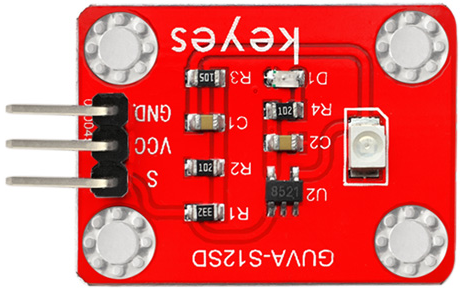
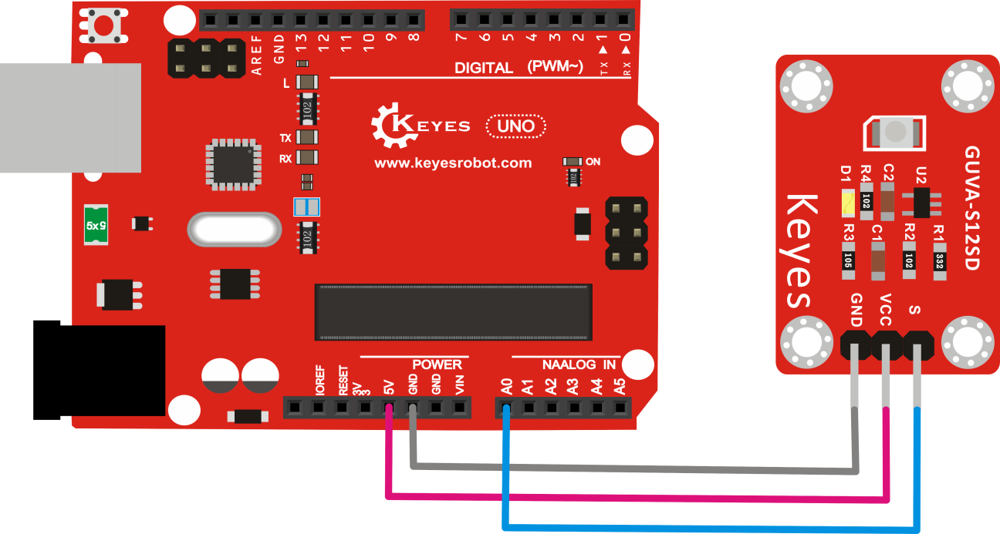

# **KE0076 Keyes GUVA-S12SD 紫外线传感器教程**



---

## **1. 模块介绍**

KE0076 Keyes GUVA-S12SD 紫外线传感器是一款基于 GUVA-S12SD 芯片的紫外线强度检测模块，能够检测环境中的紫外线强度并输出模拟电压信号。模块采用环保红色 PCB 板，具有高灵敏度和低功耗的特点，适用于紫外线强度监测、环境检测、紫外线防护设备等应用场景。

#### **应用场景**
- 紫外线强度监测
- 环境光检测
- 紫外线防护设备
- 智能家居环境监测

---

## **2. 模块特点**

- **高灵敏度**：能够检测 240nm ～ 370nm 波长范围内的紫外线。
- **低功耗**：适合电池供电设备。
- **模拟输出**：输出与紫外线强度成正比的模拟电压信号。
- **环保设计**：采用红色环保 PCB 板，耐用且稳定。
- **易于使用**：直接连接到 Arduino 等开发板的模拟输入引脚即可读取数据。

---

## **3. 规格参数**

| 参数            | 值                     |
|-----------------|------------------------|
| **工作电压**    | 3.3V ～ 5V（DC）       |
| **工作电流**    | 0.1mA                  |
| **检测波长范围**| 240nm ～ 370nm         |
| **输出信号**    | 模拟电压（0V ～ 1V）   |
| **尺寸**        | 20mm × 15mm × 3mm      |
| **重量**        | 3g                     |

---

## **4. 工作原理**

GUVA-S12SD 是一款紫外线光电二极管，能够检测 240nm ～ 370nm 波长范围内的紫外线强度，并将其转换为电流信号。模块通过电路将电流信号转换为模拟电压信号，输出电压与紫外线强度成正比。通过读取输出电压值，可以计算出紫外线强度（单位：mW/cm²）。

---

## **5. 接口说明**

模块有 3 个主要引脚：
1. **VCC**：电源正极（3.3V ～ 5V）。  
   - 用于为模块供电。
2. **GND**：电源负极（接地）。  
   - 与 Arduino 或其他控制板的 GND 引脚连接。
3. **S**：模拟信号输出。  
   - 输出与紫外线强度成正比的模拟电压信号，接 Arduino 的模拟输入引脚（如 A0）。

---

## **6. 连接图**

以下是 KE0076 模块与 Arduino UNO 的连接示意图：

| 模块引脚 | Arduino 引脚 |
| -------- | ------------ |
| **VCC**  | 5V           |
| **GND**  | GND          |
| **S**    | A0           |

连接图如下：



---

## **7. 示例代码**

以下是用于测试 KE0076 模块的 Arduino 示例代码，读取紫外线强度并在串口监视器中显示。

#### **代码示例**
```cpp
const int UVPin = A0;  // 紫外线传感器输出引脚连接到 Arduino 的 A0
float voltage;         // 模拟电压值
float uvIntensity;     // 紫外线强度（mW/cm²）

void setup() {
  Serial.begin(9600);  // 初始化串口通信，波特率为 9600
}

void loop() {
  int sensorValue = analogRead(UVPin);  // 读取传感器的模拟值（0 ～ 1023）
  voltage = sensorValue * (5.0 / 1023.0);  // 将模拟值转换为电压（0V ～ 5V）
  uvIntensity = voltage * 10.0;  // 根据模块特性计算紫外线强度（mW/cm²）

  // 打印电压值和紫外线强度
  Serial.print("Voltage: ");
  Serial.print(voltage);
  Serial.print(" V, UV Intensity: ");
  Serial.print(uvIntensity);
  Serial.println(" mW/cm²");

  delay(1000);  // 延迟 1 秒
}
```

---

## **8. 实验现象**

1. **硬件连接**：按照连接图连接模块与 Arduino UNO。
2. **烧录代码**：将代码上传到 Arduino UNO。
3. **运行测试**：
   - 打开 Arduino IDE 的串口监视器，设置波特率为 9600。
   - 串口监视器会显示传感器输出的电压值和紫外线强度。
   - 当传感器暴露在紫外线光源下时，电压值和紫外线强度会增加。
   - 当传感器处于黑暗环境中时，电压值接近 0，紫外线强度接近 0。

---

## **9. 注意事项**

1. **供电电压**：模块支持 3.3V 和 5V 电压，但建议使用 5V 供电以确保稳定性。
2. **环境光干扰**：避免强可见光对传感器的测量精度产生影响。
3. **紫外线光源**：测试时建议使用紫外线灯或自然阳光作为光源。
4. **校准**：如果需要精确测量紫外线强度，建议对传感器进行校准。
5. **安全防护**：避免长时间暴露在强紫外线光源下，以免对人体造成伤害。

---

## **10. 参考链接**

- [GUVA-S12SD 数据手册](https://www.gotop.com.tw/en/product/GUVA-S12SD.html)

---

如果需要进一步调整代码或有其他问题，请告诉我！
